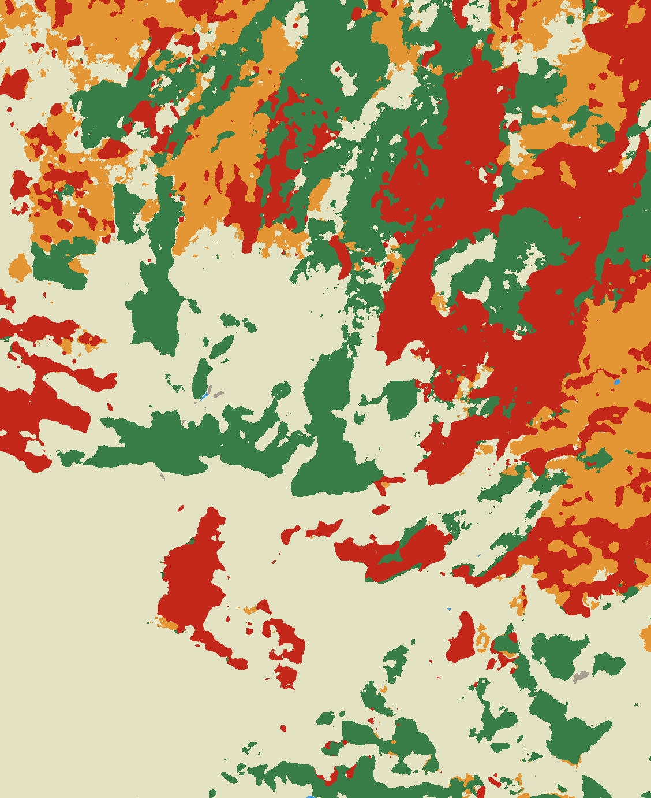
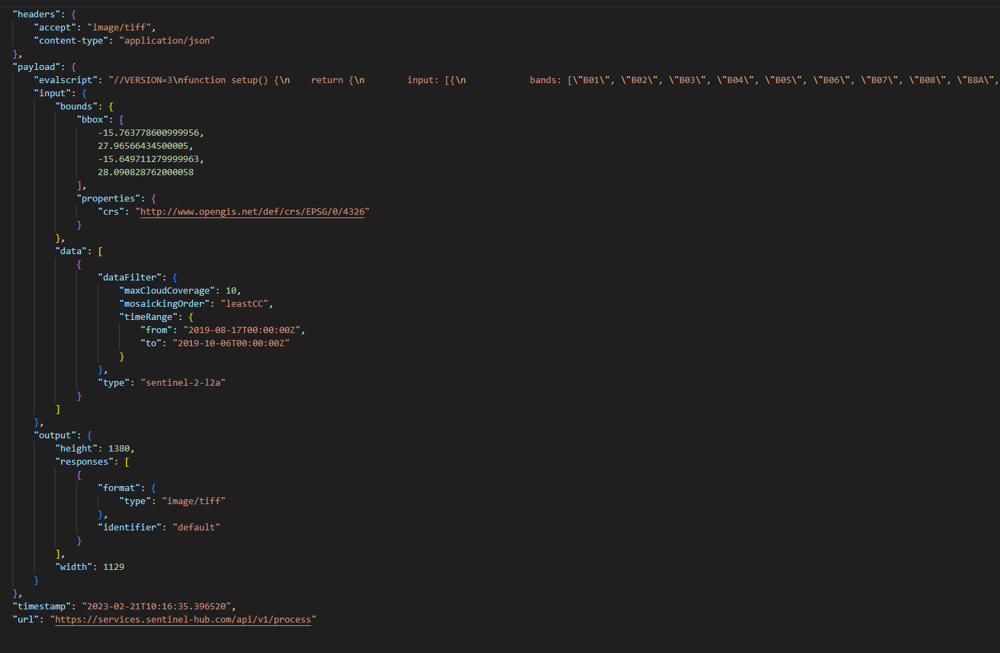
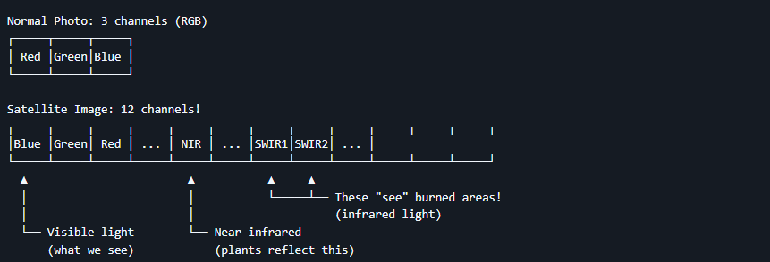
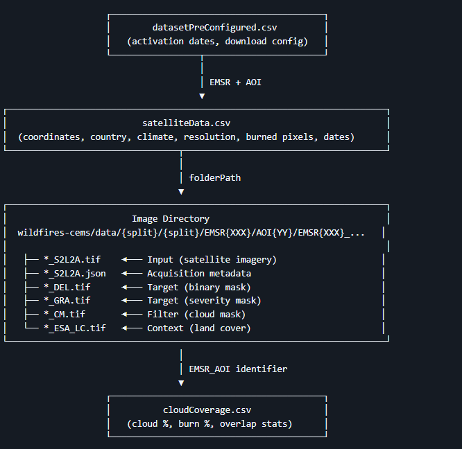
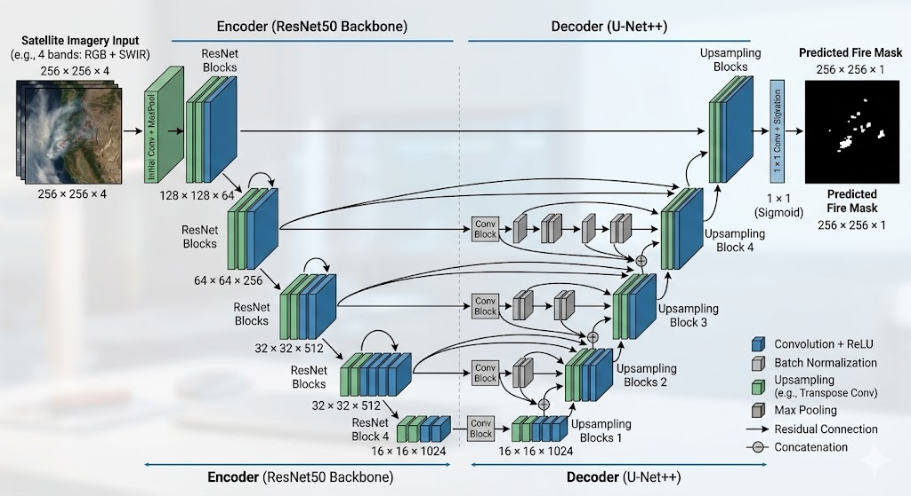
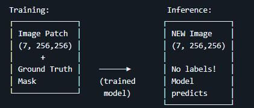
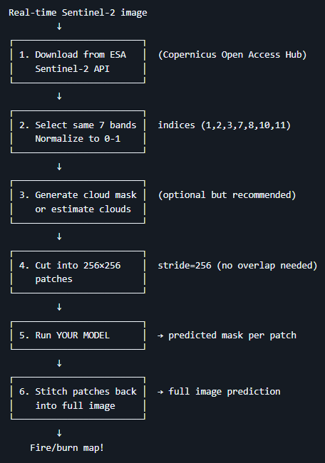
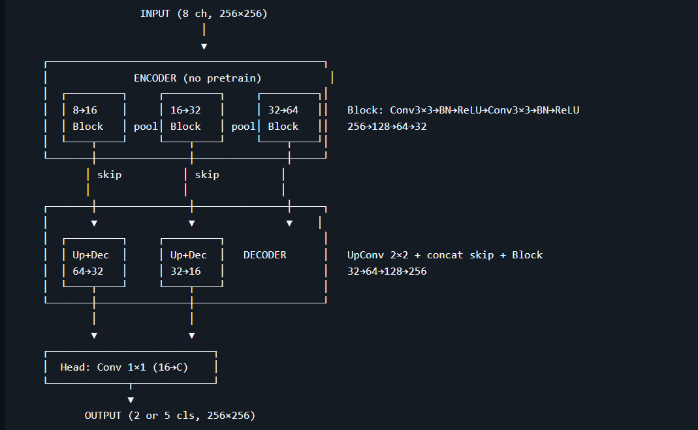
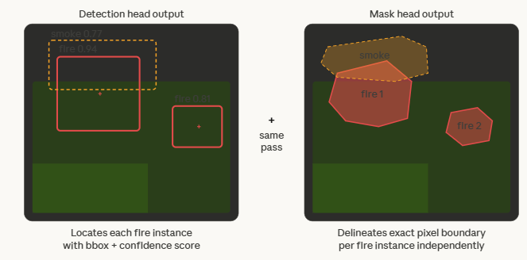

## Table of Contents

- [Exec Summary](#exec-summary)
- [Devastating Blazes](#devastating-blazes)
- [Using satellite images for fire detection](#using-satellite-images-for-fire-detection)
    - [Hypothesis:](#hypothesis)
  - [Dataset sources and selection](#dataset-sources-and-selection)
    - [Dataset overview](#dataset-overview)
    - [Directory structure](#directory-structure)
    - [Data Structure and organization.](#data-structure-and-organization)
- [Experimental setup: Our approach to Wildfire detection with Deep Learning Architecture](#experimental-setup-our-approach-to-wildfire-detection-with-deep-learning-architecture)
  - [The Complete pipeline](#the-complete-pipeline)
  - [Data Preparation](#data-preparation)
    - [What's in the data](#whats-in-the-data)
      - [Fire Masks (Labels)](#fire-masks-labels)
      - [Why Do We Cut Images into Patches?](#why-do-we-cut-images-into-patches)
      - [Why Overlap during training?](#why-overlap-during-training)
      - [Which tasks can we tackle with all this data?](#which-tasks-can-we-tackle-with-all-this-data)
      - [Understanding the Severity Mask (GRA)](#understanding-the-severity-mask-gra)
      - [Not all images have severity (GRA)](#not-all-images-have-severity-gra)
      - [Why Cloud masks matter](#why-cloud-masks-matter)
      - [Data Splits](#data-splits)
    - [Wildfire masks](#wildfire-masks)
    - [How manage cloud masks.](#how-manage-cloud-masks)
    - [Smoothing-blend image patches](#smoothing-blend-image-patches)
    - [Landcover masks](#landcover-masks)
    - [Metadata Files](#metadata-files)
      - [satelliteData.csv](#satellitedatacsv)
      - [datasetPreConfigured.csv](#datasetpreconfiguredcsv)
      - [cloudCoverage.csv](#cloudcoveragecsv)
      - [JSON Metadata](#json-metadata)
    - [How Everything Connects](#how-everything-connects)
    - [Sen2Fire Dataset Integration Plan](#sen2fire-dataset-integration-plan)
      - [Sen2Fire dataset summary](#sen2fire-dataset-summary)
  - [The training process](#the-training-process)
    - [Model](#model)
      - [Architecture](#architecture)
      - [FireSegmentationModel wrapper](#firesegmentationmodel-wrapper)
      - [Goal: Train a semantic segmentation model on CEMS wildfire patches (7-channel input, pixel-wise labels) and optionally use it for binary fire detection (patch-level "has fire" derived from segmentation).](#goal-train-a-semantic-segmentation-model-on-cems-wildfire-patches-7-channel-input-pixel-wise-labels-and-optionally-use-it-for-binary-fire-detection-patch-level-has-fire-derived-from-segmentation)
      - [Entry point: train.py in fire-pipeline/. It builds data loaders (from the data transformation pipeline), model, loss, optimizer, scheduler, and metrics; runs train/val loops; saves checkpoints and supports resume and W&B.](#entry-point-trainpy-in-fire-pipeline-it-builds-data-loaders-from-the-data-transformation-pipeline-model-loss-optimizer-scheduler-and-metrics-runs-trainval-loops-saves-checkpoints-and-supports-resume-and-wb)
      - [Outputs: output_dir/config.json, output_dir/checkpoints/best_model.pt, final_model.pt, and periodic checkpoints.](#outputs-output_dirconfigjson-output_dircheckpointsbest_modelpt-final_modelpt-and-periodic-checkpoints)
      - [Loss](#loss)
      - [Optimizer and Scheduler](#optimizer-and-scheduler)
      - [What the model learns](#what-the-model-learns)
      - [Sen2fire Fine-tune](#sen2fire-fine-tune)
      - [Our training strategy: CEMS first, then SEN2Fire](#our-training-strategy-cems-first-then-sen2fire)
      - [Trainin Plan (1):](#trainin-plan-1)
      - [Cloud handling for Sen2Fire (no cloud masks)](#cloud-handling-for-sen2fire-no-cloud-masks)
    - [Combined Binary + Severity Training Workflow](#combined-binary-severity-training-workflow)
      - [Why this workflow](#why-this-workflow)
      - [Vegetation (NDVI)](#vegetation-ndvi)
      - [Phase 1: Combined Binary Training](#phase-1-combined-binary-training)
      - [Phase 2: Severity Fine-Tuning](#phase-2-severity-fine-tuning)
      - [Two-Head Model Rationale](#two-head-model-rationale)
      - [Data Requirements](#data-requirements)
    - [V3 Pipeline: Model Architectures & Training Commands](#v3-pipeline-model-architectures-training-commands)
      - [Patch Generation](#patch-generation)
        - [CEMS DEL patches (../patches)](#cems-del-patches-patches)
        - [CEMS GRA patches (../patches_gra)](#cems-gra-patches-patches_gra)
      - [Architecture overview](#architecture-overview)
        - [Encoders (backbones)](#encoders-backbones)
        - [Decoder architectures](#decoder-architectures)
        - [Recommended Model combinations](#recommended-model-combinations)
  - [The Inference Process](#the-inference-process)
    - [What about inference?](#what-about-inference)
      - [Inference on a full image](#inference-on-a-full-image)
    - [What are the labels?](#what-are-the-labels)
      - [How the data was labeled?](#how-the-data-was-labeled)
      - [What the model learns](#what-the-model-learns-1)
      - [Which challenges we could face with Real Time data?](#which-challenges-we-could-face-with-real-time-data)
      - [Schema of the inference pipeline to be built.](#schema-of-the-inference-pipeline-to-be-built)
    - [Metrics](#metrics)
- [Bibliography](#bibliography)

---

# Exec Summary

Wildfires have been a major concern over last years because the change
in their behavior, their speed and their destructive capacity.

# Devastating Blazes

Disastrous blazes increased more than fourfold from 1980 to 2023
according to a paper in the journal Science. (Calum X. Cunningham1\*,
2025). Based on that paper, disastrous wildfires occurred globally but
were disproportionately concentrated in the Mediterranean and Temperate
Conifer Forest biomes, and in populated regions that experience intense
fire. Major economic losses caused by wildfire events increased by 4.4
fold from 1980 to 2023, amounting a 28.3 US\$ billion and 0,03% of
global GDP. Of the 200 most damaging events, 43% occurred in the last 10
years.

And the impact of the fires in on health should not be overlooked. Based
on a paper on how "Wildfire smoke exposure" will increase mortality in
USA over next decades (Minghao Qiu, 2025 ), that wildfire smoke would
kill an estimated 70,000 Americans each year by 2050.

Disasters were heavily concentrated in the Mediterranean
Forest/Woodland/Scrub Biome (Europe, southern South America, western
USA, South Africa, and southern Australia) and the Temperate Conifer
Forest Biome (mostly western North America), where disasters occurred
12.1 and 4.1 times more than expected based on the areas of those
biomes, respectively.

On the other side, increasing expenditure on fire suppression has not
prevented the rising occurrence of wildfire disasters. For example, US
federal expenditure on fire suppression increased by 3.6 fold from
1985-2022 Therefore, it's of utmost importance the implementation of
strategies that reduce transmission, NOT ONLY including retrofitting
existing structures, using stringent fire-sensitive design and materials
in new builds, establishing defendable space, and removing nearby fuel
in the home ignition zone, BUT, as well, with a fast, early
identification of fire spots or burned areas.

[]Wildfire monitoring.

In fact, wildfire season , in many regions, is year-round and continuous
fire surveillance becomes critical to minimize potential impact in
forests and communities. For a long time, watchtowers setup at hilltops
have been the traditional means of wildfire monitoring, with an
observation radius of up 20 km under ideal conditions (Rego, 2006).
Then, automated image observation devices (e.g. video surveillance
systems) mounted on watchtowers have largely replaced human observers,
demonstrating superior performance during daylight hours (Günay, 2009).
Even though, while automated thermal cameras enable basic 24-hour
operation, there are still some limitations such visibility constraints
from terrain or weather create permanent blind spots unreachable by
static towers (Guangqing Zhai, 2025)

Thanks to the development of time series data, advancements in new
sensor systems and image processing technology, and the increased
availability of free images, Remote Sensing (RS) based on satellite and
radar images has been widely applied in wildfire monitoring, especially
suitable for vast remote areas ( (Guangqing Zhai, 2025). It has been
recognized that updated information on landscape fire activity is
essential to aid fire management, and that information can only be
provided by using satellite Earth Observation approaches (Wooster, 2021)
This form of Earth observation is based on detecting the footprint or
signature of the electromagnetic radiation emitted as biomass burns.
Since the early 1980's active fire (AF) remote sensing conducted using
Earth orbiting (LEO) satellites has been deployed in certain regions of
the world to map the location and timing of landscape fire occurrence,
and from the early 2000's global-scale information updated multiple
times per day has been easily 100 available to all. Geostationary (GEO)
satellites provide even higher frequency AF information, more than 100
times per day in some cases, and both LEO- and GEO-derived AF products
now often include estimates of a fires characteristics, such as its fire
radiative power output, in addition to the fires detection (Wooster,
2021). AF data provide information relevant to fire activity ongoing
when the EO data were collected, and this can be delivered with very low
latency times.

Satellite EO can be used to probe many fire characteristics, including
burned area ( (Giglio, 2018) and the concentration and composition of
smoke plumes . Active fire (AF) remote sensing primarily focuses on
identifying the location, timing and radiative strength (Fire Radiative
Power; FRP) of fires that are actually consuming vegetation and/or
organic soil at the time the observations were made.

Active fire (AF) detection and characterization is based on remote
sensing of some of the approximately 20 MJ.kg-1 of energy released when
vegetation and organic soil burns (Sullivan, 2008) Of the total energy
released, only about 10 -20% is released as electromagnetic radiation.
This radiative energy rate is far higher than from the same area of
ambient land however, and its spectral distribution follows Planck's
Radiation law and its derivative Wien's Displacement (Wooster, 2021).
Based on this radiative analysis, there was a work to define Active Fire
detection algorithms that could identify pixels that contain active
fires. Those algorithms were defined to discriminate pixels with active
fires from non-fire pixels, taken into consideration potential confusing
effects such as sun glint, non-burning hot areas or regions with high
local thermal contrast.

All in all, active fire detection has evolved over time, from reporting
the timing and location of actively burning fires to include measures
such as fire effective temperature, area and fire radiative power (FRP).

# Using satellite images for fire detection

From Earth Observation (EO) satellites, we can get near real-time (NRT)
data streams that can help on detection and monitoring of active fires.
And there are expectations that future satellite mission, including
higher spatial resolution Geostationary (GEO) systems and an increase in
the number of Active Fire capable Low Earth Orbit (LEO) system,
including those of small satellite constellations, will provide more
opportunities to improve fire detection.

As of 2018, some authors started to map fires based on data from
Sentinel-2 sensor (Fernando Rodriguez-Jimenez, 2023). The Sentinel-2
mission is part of the Copernicus Earth observation program, with twin
satellites Sentinel 2A launched in 2015, and Sentinel 2B in 2017.
Sentinel-2 carries multispectral imaging instruments on board. The
spatial resolution for the output product chosen is 20 m, due to the
spectral bands using the most usual indices for mapping burned areas and
their severity. Fires are detected through the application of the
Relativized Burn Ratio (RBR) (Sean Parks, 2014). This index is
calculated from the Normalized Burn Ratio (NBR) using Band 8A and Band
12 in the pre-fire and post-fire images.

The new generation of geostationary satellites provides observations
every 10 to 15 min at an improved spatial resolution (2--3 km) making it
possible to detect short-lived fires not detectable by polar-orbiting
satellites and to track in detail the evolution of the fire line and
fire radiative power (Oliva, 2020). In addition, they have enhanced
sensors that provide information on 12--16 spectral bands with improved
radiometry of 10--14 bits. They introduce a substantial improvement in
spatial, temporal, spectral, and radiometric resolution over their
predecessors, which correspondingly relates to an enhanced capability
for fire detection.

While an advantage of geostationary sensors is their temporal
resolution, the polar-orbiting sensors have finer spatial resolution,
which ensures higher accuracy at locating and mapping thermal anomalies.
AF detections are produced using different polar-orbiting sensors, such
as MODIS , the Visible Infrared Imaging Radiometer Suite (VIIRS) ,
FengYun-3C VIRR, Landsat-8 OLI , TET-1, and FireBird.

Currently, the best compromise between spatial and temporal resolution
is provided by the operational active fire product derived from the 375
m VIIRS bands on board the National Polar-Orbiting Partnership (NPP)
satellite since 2013 and on board the NOAA-20 since 2017. Its improved
resolution, frequent acquisitions, and higher sensitivity to burning
pixels allow the direct estimation of the burned area by aggregation of
consecutive fire detections and the estimation of fire-driven
deforestation .With two satellites in operation, the 375 m AF product
time lapse between acquisitions is reduced to a few hours ensuring a
higher frequency of observations providing fire behavior to fire
managers and atmospheric modelers with higher resolution active fire
data.

All in all, satellite earth observations are used more and more to
monitor, estimate fire impacts by assessing the Burned Area (BA), their
spatial variation as shape, size or orientation. An new algorithms have
been developed for measuring Burned Area, incorporating machine learning
approaches. Let's show an example using Moderate Resolution Imaging
Spectroradiometer (MODIS) sensor image (Rui Ba, 2019 ), from the MODIS
data of several wildfires in the American states of Nevada, Washington
and California in 2016. They utilized a back-propagation neural network
(BPNN) to learn the spectral differences of different types from the
training sample sets and obtain the output burned area map.

> *Figure: MODIS-based burned area map example (image format not supported in Markdown preview)*

[]Our approach to Wildfire detection.

### Hypothesis:

Our aim with this project is to find the best fit in terms of datasets
and deep learning architectures to the task of classifying and
segmenting wildfires. Our expectation is to be closer as we can to a
near real time detection of wildfires. Based on the previous research
about which data can be used for fire detection, our hypothesis is that
we can leverage satellite images from specific satellite sensors that
are able to provide enough image resolution.

Imagine you have satellite photos of forests that caught fire. Your goal
is to teach a computer to look at a satellite photo and say \"fire
happened here, here, and here\" - like coloring in the burned areas.
Once trained, our model can look at a satellite image it\'s never seen
and draw the fire boundaries automatically.

[]Where gather data.

We have been looking at different sources of satellite data, and we have
selected data from new sensors as Sentinel-2, because of its
availability for medium-high spatial resolution of optical satellite
data. This helps a more detailed assessment of small fires than other
Burned Area products. Sentinel-2 is offered by the Copernicus Program,
and offers a time series data of burned areas, with high revisit
frequency, with improved spatial and spectral resolution of the MSI
optical sensor (Filipponi, 2019)

Sentinel-2 is the most commonly used satellite for mapping the precise
perimeter of a fire. They use SWIR (Short-Wave Infrared) Bands. While
standard cameras only see smoke, Sentinel-2's Bands 11 and 12 can
\"see\" the heat of the fire through the smoke. On a map, active fire
fronts appear as glowing orange or red lines. (CEMS, Sentinel-2
Documentation, n.d.)

Then, they can run a burn Scar Analysis by comparing images from before
and after a fire, scientists calculate the NBR (Normalized Burn Ratio).
This identifies which areas were hit hardest and helps plan for forest
restoration.

All in all, Sentinel-2 provides high-resolution images (10 to 20
meters), which is sharp enough to see individual roads, firebreaks, and
structures

The satellite imagery comes from Sentinel-2 L2A, which spans across 12
distinct bands of the light spectrum, each with a resolution of 10
meters. The Sentinel Level-2A data undergoes an atmospheric correction
process to adjust for the reflectance values influenced by the moisture
in the atmosphere. These images are downloaded using SentinelHub APIs.

Then, we need to refer as well to Sentinel-3 (The \"Thermometer in the
Sky\" (Global Monitoring) While Sentinel-2 takes a \"snapshot\" every
few days, Sentinel-3 provides a broader daily view of the entire planet.
It helps with Active Fire Detection. It uses a sensor called SLSTR that
acts like a thermometer. It can detect \"hotspots\" and measure FRP
(Fire Radiative Power)---a metric that tells firefighters how intense
the fire is and how fast it consumes fuel. And it provides a World Fire
Atlas. Sentinel-3 data is used to maintain a global map of all active
fires occurring at night, helping agencies track the spread of wildfires
across entire continents.

## Dataset sources and selection

The Copernicus Emergency Management Service (CEMS) is a component of the
European Union\'s Copernicus Programme. It provides rapid geospatial
information during emergencies, and damage assessment for events such as
floods, wildfires, and earthquakes. In particular, Copernicus Rapid
Mapping provides on-demand mapping services in cases of various natural
disasters, offering detailed and up-to-date geospatial information that
assists in disaster management and risk assessment (CEMS, n.d.)

The Copernicus Emergency Management Service (CEMS) Wildfire dataset
spans from June 2017 to April 2023. The dataset includes Sentinel-2
images related to wildfires, along with their respective severity and
delineation masks. Additionally, the dataset is enhanced with cloud and
landcover masks, providing more valuable information for future training
of a semantic segmentation model. The dataset comprises over 500+
high-quality images, suitable for subsequent semantic segmentation model
training. The dataset is available on
[Huggingface](https://huggingface.co/datasets/links-ads/wildfires-cems).
(Hugginface, n.d.)

### Dataset overview

  ----------------------------------- -----------------------------------
  Property                            Value

  Fire Events                         \~275 unique EMSR activations

  Total images                        500+ georeferenced tiles

  Time Period                         June 2017 - April 2023

  Satellite                           Sentinel-2 L2A (atmospherically
                                      corrected)

  Resolution                          \~10 meters per pixel

  Coverage                            Europe (Portugal, Spain, Italy,
                                      Greece, etc.)

  Format                              GeoTIFF (.tif) + PNG previews
  ----------------------------------- -----------------------------------

Here are the 12 bands from Sentinel-2 level-2A imagery

  -------- ---------- ---------------- ------------ -------------------------
  Band     Band Name  Wavelength       Resolution   Description
  Index                                             

  0        B01        443 (Coastal)    60m          Aerosol detection

  1        B02        490 (Blue)       10m          Water, coastal

  2        B03        560 (Green)      10m          Vegetation vigor

  3        B04        665 (Red)        10m          Chlorophyll absorption

  4        B05        705 (Red Edge 1) 20m          Vegetation stress

  5        B06        740 (Red Edge 2) 20m          Vegetation stress

  6        B07        783 (Red Edge 3) 20m          Leaf area index

  7        B08        842 (NIR)        10m          Vegetation biomass

  8        B09        865 (NIR narrow) 20m          Vegetation/water

  9        B10        945 (Water       60m          Atmospheric correction
                      Vapor)                        

  10       B11        1610 (SWIR1)     20m          **Fire/burn detection**

  11       B12        2190 (SWIR2)     20m          Fire/burn detection
  -------- ---------- ---------------- ------------ -------------------------

From this table, we can define as Key bands for fire detection B11 and
B12 (SWIR) since are the most sensitive to fire and burn scars.

[]Data format:

-   Type: Float32

-   Value range: 0.0 - 1.0 (surface reflectance)

-   CRS: EPSG:4326 (WGS84)

### Directory structure

CEMS-Wildfire-Dataset/

├── csv_files/ \# Metadata files

│ ├── satelliteData.csv \# Main metadata (coordinates, dates, stats)

│ ├── datasetPreConfigured.csv \# Activation list with date ranges

│ └── cloudCoverage.csv \# Cloud/burn statistics per image

│

├── wildfires-cems/data/ \# Image data (from HuggingFace)

│ ├── train/train/ \# Training split

│ │ └── EMSR/AOI/EMSR\_AOI\_/

│ │ ├── \*\_S2L2A.tif \# Satellite image (12 bands)

│ │ ├── \*\_DEL.tif \# Delineation mask (binary)

│ │ ├── \*\_GRA.tif \# Grading mask (severity)

│ │ ├── \*\_CM.tif \# Cloud mask

│ │ ├── \*\_ESA_LC.tif \# Land cover (ESA WorldCover)

│ │ ├── \*\_S2L2A.json \# Acquisition metadata

│ │ └── \*.png \# Preview images

│ ├── val/val/ \# Validation split

│ ├── test/test/ \# Test split

│ └── cat/ \# Catalonia data (regional subset)

│

└── fire-pipeline/ \# Processing tools

### Data Structure and organization.

Here is
[sample](https://github.com/MatteoM95/CEMS-Wildfire-Dataset/tree/main/assets/sample/EMSR382/AOI01)
of the dataset that gives an overv1ew of the data structure and
accompanying data. (Merlo, n.d.)

# Experimental setup: Our approach to Wildfire detection with Deep Learning Architecture

*\[Experiment setup: here you explain what the experiment consists on
(architecture, data\...)\]*

## The Complete pipeline

2.  **Data loading and normalization**

3.   **Sen2Fire reader** (fire-pipeline/sen2fire_dataset.py):

    a.  Load .npz: image (12, 512, 512), label (512, 512).

    b.  Normalize image: img = np.clip(img.astype(np.float32) / 10000.,
        0, 1).

    c.  Map to **7 channels** (or 8 with NDVI):
        indices \[1,2,3,7,8,10,11\]; optionally add NDVI from Red/NIR.

    d.  Output: **(8, 256, 256)** by center-cropping 256 from 512 (or 7
        ch if include_ndvi=False).

4.  **Patch size alignment (256 vs 512)**

    a.  **Center-crop to 256×256**: From each 512×512 patch, center
        256×256 (image + label). Same architecture as CEMS.

5.  **Cloud screening**

    a.   **Rule-based cloud
        score** (fire-pipeline/cloud_detection.py): cloud_score_sen2fire_12band();
        in Sen2FireDataset, skip patches with cloud_score \>
        max_cloud_score.

    b.   Optional: **s2cloudless** --- get_cloud_fraction_s2cloudless() implemented;
        not wired into dataset (use when dependency added).

6.  **Dataset and split mapping**

    a.   **Split mapping**: Train: scene1+scene2; Val: scene3; Test:
        scene4.

    b.   **Dataset class**: Sen2FireDataset(root_dir, split,
        max_cloud_score=\..., include_ndvi=True) returns (image_tensor,
        mask_tensor).

7.  **Training / fine-tuning**

    a.   **Fine-tune script** (train_sen2fire_finetune.py): Load CEMS
        checkpoint, freeze severity head, train binary on Sen2Fire;
        validate on scene3, optional test on scene4.

8.  **Severity (GRA) handling**

    a.   **Dual-head**: Binary head (2) + severity head (5). Fine-tune
        on Sen2Fire with severity head **frozen**; only binary loss. App
        shows two toggleable layers (binary + severity).

## Data Preparation

### What's in the data

Regular photos have 3 channels: Red, Green, Blue (RGB). But satellite
images are special - they capture light our eyes can\'t see.

Why so many channels? Different wavelengths reveal different things:

-   SWIR (Short-Wave Infrared): Burned areas show up really clearly
    here - like a superpower for detecting fire damage

-   NIR (Near-Infrared): Healthy plants reflect this strongly,
    dead/burned plants don\'t

#### Fire Masks (Labels)

For every satellite image, experts have drawn where the fire burned.
This is your \"answer key\":

-   **DEL (Delineation)** - Binary: burned or not burned

    -   0 = not burned (background)

    -   1 = burned (fire area)

-   **GRA (Grading)** - Severity levels

    -   0 = no damage

    -   1 = minimal damage

    -   2 = moderate damage

    -   3 = high damage

    -   4 = destroyed

#### Why Do We Cut Images into Patches?

One of the challenges of satellite images is that they are huge. A
single satellite image might be 1500 × 1500 pixels or bigger. On the
other hand, neural networks:

-   Need consistent input sizes (like 256 × 256)

-   Would run out of memory with huge images

-   Learn better from many small examples than few big ones

So, the solution is to slice the images up.

#### Why Overlap during training?

-   A fire at the edge of patch 1 appears in the middle of patch 2

-   The model sees each area from different \"contexts\"

-   It\'s like data augmentation - more training examples!

In our case, we use 50% overlap (stride of 128 pixels) during training.

#### Which tasks can we tackle with all this data?

Based on the data we can use for our model, we can address 2 different
type of tasks:

-   Classification (Binary). Is the simpler task and it provides answer
    to the question "Does this patch contain any fire?

    -   Yes (1)

    -   No (0)

    -   We could this by checking if any pixel in the mask \> 0, then
        label = 1

-   Segmentation. It addresses the question Which pixels are burned?.
    And the answer must provide a mask of the same size as the input.
    The Segmentation task is harder because you are making thousands of
    predictions (one per pixel) instead of just one for all the patch.

#### Understanding the Severity Mask (GRA)

When opening the TIF files from the CEMS dataset, that file contains
integer values 0,1,2,3,4 and it looks that all the image is black. This
has an explanation, since in a scale of 256 colors, 0-4 are near zero,
that means near to black. So, the data is correct, it just needs some
scaling.

In fact, the PNG file is a visualization of that TIF with a colormap
applied to those 0-4 values:

  --------- ------------------------- ----------------- -----------------
  Value     Meaning                   PNG Color         RGB

  0         No damage                 Black             (0,0,0)

  1         Negligible                Light Green       (181, 254, 142)

  2         Moderate                  Yellow            (254, 217, 142)

  3         High                      Orange            (254, 153, 41)

  4         Destroyed                 Dark Red          (204, 76, 2)
  --------- ------------------------- ----------------- -----------------

So, for training, use the TIF (with values 0-4). The PNG is just for
humans to look at.

#### Not all images have severity (GRA)

Some fires only have DEL (binary burned/not burned), while some have
both DEL and GRA (severity levels). This depends on what CEMS analysts
provided. The satelliteData.csv has a GRA column (0 or 1) indicating
availability.

#### Why Cloud masks matter

When the satellite takes a photo, it captures whatever is there -
including clouds. Since The cloud pixels in contain cloud reflectance,
NOT ground information. That data is useless for fire detection.

Cloud masks help since we can ignore those pixels marked as cloud
reflectance. Then, Either we skip those pixels or we mask out cloudy
pixels from the loss calculation. Therefore, during training we skip
patches with too many clouds (\> 50% cloudy is unreliable)

On the other side, during inference, we must flag predictions in cloudy
areas as \"uncertain\" or, just don\'t make predictions for those
pixels.

#### Data Splits

The dataset is pre-split into train/val/test:

  -----------------------------------------------------------------------
  Split               Location             Purpose
  ------------------- -------------------- ------------------------------
  train/train/        Training data        Model training

  val/val/            Validation data      Hyperparameter tuning

  test/test/          Test data            Final evaluation

  cat/                Catalonia subset     Regional testing (optional)
  -----------------------------------------------------------------------

To get statistics per split:

from pathlib import Path

data_root = Path(\"wildfires-cems/data\")

for split in \[\"train\", \"val\", \"test\"\]:

split_dir = data_root / split / split

if split_dir.exists():

emsr_folders = list(split_dir.glob(\"EMSR\*\"))

print(f\": EMSR activations\")

### Wildfire masks

From Copernicus Rapid Mapping for each activation under the tag Wildfire
are available different post-fire products:

-   FEP (First Estimation): a first estimation of the burned area.

-   DEL (Delineation): a delineation of the area affected by the
    wildfire.

-   GRA (Grading): a detailed description about the severity of the
    burned area.

Each product includes metadata and associated JSON files which contain
geographical details about the affected areas (you can see above an
excerpt of a json file)

On Copernicus site are available several georeferenced data in GeoJSON
format. For this dataset are considered only those files for each
activation that are formatted with the following string:

-   EMSRXXX_AOIYY_TYPE_PRODUCT_areaOfInterestA.json, where TYPE can be
    GRA, DEL or FEP, defines the AOI YY of that particular activation
    XXX where the event happened.

-   EMSRXXX_AOIYY_TYPE_PRODUCT_observedEventA.json, where TYPE can be
    DEL or FEP, defines the multipolygons geometry for the wildfire
    delineation for an AOI YY of the activation XXX.

-   EMSRXXX_AOIYY_GRA_PRODUCT_naturalLandUseA.json defines the various
    multipolygons geometry for the grading damage levels for an AOI YY
    of the activation XXX

Those are the different grading levels of damage used in the Copernicus
products:

  ------------------------------------------------------------------------------------------------------------------------------------------------
  **Damage       **CopernicusEMS       **EMS-98 class**           **Color**
  Level**        class**                                          
  -------------- --------------------- -------------------------- --------------------------------------------------------------------------------
  0              No visible damage     No visible damage          ⬛ `#000000`

  1              \-                    Negligible to slight       🟩 `#b4fe8e`

  2              Possibly damaged      Moderate damage            🟨 `#fed98e`

  3              Damaged               High damage                🟧 `#fe9929`

  4              Destroyed             Destruction                🟫 `#cc4c02`
  ------------------------------------------------------------------------------------------------------------------------------------------------

Here in order are reported the DEL map, GRA map and the actual
sentinel-2 Image for the activation EMSR382.

### How manage cloud masks.

A special topic is on how deal with clouds (a weather condition) in the
images from the dataset. Creating cloud masks before making inferences
on Sentinel-2 images is important because clouds can obscure or distort
the underlying land cover or land use information that is the focus of
the analysis. This can lead to inaccurate or incomplete results.
Sentinel-2 images are often used for remote sensing applications, such
as monitoring vegetation health, mapping land cover and land use, and
detecting changes over time. However, clouds can interfere with these
applications by blocking or reflecting the light that is captured by the
satellite, which can result in missing or distorted data. By default,
all images are retrieved from sentinel-hub with the condition of no more
than 10 percent of cloud coverage. However some images have a relevant
cloud coverage.

This dataset makes available for each image a cloud masks: the areas
that are affected by clouds can be identified and excluded from future
analyses. This ensures that the inferences made from the Sentinel-2 data
are based on accurate and reliable information. The masks were generated
using the CloudSen12 model.

The output prediction of CloudSen12 has 4 different layers for cloud
coverage:

  ---------------------------------------------------------------------------------------------------------------------------------------------------------
  **Label**   **Class**   **Class definitions**                            **Color**
  ----------- ----------- ------------------------------------------------ --------------------------------------------------------------------------------
  0           Clear       Areas where no clouds are found                  🟦 `#67BEE0`

  1           Clouds      Clouds and heavy clouds are present, terrain is  ⬜ `#DCDCDC`

  2           Light       Areas affected by light clouds, where could      🔲 `#B4B4B4`
                          this class are included also fog and wildfire\'s 
                          smoke.                                           

  3           Shadow      This areas are in the shadow of the clouds. The  ⬛ `#3C3C3C`
                          and some bands of sentinel2 could be changed     
                          from real value.                                 
  ---------------------------------------------------------------------------------------------------------------------------------------------------------

he cloud masks resulted from CloudSen12 model for activation EMSR382

### Smoothing-blend image patches

Let's start taking into consideration how data should be prepared for
selected deep learning models. One challenge of using a U-Net
architecture for image segmentation is to have smooth predictions,
especially if the receptive field of the neural network is a small
amount of pixels. In the context of the U-Net architecture for image
segmentation, blending image patches can be used to generate smooth
predictions by reducing the effect of discontinuities at patch
boundaries. This approach involves dividing the input image into
overlapping patches, running the U-Net architecture on each patch
individually, and then blending the resulting predictions together to
form a single output image.

By blending the predictions from multiple patches, the resulting output
image is typically smoother and more continuous than if a single U-Net
model was trained on the entire input image. This can help to reduce
artifacts and improve the overall quality of the segmentation results.
In this work the source code of cloudSen12 has been customized so that
it could be smoothly predicted. (Chevalier, n.d.)

### Landcover masks

In addition to wildfire delineation, severity and cloud masks, also the
landcovers is provided for each image. In particular the models
considered are:

-   [**ESRI 10m Annual Land Use Land Cover
    (2017-2021)**](https://ieeexplore.ieee.org/stamp/stamp.jsp?tp=&arnumber=9553499&tag=1);

-   [**ESRI 2020 Global Land Use Land
    Cover**](https://ieeexplore.ieee.org/stamp/stamp.jsp?tp=&arnumber=9553499&tag=1);

-   [**ESA WorldCover 10 m
    2020**](https://esa-worldcover.org/en/data-access).

All this landcover are downloaded from [Planetary
Computer](https://planetarycomputer.microsoft.com/). All landcover
models are based on sentinel2 10-meter resolution.

**ESA WorldCover 2020**

**File**: \*\_ESA_LC.tif

  -----------------------------------------------------------------------
  Value             Class
  ----------------- -----------------------------------------------------
  10                Tree cover

  20                Shrubland

  30                Grassland

  40                Cropland

  50                Built-up

  60                Bare/sparse vegetation

  70                Snow and ice

  80                Permanent water bodies

  90                Herbaceous wetland

  95                Mangroves

  100               Moss and lichen
  -----------------------------------------------------------------------

### Metadata Files

#### satelliteData.csv

**Location**: csv_files/satelliteData.csv **Rows**: \~560 (one per image
tile)

The primary metadata file containing geographic, temporal, and
statistical information.

  --------------------------------------------------------------------------
  Column                  Type       Description
  ----------------------- ---------- ---------------------------------------
  EMSR                    string     Emergency activation ID (e.g.,
                                     \"EMSR207\")

  AOI                     string     Area of Interest (e.g., \"AOI01\")

  folder                  string     Data quality category: \"optimal\" or
                                     \"colomba\"

  folderPath              string     Relative path to image directory

  activationDate          datetime   When CEMS was activated for this fire

  interval_startDate      datetime   Start of Sentinel-2 search window

  interval_endDate        datetime   End of Sentinel-2 search window

  post_fire_acquisition   string     Actual satellite acquisition timestamp

  GRA                     bool (0/1) Grading mask available

  DEL                     bool (0/1) Delineation mask available

  FEP                     bool (0/1) First Estimate Product available

  left_Long               float      Bounding box: left longitude

  bottom_Lat              float      Bounding box: bottom latitude

  right_Long              float      Bounding box: right longitude

  top_Lat                 float      Bounding box: top latitude

  centerBoxLong           float      Center longitude

  centerBoxLat            float      Center latitude

  resolution_x            float      Pixel size in X (degrees)

  resolution_y            float      Pixel size in Y (degrees)

  height                  int        Image height in pixels

  width                   int        Image width in pixels

  pixelBurned             int        Number of burned pixels in DEL mask

  country                 string     Country name (Portugal, Spain, Italy,
                                     etc.)

  koppen_group            string     Köppen climate classification group

  koppen_subgroup         string     Köppen climate subgroup
  --------------------------------------------------------------------------

**Example query** - Find all fires in Spain:

import pandas as pd

df = pd.read_csv(\"csv_files/satelliteData.csv\")

spain_fires = df\[df\[\"country\"\] == \"Spain\"\]

#### datasetPreConfigured.csv

Location: csv_files/datasetPreConfigured.csv Rows: \~274 (one per
EMSR+AOI combination)

High-level activation information for downloading/configuring the
dataset.

  ----------------------------------------------------------------------------
  Column                Type       Description
  --------------------- ---------- -------------------------------------------
  EMSR                  string     Emergency activation ID

  AOI                   string     Area of Interest

  folderType            string     \"optimal\", \"subOptimal_cloudy\", or
                                   \"subOptimal_FEP\"

  folderPath            string     Base folder path

  activationDate        datetime   When CEMS was activated

  suggested_startDate   datetime   Recommended search window start

  suggested_endDate     datetime   Recommended search window end
  ----------------------------------------------------------------------------

#### cloudCoverage.csv

**Location**: csv_files/cloudCoverage.csv **Rows**: \~998 (entries for
both DEL and GRA masks)

Statistics about cloud cover and burn extent per image.

  -------------------------------------------------------------------------
  Column              Type       Description
  ------------------- ---------- ------------------------------------------
  EMSR_AOI            string     Combined identifier (e.g.,
                                 \"EMSR230_AOI01_01\")

  folderPath          string     Path to image directory

  startDate           datetime   Search window start

  endDate             datetime   Search window end

  height              int        Image height

  width               int        Image width

  sizeImage           int        Total pixels (height × width)

  burnedPixel         int        Pixels with burn mask \> 0

  cloudPixel          int        Pixels with cloud mask \> 0

  countOverlap        int        Pixels where burn and cloud overlap

  percentageCloud     float      Fraction of image with clouds

  percentageOverlap   float      Fraction of burned area obscured by clouds

  Type                string     \"DEL\" or \"GRA\"
  -------------------------------------------------------------------------

#### JSON Metadata

Contains Sentinel Hub API request details and acquisition metadata

},

\"data\": \[

},

\"type\": \"sentinel-2-l2a\"

}\]

},

\"output\":,

\"acquisition_date\": \[\"2017/08/15_09:31:03\"\]

},

\"timestamp\": \"2023-04-23T01:51:47.114008\"

}

**Key fields**:

-   bbox: Exact bounding box coordinates

-   acquisition_date: When the satellite captured the image

-   timeRange: Search window used to find the image

### How Everything Connects

Joining data example:

import pandas as pd

\# Load metadata

satellite_df = pd.read_csv(\"csv_files/satelliteData.csv\")

cloud_df = pd.read_csv(\"csv_files/cloudCoverage.csv\")

\# Create matching identifier in satellite_df

satellite_df\[\"EMSR_AOI\"\] = satellite_df.apply(

lambda r: f\"\_\_01\", axis=1 \# Adjust
tile number as needed

)

\# Join on identifier

merged = satellite_df.merge(

cloud_df\[cloud_df\[\"Type\"\] == \"DEL\"\],

on=\"EMSR_AOI\",

how=\"left\"

)

Common use cases with data

1.  Binary File Segmentation

\# Load image and mask

import rasterio

with rasterio.open(\"path/to/EMSR230_AOI01_01_S2L2A.tif\") as src:

image = src.read() \# Shape: (12, H, W)

with rasterio.open(\"path/to/EMSR230_AOI01_01_DEL.tif\") as src:

mask = src.read(1) \# Shape: (H, W), values 0 or 1

2.  Filter by Country / Region

import pandas as pd

df = pd.read_csv(\"csv_files/satelliteData.csv\")

\# Get Portuguese fires only

portugal = df\[df\[\"country\"\] == \"Portugal\"\]

\# Get fires in a specific bounding box (e.g., Catalonia)

catalonia = df\[

(df\[\"country\"\] == \"Spain\") &

(df\[\"centerBoxLong\"\] \>= 0.15) & (df\[\"centerBoxLong\"\] \<= 3.35)
&

(df\[\"centerBoxLat\"\] \>= 40.5) & (df\[\"centerBoxLat\"\] \<= 42.9)

\]

3.  Filter by Data Range

df\[\"activationDate\"\] = pd.to_datetime(df\[\"activationDate\"\])

\# Fires from 2022

fires_2022 = df\[df\[\"activationDate\"\].dt.year == 2022\]

\# Summer fires (June-September)

summer_fires = df\[df\[\"activationDate\"\].dt.month.isin(\[6, 7, 8,
9\])\]

4.  Filter by Burn Size

\# Large fires only (\>100,000 burned pixels)

large_fires = df\[df\[\"pixelBurned\"\] \> 100000\]

\# Calculate actual area (approximate)

\# At 10m resolution: area = pixelBurned \* 10 \* 10 = pixelBurned \*
100 m²

df\[\"burned_area_km2\"\] = df\[\"pixelBurned\"\] \* 100 / 1e6

5.  Exclude Cloud images

cloud_df = pd.read_csv(\"csv_files/cloudCoverage.csv\")

\# Keep only images with \<10% cloud cover

clear_images = cloud_df\[cloud_df\[\"percentageCloud\"\] \< 0.10\]

### Sen2Fire Dataset Integration Plan

Here we provide some outlines about how to add the Sen2Fire dataset
(Australia, binary fire only, no cloud masks) to the existing CEMS-based
pipeline, and how to handle clouds and training strategy.

  ----------------------------------------------------------------------------------------------------------------------------------------------------------------------------------------------
  Component                                                 Location    Notes
  -------------- ------------------------------------------ ----------- ------------------------------------------------------------------------------------------------------------------------
  Dual-head      fire-pipeline/model.py                                 FireDualHeadModel: binary head (2 classes) + severity head (5). freeze_severity_head() for Sen2Fire fine-tune.
  model                                                                 

  CEMS dual-head fire-pipeline/train.py                                 \--dual-head (requires \--num-classes 5 and GRA patches). Trains both heads; saves dual_head: true in config.
  training                                                              

  Sen2Fire       fire-pipeline/sen2fire_dataset.py                      Sen2FireDataset: loads .npz, 7/8 ch, center-crop 256. **Cloud filter**: s2cloudless by default when installed, else
  dataset                                                               rule-based (max_cloud_score). use_s2cloudless=True (default); \--no-s2cloudless in fine-tune script for rule-based only.
                                                                        Splits: train=scene1+2, val=scene3, test=scene4.

  Cloud          fire-pipeline/cloud_detection.py                       Rule-based cloud_score\_\*; get_cloud_fraction_s2cloudless() and get_cloud_fraction_sen2fire() (10-band subset for
  detection                                                             s2cloudless). Optional dep: s2cloudless in train / all extras.

  Sen2Fire       fire-pipeline/train_sen2fire_finetune.py               Loads CEMS checkpoint (dual or single-head), freezes severity head, trains binary on
  fine-tune                                                             Sen2Fire. \--checkpoint, \--sen2fire-dir, \--output-dir, \--max-cloud-score, \--no-s2cloudless, \--no-ndvi.

  Inference      fire-pipeline/inference.py                             Loads FireDualHeadModel when config.dual_head;
  dual-head                                                             returns InferenceResult with binary_segmentation, severity_segmentation, binary_probabilities, severity_probabilities.

  App: two       fire-pipeline/app.py                                   When result.dual_head, two checkboxes: \"Show binary fire map\", \"Show severity map\"; each toggles a separate overlay.
  layers                                                                

  History        fire-pipeline/storage.py                               Saves/loads binary_segmentation, severity_segmentation, binary_probabilities, severity_probabilities in result
  (dual-head)                                                           npz; metadata.dual_head so history view shows both layers.

  Tests          fire-pipeline/tests/                                   test_cloud_detection.py, test_sen2fire_dataset.py, test_model_dual_head.py; dual-head save/load in test_storage.py;
                                                                        dual-head InferenceResult and create_visualization_from_segmentation in test_inference.py.
  ----------------------------------------------------------------------------------------------------------------------------------------------------------------------------------------------

#### Sen2Fire dataset summary

  -----------------------------------------------------------------------
  Aspect      Detail
  ----------- -----------------------------------------------------------
  Source      [Zenodo 10881058](https://zenodo.org/records/10881058),
              paper: [Sen2Fire
              arXiv:2403.17884](https://arxiv.org/abs/2403.17884)

  Content     2,466 patches from 4 bushfire scenes, NSW Australia,
              2019--2020 season

  Patch size  512×512 (vs CEMS 256×256)

  Bands       12 Sentinel-2 L2A + 1 Sentinel-5P aerosol index (13
              channels)

  Labels      Binary fire mask only (0/1), from MOD14A1 V6.1 --- **no
              severity (GRA)**

  Splits      **Train**: scene1 + scene2 (1,458 patches). **Val**: scene3
              (504). **Test**: scene4 (504).

  Format      .npz per patch: image (12, 512, 512) int16, aerosol (512,
              512), label (512, 512) uint8

  Values      Reflectance-style DN (e.g. ×10000); need to normalize to
              \[0, 1\] or similar

  Cloud mask  **None** --- we need to infer or filter cloudy patches
  -----------------------------------------------------------------------

## The training process

-   **Goal**: Train a **semantic segmentation** model on CEMS wildfire
    patches (7-channel input, pixel-wise labels) and optionally use it
    for **binary fire detection** (patch-level "has fire" derived from
    segmentation).

-   **Entry point**: train.py in fire-pipeline/. It builds data loaders
    (from the [data transformation
    pipeline](https://github.com/essenciary/aidlfire/blob/main/_docs_critical_review_/Pipeline_Data_Transformation_Expanded.md)),
    model, loss, optimizer, scheduler, and metrics; runs train/val
    loops; saves checkpoints and supports resume and W&B.

-   **Outputs**: output_dir/config.json, output_dir/checkpoints/best_model.pt, final_model.pt,
    and periodic checkpoints.

One training script covers both DEL (binary) and GRA (5-class); we pick
the best model by validation fire IoU and can resume or log to
Weights&Biases.

For the training process we plan to use an input Tensor with the
following shape:

-   Multiple images at once (batch)

-   7 spectral bands (we will pick the useful ones from here)

-   Width and Height of 256 x 256

On the other side, the shape of the Target mask will include:

-   One label per pixel (0,1,2,3 or 4), representing the fire severity.

-   Same Width and Height as input: 256 x 256

### Model

#### Architecture

-   Goal: Train a semantic segmentation model on CEMS wildfire patches
    (7-channel input, pixel-wise labels) and optionally use it for
    binary fire detection (patch-level "has fire" derived from
    segmentation).

-   Entry point: train.py in fire-pipeline/. It builds data loaders
    (from the data transformation pipeline), model, loss, optimizer,
    scheduler, and metrics; runs train/val loops; saves checkpoints and
    supports resume and W&B.

-   Outputs: output_dir/config.json,
    output_dir/checkpoints/best_model.pt, final_model.pt, and periodic
    checkpoints.

#### FireSegmentationModel wrapper

A single model does pixel-wise segmentation and patch-level
detection/confidence. e don't train a separate classifier; detection is
derived from segmentation by 'any fire pixel in the patch

**Goal: Train a semantic segmentation model on CEMS wildfire patches (7-channel input, pixel-wise labels) and optionally use it for binary fire detection (patch-level "has fire" derived from segmentation).**

**Entry point: train.py in fire-pipeline/. It builds data loaders (from the data transformation pipeline), model, loss, optimizer, scheduler, and metrics; runs train/val loops; saves checkpoints and supports resume and W&B.**

**Outputs: output_dir/config.json, output_dir/checkpoints/best_model.pt, final_model.pt, and periodic checkpoints.**

#### Loss

We combine CE and Dice and can add class weights or Focal to handle rare
fire pixels

**CombinedLoss**

-   **Formula**: total = 0.5 \* CE + 0.5 \* Dice.

-   **CE**: Pixel-wise cross-entropy; optional **class
    weights** (inverse frequency); optional **Focal** variant (γ=2)
    instead of plain CE.

-   **Dice**: 1 − mean(Dice per class); smooth term 1e-6. Helps
    with **imbalanced** fire pixels (region-based).

-   **Returns**: (total_loss, dict with ce_loss, dice_loss) for logging.

**Class weights and Focal**

-   **Class weights**: If use_class_weights=True, weights are computed
    from the **training** split
    (compute_class_weights(patches_dir/train, num_classes)) and passed
    to CE (or Focal). Fire class(es) get higher weight.

-   **Focal**: \--focal-loss switches CE to Focal (same weights, γ=2 by
    default). Down-weights easy pixels and focuses on hard ones.

#### Optimizer and Scheduler

-   **Optimizer**: **AdamW** (lr=1e-4, weight_decay=1e-4).

-   **Scheduler**: **ReduceLROnPlateau** on **validation
    fire_iou** (mode=max): factor=0.5, patience=5. So LR is reduced when
    val fire IoU stops improving.

#### What the model learns

The model learns patterns like:

-   \"When SWIR bands show high values + NIR shows low values → probably
    burned\"

-   \"This texture pattern usually means fire damage\"

-   \"Edges between these colors often indicate burn boundaries\"

#### Sen2fire Fine-tune

1.  Train dual-head on CEMS (GRA patches, NDVI default)

> uv run python train.py \--patches-dir ./patches \--output-dir
> ./output/dual \--num-classes 5 \--dual-head

2.  Fine-tune on Sen2Fire (binary only, severity frozen; s2cloudless
    used by default)

> uv run python train_sen2fire_finetune.py \\
>
> \--checkpoint ./output/dual/checkpoints/best_model.pt \\
>
> \--sen2fire-dir ../data-sen2fire \\
>
> \--output-dir ./output/sen2fire_ft

#### Our training strategy: CEMS first, then SEN2Fire

Recommendation: train on CEMS → fine-tune on Sen2Fire (with optional
joint training variant)

  -----------------------------------------------------------------------
  Approach        Pros                        Cons
  --------------- --------------------------- ---------------------------
  CEMS only       Already implemented         No Australia / geographic
                                              diversity

  Sen2Fire only   Simple                      Small (1,458 train), single
                                              region, no severity

  Joint from      One pipeline                Different formats/sizes,
  scratch                                     label mismatch (severity vs
                                              binary), risk of CEMS
                                              dominance

  CEMS train →    Reuse CEMS representation;  Need a clear fine-tune
  Sen2Fire        add Australian data; binary protocol
  fine-tune ✓     head matches Sen2Fire       

  Joint with two  Can balance datasets        More complex; need to align
  loaders                                     input channels and loss
                                              (e.g. binary-only on
                                              Sen2Fire)
  -----------------------------------------------------------------------

#### Trainin Plan (1):

1.  **Phase 1 -- CEMS (current)**

    -   Train segmentation model on CEMS (binary DEL or 5-class GRA, as
        now).

    -   Output: pretrained backbone + binary (and optionally severity)
        head.

2.  **Phase 2 -- Fine-tune on Sen2Fire**

    -   Use **binary fire only** (Sen2Fire has no severity).

    -   Options:

        -   **A)** Freeze encoder, train only decoder/head on Sen2Fire
            (fast, preserves CEMS features).

        -   **B)** Full fine-tune with small LR (e.g. 1e-5) to adapt to
            Australian conditions.

    -   Input: map Sen2Fire 12 (+ aerosol) to same **7 or 8
        channels** as CEMS (same 7 bands; add NDVI for 8-channel to
        match current CEMS default).

    -   Patch size: either crop 512→256 from center (or multiple 256×256
        crops per 512 patch) so the model sees 256×256 as in CEMS.

3.  **Evaluation**

    -   CEMS val/test for European performance.

    -   Sen2Fire val (scene3) during fine-tune; Sen2Fire test (scene4)
        for final Australian / out-of-region report.

4.  **Optional later**

    -   Joint training: two dataloaders (CEMS + Sen2Fire), binary loss
        on both; severity loss only on CEMS (ignore severity on
        Sen2Fire). Requires consistent 7-channel input and 256×256
        patches from both.

#### Cloud handling for Sen2Fire (no cloud masks)

Because Sen2Fire has **no cloud mask**, we have three practical options.

**Option A -- Rule-based cloud screening (recommended first)**

Use spectral heuristics to flag "likely cloudy" patches and **exclude
them from training** (and optionally from val/test).

-   **Idea**: Clouds are bright in visible (e.g. Blue, Green), often
    flat in NIR, and we have Water Vapour (B10) which is high over
    clouds.

-   **Simple proxy**: e.g. mean reflectance in B02 (Blue) or (B02+B03)/2
    above a threshold → "cloudy".

-   **Alternative**: Compute a **simple cloud score** per patch, e.g.

    -   cloud_score = mean(B02 + B03) / (1 + mean(B08))

    -   or use B10 (water vapour) if available in the 12-band cube.

-   **Action**: Exclude patches with cloud_score \> threshold (tune
    threshold on a few manual checks or on CEMS by comparing to real
    CM).

-   **Pros**: No extra model, no external API, fast.

-   **Cons**: Heuristic; may drop some usable patches or keep some
    cloudy ones.

**Option B -- s2cloudless (or similar) cloud mask**

-   Use **s2cloudless** (Sentinel Hub) or another Sentinel-2 cloud
    detector to predict a cloud mask per patch.

-   Then: either **drop patches** with cloud fraction \> X%, or **mask
    out** cloudy pixels in the loss (same idea as CEMS).

-   **Pros**: Better accuracy than a simple rule.

-   **Cons**: Extra dependency; possibly different resolution; need to
    run it over all Sen2Fire patches once and save masks or exclude
    list.

**Option C -- Cloud classifier trained on CEMS**

-   Train a small **binary cloud classifier** on CEMS (input: 7-channel
    patch, label: from CEMS CM).

-   Run this classifier on Sen2Fire patches; treat "cloud probability"
    as cloud fraction and exclude (or mask) high-cloud patches.

-   **Pros**: Same sensor/bands as your pipeline; no external service.

-   **Cons**: Need to implement and train; CEMS cloud distribution may
    differ from Australia.

**Recommendation:** Start with **Option A** (rule-based) to get a clean
subset quickly. If you see obvious cloud contamination in visual checks
or validation metrics, add **Option B** or **Option C**.

### Combined Binary + Severity Training Workflow

Here we describe the two-phase training workflow for wildfire detection
and severity assessment:

1.  **Phase 1**: Train a binary fire model on combined CEMS + Sen2Fire
    data (with vegetation/NDVI)

2.  **Phase 2**: Fine-tune the severity head on CEMS GRA data only (with
    vegetation/NDVI)

  -------------------------------------------------------------------------
  Phase   Data                  Model                     Output
  ------- --------------------- ------------------------- -----------------
  1       CEMS DEL + Sen2Fire   Single-head binary (2     Binary fire
          (combined)            classes)                  detection model

  2       CEMS GRA only         Dual-head (binary         Binary + severity
                                frozen + severity         model
                                trained)                  
  -------------------------------------------------------------------------

This approach maximizes geographic diversity for fire detection
(Europe + Australia) before specializing on severity (CEMS-only, since
Sen2Fire has no severity labels). **Input channels**: 8 (7 spectral
bands + NDVI) for both phases.

#### Why this workflow

  -----------------------------------------------------------------------
  Aspect             Benefit
  ------------------ ----------------------------------------------------
  Phase 1 --         More fire examples from two continents (Europe +
  Combined binary    Australia); better generalization

  Phase 2 --         Severity (GRA) exists only in CEMS; fine-tune a
  Severity on CEMS   dedicated head without diluting binary performance

  Two-phase          Binary head learns from all data; severity head
  separation         learns only where labels exist

  Vegetation (NDVI)  Helps separate burn scars from water, shadow, and
                     soil; improves both detection and severity
  -----------------------------------------------------------------------

#### Vegetation (NDVI)

**NDVI** (Normalized Difference Vegetation Index) is used as the 8th
input channel:

$$\text = \frac - \text} + \text}
$$

-   **High NDVI** → healthy vegetation

-   **Low NDVI** → burned areas, water, bare soil, shadow

Both CEMS and Sen2Fire support 8-channel input (7 bands + NDVI). Use
NDVI by default; disable with --*no-ndvi* if needed.

#### Phase 1: Combined Binary Training

**Goal**: Train a binary fire detection model on CEMS + Sen2Fire.

**Data**

-   **CEMS**: DEL patches (binary mask: 0=no fire, 1=fire)

-   **Sen2Fire**: Binary patches (scene1 + scene2 for train; scene3 for
    val; scene4 for test)

-   **Combined**: ConcatDataset of both loaders

**Model**

-   Single-head binary (2 classes)

-   8 input channels (7 bands + NDVI)

-   Same architecture as the binary head of FireDualHeadModel (encoder +
    decoder + segmentation head)

\# 1. Generate CEMS DEL patches (if not already done)

uv run python run_pipeline.py \\

\--dataset-dir ../wildfires-cems \\

\--output-dir ./patches \\

\--mask-type DEL

\# 2. Ensure Sen2Fire data is available (scene1, scene2, scene3, scene4)

\# 3. Train combined binary model (script: train_combined_binary.py)

uv run python train_combined_binary.py \\

\--patches-dir ./patches \\

\--sen2fire-dir ../data-sen2fire \\

\--output-dir ./output/combined_binary \\

\--epochs 50

**Output**: Checkpoint with encoder, decoder, and binary head. No
severity head yet.

#### Phase 2: Severity Fine-Tuning

**Goal**: Add a severity head and train it on CEMS GRA data.

-   **Data**

    -   **CEMS GRA patches only** (5 severity classes: no damage,
        negligible, moderate, high, destroyed)

    -   Generate with: run_pipeline.py \--mask-type GRA \--output-dir
        ./patches_gra

-   **Model**

    -   FireDualHeadModel: binary head (from Phase 1) + severity head
        (new)

    -   **Frozen**: encoder, decoder, binary head

    -   **Trained**: severity head only

Training

\# 1. Generate CEMS GRA patches (if not already done)

uv run python run_pipeline.py \\

\--dataset-dir ../wildfires-cems \\

\--output-dir ./patches_gra \\

\--mask-type GRA

\# 2. Fine-tune severity head (script: train_severity_finetune.py)

uv run python train_severity_finetune.py \\

\--checkpoint ./output/combined_binary/checkpoints/best_model.pt \\

\--patches-dir ./patches_gra \\

\--output-dir ./output/severity_finetune \\

\--epochs 30

**Output**: Dual-head checkpoint (binary + severity). Use with inference
and the app for both fire detection and severity maps.

#### Two-Head Model Rationale

Phase 2 uses a **2-head model** (FireDualHeadModel) because:

1.  **Inference**: One model provides both binary fire detection and
    severity maps.

2.  **Hierarchy**: Severity is only meaningful where fire exists; binary
    acts as a gate.

3.  **Stability**: Phase 1 binary head stays frozen; only the severity
    head is trained.

4.  **Reuse**: Existing FireDualHeadModel and inference pipeline support
    this setup.

The severity head is a single Conv2d layer on top of the shared decoder
output. It is randomly initialized in Phase 2 and trained only on CEMS
GRA data.

#### Data Requirements

  -------------------------------------------------------------------------
  Dataset      Phase     Mask type         Patches
  ------------ --------- ----------------- --------------------------------
  CEMS         1         DEL (binary)      ./patches (train/val/test)

  Sen2Fire     1         Binary            ../data-sen2fire (scene1--4)

  CEMS         2         GRA (severity)    ./patches_gra (train/val/test)
  -------------------------------------------------------------------------

### V3 Pipeline: Model Architectures & Training Commands

Here we describe the model architectures used in the combined binary +
severity workflow, recommended encoder/decoder combinations,
and **copy-paste commands** to train each variant.

#### Patch Generation

We generate patches before training

##### CEMS DEL patches (../patches)

Binary fire/no-fire masks. Used for **Phase 1** (combined binary
training).

cd fire-pipeline

uv run python run_pipeline.py \\

\--dataset-dir ../wildfires-cems \\

\--output-dir ../patches \\

\--mask-type DEL

Output: ../patches/train/, ../patches/val/, ../patches/test/ with \*\_image.npy and \*\_mask.npy (binary
0/1)

##### CEMS GRA patches (../patches_gra)

**What is patches_gra?** CEMS patches with **GRA (Grading)** masks --- 5
severity levels (no damage, negligible, moderate, high, destroyed)
instead of binary. Used for **Phase 2** (severity fine-tuning). Only
CEMS images that have GRA annotations are included
(check satelliteData.csv column GRA).

cd fire-pipeline

uv run python run_pipeline.py \\

\--dataset-dir ../wildfires-cems \\

\--output-dir ../patches_gra \\

\--mask-type GRA

Output: ../patches_gra/train/, ../patches_gra/val/, ../patches_gra/test/ with \*\_image.npy and \*\_mask.npy (values
0--4).

**Sen2Fire patches (../data-sen2fire)**

Sen2Fire patches are **not** generated by run_pipeline.py. The dataset
is downloaded from [Zenodo
10881058](https://zenodo.org/records/10881058) so you have

./data-sen2fire/

├── scene1/ \# .npz files (train)

├── scene2/ \# .npz files (train)

├── scene3/ \# .npz files (val)

└── scene4/ \# .npz files (test)

#### Architecture overview

The pipeline uses **segmentation_models_pytorch (smp)** with two
components:

  ------------------------------------------------------------------------
  Component   Role                                   Example
  ----------- -------------------------------------- ---------------------
  Encoder     Backbone for feature extraction        ResNet34,
              (pretrained on ImageNet)               EfficientNet-B0

  Decoder     Reconstructs segmentation map from     U-Net, U-Net++,
              encoder features                       DeepLabV3+
  ------------------------------------------------------------------------

Input (8 ch) → Encoder → Decoder → Heads (binary 2-class, severity
5-class)

Summary

-   **Phase 1**: Single-head binary (encoder + decoder + binary head)

-   **Phase 2**: Dual-head (encoder + decoder + binary head frozen +
    severity head trained)

Available options for the 2-phases architecture

##### Encoders (backbones)

  -----------------------------------------------------------------------
  Encoder           Params (approx)     Use case
  ----------------- ------------------- ---------------------------------
  resnet18          \~11M               Fast, lightweight

  resnet34          \~21M               Default, balanced

  resnet50          \~25M               Higher accuracy

  efficientnet-b0   \~5M                Efficient, good quality

  efficientnet-b1   \~7M                Stronger EfficientNet

  efficientnet-b2   \~9M                Best quality (EfficientNet
                                        family)

  mobilenet_v2      \~3.5M              Edge deployment
  -----------------------------------------------------------------------

##### Decoder architectures

  --------------------------------------------------------------------------
  Architecture    Description                     Best for
  --------------- ------------------------------- --------------------------
  unet            Classic U-Net with skip         General purpose, robust
                  connections                     baseline

  unetplusplus    Nested skip connections, denser Fine boundaries, small
                  decoder                         burn scars

  deeplabv3plus   Atrous convolutions,            Large burned areas, global
                  multi-scale context             context
  --------------------------------------------------------------------------

##### Recommended Model combinations

**Default / Balanced**

  ---------------------------------------------------------------------------
  Encoder    Architecture   Why
  ---------- -------------- -------------------------------------------------
  resnet34   **unet**       Solid baseline, moderate size, widely used. Good
                            starting point.

  ---------------------------------------------------------------------------

**2. Higher Accuracy**

  ----------------------------------------------------------------------------
  Encoder           Architecture       Why
  ----------------- ------------------ ---------------------------------------
  resnet50          **unetplusplus**   Deeper encoder + denser skip
                                       connections. Better for fine-grained
                                       severity.

  efficientnet-b1   **unetplusplus**   EfficientNet scales well; U-Net++
                                       improves boundary detail.
  ----------------------------------------------------------------------------

**3. Fast / Lightweight**

  --------------------------------------------------------------------------
  Encoder          Architecture   Why
  ---------------- -------------- ------------------------------------------
  resnet18         **unet**       Smaller, faster. Good for quick
                                  experiments or limited compute.

  mobilenet_v2     **unet**       Very lightweight. Suitable for edge or
                                  real-time deployment.
  --------------------------------------------------------------------------

**4. Best Quality (more compute)**

  -----------------------------------------------------------------------------
  Encoder           Architecture        Why
  ----------------- ------------------- ---------------------------------------
  efficientnet-b2   **unetplusplus**    Strong encoder + decoder. Best for
                                        severity and small burn scars.

  resnet50          **deeplabv3plus**   Atrous convolutions for multi-scale
                                        context. Good for large fires.
  -----------------------------------------------------------------------------

## The Inference Process

### What about inference?

Inference is about using our trained model on new images. The input
format for the inference will be identical to training input:

-   Same 7 bands (or 12 if you use all)

-   Same 256×256 patch size

-   Same value range (0-1)

Here you can see an schema of the Training- Inference process

#### Inference on a full image

When dealing with real images, since they are huge, we will:

-   Cut the new image into patches (no overlap needed, or small overlap)

-   Run each patch through the model

-   Stitch the predictions back together

### What are the labels?

The labels are the mask files (DEL and GRA) so, for every satellite
image, there is a corresponding mask that shows where fire burned. So
for each satellite image

-   EMSR230_AOI01_01_S2L2A.tif ← INPUT (what satellite sees)

-   EMSR230_AOI01_01_DEL.tif ← LABEL (binary: fire/no fire)

-   EMSR230_AOI01_01_GRA.tif ← LABEL (severity: 0-4)

-   EMSR230_AOI01_01_CM.tif ← Cloud mask (helper data)

After patching:

-   patch_r0_c0_image.npy ← INPUT (256×256×7 channels)

-   patch_r0_c0_mask.npy ← LABEL (256×256 with 0/1 or 0-4)

#### How the data was labeled?

The data was not labeled by an algorithm, but by human experts at
Copernicus Emergency Management Service (CEMS), as follows:

1.  Fire event reported (e.g., Portugal 2017)

2.  Analysts get PRE-fire satellite image

3.  Analysts get POST-fire satellite image

4.  Analysts MANUALLY draw polygons around burned areas (comparing pre
    vs post, using spectral signatures)

5.  Polygons converted to raster masks (DEL, GRA)

That's the reason why the labels are high quality --- they\'re
human-verified ground truth, not automated predictions.

#### What the model learns

The model learns the relationship between spectral patterns and fire
presence: when pixel looks THIS, then label THAT.

The training data (from satellite images) will include masks (labels as
DEL/GRA), it's acquired after the fire (post-fire), where the burned
area is visible and its quality is based on curated data (cloud free
selected)

Then, with the inference (here we try to use as close as possible images
from real time datasets) we provide a prediction of fire detection and
severity. The data for inference will be acquired during fire or right
after fire.

#### Which challenges we could face with Real Time data?

When we use our trained model on new satellite images, we could face the
following challenges:

-   No mask --- then one of model\'s jobs is to predict that mask

-   If there is no curated cloud mask, then we may need to:

    -   Use Sentinel-2\'s built-in cloud detection

    -   Train a separate cloud detection model

    -   Use external cloud masking service

-   There is no guaranteed quality, so the images may have:

    -   Partial cloud cover

    -   Smoke from active fires

    -   Haze or atmospheric interference

-   There is no geographical metadata... so we would need to track
    coordinates.

#### Schema of the inference pipeline to be built.

### Metrics

**CombinedMetrics**

-   **SegmentationMetrics**: Confusion matrix over pixels; then
    per-class and aggregate:

    -   **IoU**, **Dice**, **Precision**, **Recall** per class.

    -   **mean_iou**, **mean_dice**.

    -   **fire_iou**, **fire_dice**, **fire_precision**, **fire_recall** (all
        classes with index \> 0 pooled).

-   **DetectionMetrics**: Patch-level. "Has fire" = any pixel predicted
    as fire; same for target.
    Then **accuracy**, **precision**, **recall**, **F1** (and
    tp/fp/tn/fn).

**What is used for model selection and logging**

-   **Best checkpoint**: Saved when **validation fire_iou** improves.
    This is the **primary** metric.

-   **Scheduler**: Steps on **val fire_iou** (maximize).

-   **Printed each epoch**: Train/val loss; val fire_iou, fire_recall,
    detection_f1.

-   **W&B** (if enabled): train/val loss, train/val fire_iou, train/val
    detection_f1, val fire_recall, learning rate.

**Talking point**: "We optimize for fire IoU; detection F1 and recall
are monitored but the saved best model is by fire IoU."

[]Application design and features.

The application is intended to display both severity maps (based on the
1st dataset training) and binary maps (based on the 2nd dataset fine
tuning) as layers - so one could visually compare for ex the maps.

In this case, the application shows no fires (usual in winter's time)

[]Machine Learning Ops: Testing and Performance
/ Weights and Biases analysis

[]Analysis of results, discussion and next
steps.

*Results: brief description/explanation of the results.*

[]Conclusions

*Conclusions: what insights do you get from the results (usually these
lead to new hypothesis)*

# Bibliography

Calum X. Cunningham1\*, J. T. (2025). Climate-linked escalation of
societally disastrous 1 wildfires. *Science Vol 390, Issue 6768*, 53-58.

Fernando Rodriguez-Jimenez, H. L.-A. (2023). PLS-PM analysis of forest
fires using remote sensing tools. The case of Xur´es in the
Transboundary Biosphere Reserve. *Ecological informatics Volume 75*.

Filipponi, F. (2019). Exploitation of Sentinel-2 Time Series to Map
Burned Areas at the National Level: A Case Study on the 2017 Italy
Wildfires. *Remote Sensing*.

Giglio, L. B. (2018). The Collection 6 MODIS burned area mapping
algorithm and product. *Remote Sensing of Environment 217*, 72-85.

Guangqing Zhai, L. D. (2025). From spark to suppression: An overview of
wildfire monitoring, progression. *International Journal of Applied
Earth Observation and Geoinformation, vol 140*.

Günay, O. T. (2009). Video based wildfire detection at. *Fire Saf. J.,
44 (6)*, 860-868.

Minghao Qiu, J. L.-N. (2025 ). Wildfire smoke exposure and mortality
burden in the USA under climate change. *Nature*, Number 647,
pages935--943.

Oliva, E. C. (2020). Satellite Remote Sensing Contributions to Wildland
Fire Science and management. *Fire Science Management* , 81-96.

Rego, F. C. (2006). Modelling the effects of distance on the probability
of fire. *Int. J. Wildland Fire 15 (2)*, 197-202.

Rui Ba, W. S. (2019 ). Integration of Multiple Spectral Indices and a
Neural Network for Burned Area Mapping Based on MODIS Data. *Remote
Sensing* .

Sean Parks, G. D. (2014). A New Metric for Quantifying Burn Severity:
The Relativized Burn Ratio. *Remote sensing vol 6*, 1827-1844.

Sullivan, P. C. (2008). *Grassfires: Fuel, Weather and Fire Behaviour.*
CSIRO Publishing.

Wooster, M. J. (2021). Satellite Remote Sensing of Active 1 Fires:
History and Current Status, Applications and Future Requirements.
*Remote Sens. Environ. Vol 267*.
