# Forest Fire Detection with Satellite Images

---


## Table of Contents

- [Abstract](#abstract)
- [Devastating Blazes](#devastating-blazes)
- [Wildfire Monitoring](#wildfire-monitoring)
- [Using Satellite Images for Fire Detection](#using-satellite-images-for-fire-detection)
- [Our Approach to Wildfire Detection](#our-approach-to-wildfire-detection)
  - [Hypothesis](#hypothesis)
  - [From Where to Gather Data](#from-where-to-gather-data)
  - [Dataset Sources and Selection](#dataset-sources-and-selection)
  - [Dataset Overview](#dataset-overview)
  - [Data Format](#data-format)
  - [Data Structure and Organization](#data-structure-and-organization)
- [Experimental Setup: Our Approach to Wildfire Detection with Deep Learning Architecture](#experimental-setup-our-approach-to-wildfire-detection-with-deep-learning-architecture)
  - [The Complete Pipeline](#the-complete-pipeline)
  - [Data Preparation](#data-preparation)
  - [What's in the Data](#whats-in-the-data)
  - [Labeled by Experts](#labeled-by-experts)
  - [Wildfire Masks](#wildfire-masks)
  - [Understanding the Severity Mask (GRA)](#understanding-the-severity-mask-gra)
  - [Not All Images Have Severity (GRA)](#not-all-images-have-severity-gra)
  - [Why Overlap During Training?](#why-overlap-during-training)
  - [Which Tasks Can We Tackle with All This Data?](#which-tasks-can-we-tackle-with-all-this-data)
  - [Cloud Masks](#cloud-masks)
  - [Landcover Masks](#landcover-masks)
  - [JSON Metadata](#json-metadata)
  - [Data Preprocessing](#data-preprocessing)
  - [Patch Extraction](#patch-extraction)
  - [Smoothing-Blend Image Patches](#smoothing-blend-image-patches)
  - [Data Augmentation](#data-augmentation)
  - [Dataset Split Strategy](#dataset-split-strategy)
  - [How Everything Connects](#how-everything-connects)
  - [Sen2Fire Dataset Integration Plan](#sen2fire-dataset-integration-plan)
  - [Sen2Fire Dataset Summary](#sen2fire-dataset-summary)
- [Model Development and the Training Process](#model-development-and-the-training-process)
  - [Architecture Selection](#architecture-selection)
  - [Recommended Architecture: U-Net with Pretrained Encoder](#recommended-architecture-u-net-with-pretrained-encoder)
  - [ResNet34 + U-Net](#resnet34--u-net)
  - [ResNet50 + U-Net++](#resnet50--u-net)
  - [Training Goals and Tasks](#training-goals-and-tasks)
  - [Training the Model](#training-the-model)
  - [Model Optimization](#model-optimization)
  - [Sen2Fire Fine-Tune](#sen2fire-fine-tune)
  - [Our Training Strategy: CEMS First, Then Sen2Fire](#our-training-strategy-cems-first-then-sen2fire)
  - [Training Plan (1)](#training-plan-1)
  - [Cloud Handling for Sen2Fire (no cloud masks)](#cloud-handling-for-sen2fire-no-cloud-masks)
  - [Combined Binary + Severity Training Workflow](#combined-binary--severity-training-workflow)
  - [Two-Head Model Rationale](#two-head-model-rationale)
  - [Vegetation (NDVI)](#vegetation-ndvi)
  - [Data Requirements](#data-requirements)
  - [V3 Pipeline: Model Architectures & Training Commands](#v3-pipeline-model-architectures--training-commands)
  - [Training Summary](#training-summary)
  - [Virtual Machine — Compute Instance & Software Stack](#virtual-machine--compute-instance--software-stack)
- [The Inference Process](#the-inference-process)
  - [What About Inference?](#what-about-inference)
  - [Inference on a Full Image](#inference-on-a-full-image)
  - [What Are the Labels?](#what-are-the-labels)
  - [How Was the Data Labeled?](#how-was-the-data-labeled)
  - [What the Model Learns](#what-the-model-learns-1)
  - [Which Challenges Could We Face with Real-Time Data?](#which-challenges-could-we-face-with-real-time-data)
  - [Schema of the Inference Pipeline to Be Built](#schema-of-the-inference-pipeline-to-be-built)
  - [Metrics](#metrics)
- [Analysis of Results, Discussion on Architectures and Next Steps](#analysis-of-results-discussion-on-architectures-and-next-steps)
  - [Scratch Models (No Pretrained Encoder)](#scratch-models-no-pretrained-encoder)
  - [A View on U-Net Scratch and YOLO Architectures](#a-view-on-u-net-scratch-and-yolo-architectures)
  - [YOLO Baseline](#yolo-baseline)
  - [Inference Recommendation for the Fire Detection App](#inference-recommendation-for-the-fire-detection-app)
  - [Interpretation](#interpretation)
- [Application Design and Features](#application-design-and-features)
- [Machine Learning Ops: Measuring Performance with Weights and Biases Analysis](#machine-learning-ops-measuring-performance-with-weights-and-biases-analysis)
- [Conclusions](#conclusions)
- [Bibliography](#bibliography)
- [Resource Links](#resource-links)

---

## Abstract

This project is based on the motivation to improve detection of wildfires thru selected datasets from satellite imagery and leveraging a number of deep learning models to find out the best fit in terms of precision and performance. It makes a recommendation on which deep learning approaches fit better to wildfire detection and we show how those deep learning models work on fire detection thru an application that scans satellite images across a selected geographical area.

Wildfires have been a major concern because of the change in their behavior, their speed and their destructive capacity. On the other hand, over the last years, a new series of data collected thru Copernicus Emergency Management System (CEMS), from Sentinel-x satellites together with the development of a number of deep learning models on classification and segmentation of images is providing a solid foundation for developing deep learning based architectures and applications that can improve fire detection accuracy.

Our focus has been on fire detection at the Catalonia geographical area, nevertheless we have relied on datasets from CEMS across the world. Our objective has been to build a deep learning system that detects active wildfires and burned areas from Sentinel-2 satellite imagery, with a focus on the Catalonia region. The system should provide near-real-time detection capabilities, fire area measurement, spread analysis, and automated alerts.

Thanks to labeled datasets, we have taken a selection of them as starting point for the training of our deep learning system. Since this project is a unique opportunity to solidify our knowledge on deep learning architecture, we have run a number of experiments with different models, we have compared their results and we are providing a recommendation on our best bet for wildfire detection.

Results from our experiments show that "ResNet50 + U-Net++" network trained on combined dataset of CEMS + Sen2Fire data (that includes a vegetation index NDVI) delivers the best performance in terms of precision. Nevertheless, a "ResNet34 + U-Net" on the same dataset delivers a very good tradeoff precision/performance. The used dataset maximizes geographic diversity for fire detection since the model is trained on a large dataset from Europe and Australia.

We have developed a small app where we can run those trained models on satellite images from Catalonia geography. Together with the data collected in Weights and Biases, this application shows how a burned area or an active fire can be detected and pictured with a high level of precision. Based on these experiments, we foresee these models could be used as a detection tool for authorities or entities that need to track how wildfires impact a specific geography.

---

## Devastating Blazes

Disastrous blazes increased more than fourfold from 1980 to 2023 according to a paper in the journal Science (Calum X. Cunningham\*, 2025). Based on that paper, disastrous wildfires occurred globally but were disproportionately concentrated in the Mediterranean and Temperate Conifer Forest biomes, and in populated regions that experience intense fire. Major economic losses caused by wildfire events increased by 4.4 fold from 1980 to 2023, amounting to 28.3 US$ billion and 0.03% of global GDP. Of the 200 most damaging events, 43% occurred in the last 10 years.

And the impact of fires on health should not be overlooked. Based on a paper on how "Wildfire smoke exposure" will increase mortality in USA over next decades (Minghao Qiu, 2025), wildfire smoke would kill an estimated 70,000 Americans each year by 2050.

Disasters were heavily concentrated in the Mediterranean Forest/Woodland/Scrub Biome (Europe, southern South America, western USA, South Africa, and southern Australia) and the Temperate Conifer Forest Biome (mostly western North America), where disasters occurred 12.1 and 4.1 times more than expected based on the areas of those biomes, respectively.

On the other side, increasing expenditure on fire suppression has not prevented the rising occurrence of wildfire disasters. For example, US federal expenditure on fire suppression increased by 3.6 fold from 1985–2022. Therefore, it's of utmost importance the implementation of strategies that reduce transmission, NOT ONLY including retrofitting existing structures, using stringent fire-sensitive design and materials in new builds, establishing defendable space, and removing nearby fuel in the home ignition zone, BUT, as well, with a fast, early identification of fire spots or burned areas.

---

## Wildfire Monitoring

In fact, wildfire season, in many regions, is year-round and continuous fire surveillance becomes critical to minimize potential impact in forests and communities. For a long time, watchtowers setup at hilltops have been the traditional means of wildfire monitoring, with an observation radius of up to 20 km under ideal conditions (Rego, 2006). Then, automated image observation devices (e.g. video surveillance systems) mounted on watchtowers have largely replaced human observers, demonstrating superior performance during daylight hours (Günay, 2009). Even though, while automated thermal cameras enable basic 24-hour operation, there are still some limitations such as visibility constraints from terrain or weather that create permanent blind spots unreachable by static towers (Guangqing Zhai, 2025).

Thanks to the development of time series data, advancements in new sensor systems and image processing technology, and the increased availability of free images, Remote Sensing (RS) based on satellite and radar images has been widely applied in wildfire monitoring, especially suitable for vast remote areas (Guangqing Zhai, 2025). It has been recognized that updated information on landscape fire activity is essential to aid fire management, and that information can only be provided by using satellite Earth Observation approaches (Wooster, 2021). This form of Earth observation is based on detecting the footprint or signature of the electromagnetic radiation emitted as biomass burns. Since the early 1980's active fire (AF) remote sensing conducted using Earth orbiting (LEO) satellites has been deployed in certain regions of the world to map the location and timing of landscape fire occurrence, and from the early 2000's global-scale information updated multiple times per day has been easily available to all. Geostationary (GEO) satellites provide even higher frequency AF information, more than 100 times per day in some cases, and both LEO- and GEO-derived AF products now often include estimates of a fire's characteristics, such as its fire radiative power output, in addition to the fire detection (Wooster, 2021). AF data provide information relevant to fire activity ongoing when the EO data were collected, and this can be delivered with very low latency times.

Satellite EO can be used to probe many fire characteristics, including burned area (Giglio, 2018) and the concentration and composition of smoke plumes. Active fire (AF) remote sensing primarily focuses on identifying the location, timing and radiative strength (Fire Radiative Power; FRP) of fires that are actually consuming vegetation and/or organic soil at the time the observations were made.

Active fire (AF) detection and characterization is based on remote sensing of some of the approximately 20 MJ/kg of energy released when vegetation and organic soil burns (Sullivan, 2008). Of the total energy released, only about 10–20% is released as electromagnetic radiation. This radiative energy rate is far higher than from the same area of ambient land however, and its spectral distribution follows Planck's Radiation law and its derivative Wien's Displacement (Wooster, 2021). Based on this radiative analysis, there was a work to define Active Fire detection algorithms that could identify pixels that contain active fires. Those algorithms were defined to discriminate pixels with active fires from non-fire pixels, taken into consideration potential confusing effects such as sun glint, non-burning hot areas or regions with high local thermal contrast.

All in all, active fire detection has evolved over time, from reporting the timing and location of actively burning fires to include measures such as fire effective temperature, area and fire radiative power (FRP).

---

## Using Satellite Images for Fire Detection

From Earth Observation (EO) satellites, we can get near real-time (NRT) data streams that can help on detection and monitoring of active fires. And there are expectations that future satellite missions, including higher spatial resolution Geostationary (GEO) systems and an increase in the number of Active Fire capable Low Earth Orbit (LEO) systems, including those of small satellite constellations, will provide more opportunities to improve fire detection.

As of 2018, some authors started to map fires based on data from Sentinel-2 sensor (Fernando Rodriguez-Jimenez, 2023). The Sentinel-2 mission is part of the Copernicus Earth observation program, with twin satellites Sentinel 2A launched in 2015, and Sentinel 2B in 2017. Sentinel-2 carries multispectral imaging instruments on board. The spatial resolution for the output product chosen is 20 m, due to the spectral bands using the most usual indices for mapping burned areas and their severity. Fires are detected through the application of the Relativized Burn Ratio (RBR) (Sean Parks, 2014). This index is calculated from the Normalized Burn Ratio (NBR) using Band 8A and Band 12 in the pre-fire and post-fire images.

The new generation of geostationary satellites provides observations every 10 to 15 min at an improved spatial resolution (2–3 km) making it possible to detect short-lived fires not detectable by polar-orbiting satellites and to track in detail the evolution of the fire line and fire radiative power (Oliva, 2020). In addition, they have enhanced sensors that provide information on 12–16 spectral bands with improved radiometry of 10–14 bits. They introduce a substantial improvement in spatial, temporal, spectral, and radiometric resolution over their predecessors.

---

## Our Approach to Wildfire Detection

### Hypothesis

Our hypothesis is that by combining Sentinel-2 multispectral imagery with state-of-the-art deep learning segmentation architectures and high-quality labeled datasets from CEMS, we can build a system that:

- Detects active wildfires and burned areas with fire IoU > 0.70
- Provides severity grading (5-class) at a mean IoU comparable to published remote sensing benchmarks
- Generalizes beyond the training geography (Mediterranean → Australia and back)
- Runs inference fast enough for near-real-time alerting

### From Where to Gather Data

We defined the following criteria on the kind of data that would be useful for our project:

- Sentinel-2 imagery (same sensor as operational system → minimal domain shift)
- Expert-labeled masks (not automated predictions)
- Geographic diversity (especially European and Mediterranean fires)
- Rich annotations: binary delineation (DEL), severity grading (GRA), cloud masks, land cover
- Accessible via standard APIs or repositories (HuggingFace, Zenodo, GitHub)

### Dataset Sources and Selection

Our first objective was about selecting those datasets that will fit into our objective of fire detection. These are the datasets that we were looking at:

- **CEMS-Wildfire:**
  - Directly from Copernicus Emergency Management Service (authoritative source)
  - Includes Spanish fire events (relevant for Catalonia)
  - Rich annotations: delineation masks, severity grading, cloud masks, land cover masks
  - Same sensor (Sentinel-2) as live data → minimal domain shift
  - Well-documented and accessible via HuggingFace
  - Temporal coverage: 2017–2023
  - Moderate size (~500 images)
  - Primarily European coverage
  - May need data augmentation for robust training

- **EO4WildFires:**
  - Very large: 31,730 events across 45 countries (2018–2022)
  - Multi-modal: Sentinel-2 + SAR + meteorological data
  - Excellent for generalization: Geographic diversity across multiple continents
  - EFFIS annotations: European Forest Fire Information System ground truth
  - Temporal depth: Multi-temporal sequences for progression modeling
  - More complex preprocessing (SAR alignment, multi-modal fusion)
  - Larger storage/compute requirements
  - Learning curve for multi-modal data handling

- **Sen2Fire:**
  - Good spectral richness (13 Sentinel-2 bands + aerosol data)
  - Includes spectral indices (NDVI, NBR) pre-computed
  - Well-suited for segmentation tasks
  - Transferable to other regions (Australia → Mediterranean)
  - Moderate size (2,466 patches)
  - Patch-based (may lack full temporal sequences)

- **Land8Fire:**
  - Large size: ~20,000 patches
  - Global coverage: Diverse geographies for generalization testing
  - Human-annotated: High-quality segmentation masks
  - Multi-spectral: 10 Landsat-8 bands
  - Coarser resolution (30m vs 10–20m Sentinel-2)
  - Less frequent revisit time (~16 days)
  - Primarily static (before/after) rather than temporal sequences

- **TS-SatFire:**
  - Multi-task: Active fire detection, burned area mapping, AND next-day prediction
  - Auxiliary data: Weather, topography, land cover, fuel loads
  - Temporal sequences: Time-series data for progression modeling
  - Excellent for demonstrating advanced ML capabilities
  - Coarse spatial resolution (375–750m) — may miss small fires
  - Large dataset size (~71 GB)
  - US-only coverage (limited geographic diversity)
  - More complex pipeline (temporal alignment, auxiliary data fusion)

We had to define a kind of dataset strategy in order to focus in those 2 or 3 datasets that will better fit into our project objective. So, initially our strategy was:

1. **Primary Training Dataset: CEMS-Wildfire**
   - Intended to use for main model development
   - It is well-documented and manageable in size
   - Looks good for segmentation tasks

2. **Augmentation Dataset: EO4WildFires (if feasible) OR Sen2Fire**
   - EO4WildFires looks to be the best for geographic generalization
   - Sen2Fire looks a simpler alternative with good spectral richness
   - Either one or the other, we will use it to increase dataset diversity and test generalization

3. **Evaluation/Testing. Here our intent was to use Land8Fire**
   - So, we can test geographic generalization
   - And we can compare performance across different regions

4. **As an optional dataset we looked at TS-SatFire**
   - In case we wanted to demonstrate prediction/progression tasks
   - It requires more complex pipeline setup
   - It's good for showing advanced Machine Learning capabilities

After a number of discussions, we defined a dataset combination strategy:

- Train primarily on CEMS-Wildfire (Europe, including Spain)
- Augment with EO4WildFires or Sen2Fire for diversity
- Evaluate on Land8Fire (global) + Catalonia validation set
- Ensures geographic generalization while maintaining focus on European/Mediterranean fires

Nevertheless, we had to focus our (time) limited effort to our first 2 bullets from that strategy. While we have achieved very good results from our training process, there is still room for improvement with additional datasets as shown before.

From all this dataset strategy, what has been important is about the ability either to make the model applicable to our Catalonia or generalize to other regions/geographies.

### Dataset Overview


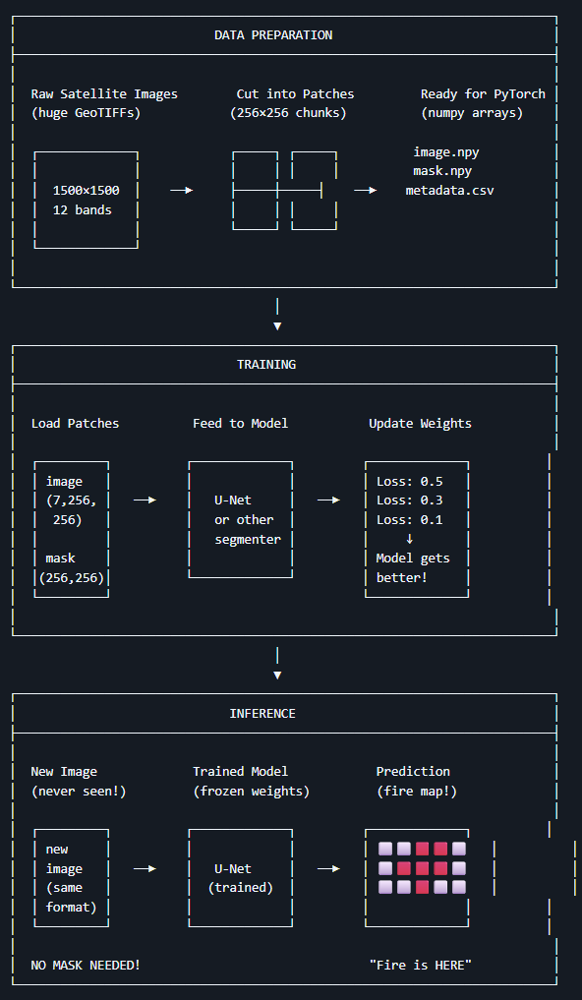

| Dataset | Size | Source | Key Feature |
|---|---|---|---|
| CEMS-Wildfire | ~500 events | Copernicus/HuggingFace | DEL + GRA + cloud masks |
| Sen2Fire | 2,466 patches | Zenodo / arXiv:2403.17884 | 13 bands + NDVI, Australia |
| EO4WildFires | 31,730 events | HuggingFace | Multi-modal, 45 countries |
| Land8Fire | ~20,000 patches | MDPI Remote Sensing 2025 | Global, Landsat-8 |
| TS-SatFire | ~71 GB | arXiv:2412.11555 | Temporal, US, multi-task |


### Data Format

Each CEMS activation provides the following files per area of interest:

```
EMSR{id}_AOI{n}_{seq}_S2L2A.tif    ← Sentinel-2 image (multi-band GeoTIFF)
EMSR{id}_AOI{n}_{seq}_DEL.tif      ← Binary delineation mask (0/1)
EMSR{id}_AOI{n}_{seq}_GRA.tif      ← Severity grading mask (0–4)
EMSR{id}_AOI{n}_{seq}_CM.tif       ← Cloud mask (0–3)
EMSR{id}_AOI{n}_{seq}_LC.tif       ← Land cover mask
satelliteData.csv                   ← Metadata including GRA availability flag
```

### Data Structure and Organization

```
data/
├── cems-wildfire/
│   ├── activations/
│   │   ├── EMSR230/
│   │   │   ├── AOI01/
│   │   │   │   ├── *_S2L2A.tif
│   │   │   │   ├── *_DEL.tif
│   │   │   │   ├── *_GRA.tif
│   │   │   │   └── *_CM.tif
│   └── satelliteData.csv
├── data-sen2fire/
│   ├── scene1/ ... scene4/
│   │   └── *.npz  (image, aerosol, label)
patches/            ← CEMS DEL patches (256×256, binary)
patches_gra/        ← CEMS GRA patches (256×256, severity 0–4)
```

---

## Experimental Setup: Our Approach to Wildfire Detection with Deep Learning Architecture

### The Complete Pipeline

The pipeline follows a structured sequence:

1. **Data ingestion** — Download CEMS activations and Sen2Fire patches
2. **Preprocessing** — Band selection, normalization, cloud filtering, NDVI computation
3. **Patch extraction** — Tile full scenes into 256×256 patches with 50% overlap
4. **Augmentation** — Random flips, rotations, color jitter on spectral bands
5. **Training Phase 1** — Binary segmentation on CEMS DEL + Sen2Fire
6. **Training Phase 2** — Severity fine-tuning on CEMS GRA (dual-head)
7. **Evaluation** — fire\_iou, fire\_recall, mean\_iou, detection F1
8. **Inference** — Patch-based sliding window on full Sentinel-2 scenes
9. **Application** — Streamlit app with Planetary Computer data source

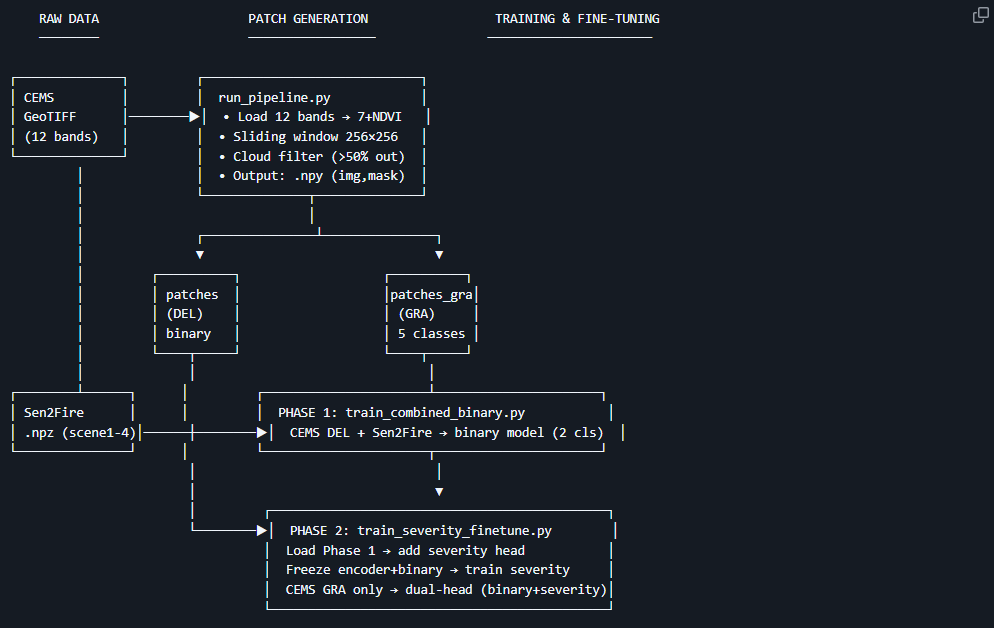


### Data Preparation

The data preparation workflow includes:

| Step | Detail |
|---|---|
| Band selection | 7 bands: B2 (Blue), B3 (Green), B4 (Red), B8 (NIR), B8A (Red-Edge), B11 (SWIR1), B12 (SWIR2) |
| NDVI | (B8 − B4) / (B8 + B4); appended as 8th channel |
| Normalization | Per-band min-max to [0, 1] using training-set statistics |
| Cloud filtering | Skip patches with > 50% cloud coverage (CM mask) |
| Patch size | 256×256 pixels (CEMS); 512×512 (Sen2Fire, resized) |
| Overlap (train) | 50% stride (128 px) for data augmentation effect |
| Overlap (infer) | Gaussian-weighted smooth blending across patches |

### What's in the Data

Those datasets have been selected for the breadth of information they can provide thru their imagery. Regular photos have 3 channels: Red, Green, Blue (RGB). But satellite images are special — they capture light our eyes can't see.

Why so many channels? Different wavelengths reveal different things:


- **SWIR (Short-Wave Infrared):** Burned areas show up really clearly here — like a superpower for detecting fire damage
- **NIR (Near-Infrared):** Healthy plants reflect this strongly, dead/burned plants don't

#### Labeled by Experts

For every satellite image, experts have drawn where the fire burned. This is the "answer key":

- **DEL (Delineation)** — Binary: burned or not burned
  - 0 = not burned (background)
  - 1 = burned (fire area)

- **GRA (Grading)** — Severity levels
  - 0 = no damage
  - 1 = minimal damage
  - 2 = moderate damage
  - 3 = high damage
  - 4 = destroyed

### Wildfire Masks

From Copernicus Rapid Mapping for each activation under the tag Wildfire are available different post-fire products:

- **FEP (First Estimation):** a first estimation of the burned area.
- **DEL (Delineation):** a delineation of the area affected by the wildfire.
- **GRA (Grading):** a detailed description about the severity of the burned area.

Each product includes metadata and associated JSON files which contain geographical details about the affected areas.

#### Understanding the Severity Mask (GRA)

When opening the TIF files from the CEMS dataset, that file contains integer values 0, 1, 2, 3, 4 and it looks that all the image is black. This has an explanation, since in a scale of 256 colors, 0–4 are near zero, that means near to black. So, the data is correct, it just needs some scaling.

In fact, the PNG file is a visualization of that TIF with a colormap applied to those 0–4 values:

| Value | Meaning | PNG Color | RGB |
|---|---|---|---|
| 0 | No damage | Black | (0, 0, 0) |
| 1 | Negligible | Light Green | (181, 254, 142) |
| 2 | Moderate | Yellow | (254, 217, 142) |
| 3 | High | Orange | (254, 153, 41) |
| 4 | Destroyed | Dark Red | (204, 76, 2) |

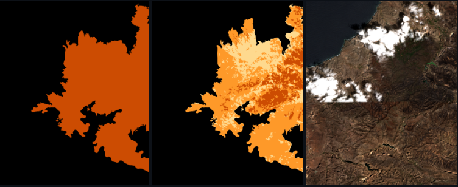


So, for training, use the TIF (with values 0–4). The PNG is just for humans to look at.

Here in order are reported the DEL map, GRA map and the actual Sentinel-2 Image for the activation EMSR382.

#### Not All Images Have Severity (GRA)

Some fires only have DEL (binary burned/not burned), while some have both DEL and GRA (severity levels). This depends on what CEMS analysts provided. The `satelliteData.csv` has a GRA column (0 or 1) indicating availability.

#### Why Overlap During Training?

- A fire at the edge of patch 1 appears in the middle of patch 2
- The model sees each area from different "contexts"
- It's like data augmentation — more training examples!

In our case, we use 50% overlap (stride of 128 pixels) during training.

#### Which Tasks Can We Tackle with All This Data?

Based on the data we can use for our model, we can address 2 different types of tasks:

- **Classification (Binary).** Is the simpler task and it provides answer to the question "Does this patch contain any fire?"
  - Yes (1)
  - No (0)
  - We could do this by checking if any pixel in the mask > 0, then label = 1

- **Segmentation.** It addresses the question "Which pixels are burned?" And the answer must provide a mask of the same size as the input. The Segmentation task is harder because you are making thousands of predictions (one per pixel) instead of just one for all the patch.

### Cloud Masks

#### Why Cloud Masks Matter

When the satellite takes a photo, it captures whatever is there — including clouds. Since the cloud pixels contain cloud reflectance, NOT ground information. That data is useless for fire detection.

Cloud masks help since we can ignore those pixels marked as cloud reflectance. Then, either we skip those pixels or we mask out cloudy pixels from the loss calculation. Therefore, during training we skip patches with too many clouds (> 50% cloudy is unreliable).

On the other side, during inference, we must flag predictions in cloudy areas as "uncertain" or, just don't make predictions for those pixels.

#### How to Manage Cloud Masks

A special topic is on how to deal with clouds (a weather condition) in the images from the dataset. Creating cloud masks before making inferences on Sentinel-2 images is important because clouds can obscure or distort the underlying land cover or land use information that is the focus of the analysis. This can lead to inaccurate or incomplete results. Sentinel-2 images are often used for remote sensing applications, such as monitoring vegetation health, mapping land cover and land use, and detecting changes over time. However, clouds can interfere with these applications by blocking or reflecting the light that is captured by the satellite, which can result in missing or distorted data. By default, all images are retrieved from sentinel-hub with the condition of no more than 10 percent of cloud coverage. However some images have a relevant cloud coverage.

This dataset makes available for each image a cloud mask: the areas that are affected by clouds can be identified and excluded from future analyses. This ensures that the inferences made from the Sentinel-2 data are based on accurate and reliable information. The masks were generated using the CloudSen12 model.

The output prediction of CloudSen12 has 4 different layers for cloud coverage:

| Label | Class | Class Definitions | Color |
|---|---|---|---|
| 0 | Clear | Areas where no clouds are found | #67BEE0 |
| 1 | Clouds | Clouds and heavy clouds are present, terrain is obscured and not visible | #DCDCDC |
| 2 | Light clouds | Areas affected by light clouds, where could cause some issue in the terrain visibility. In this class are included also fog and wildfire's smoke. | #B4B4B4 |
| 3 | Shadow | These areas are in the shadow of the clouds. The terrain is partially/fully visible but the color and some bands of Sentinel-2 could be changed from real value. | #3C3C3C |

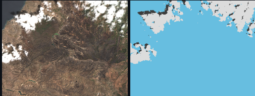


### Landcover Masks

In addition to wildfire delineation, severity and cloud masks, also the landcover is provided for each image. In particular the models considered are:

- [**ESRI 10m Annual Land Use Land Cover (2017–2021)**](https://ieeexplore.ieee.org/stamp/stamp.jsp?tp=&arnumber=9553499&tag=1)
- [**ESRI 2020 Global Land Use Land Cover**](https://ieeexplore.ieee.org/stamp/stamp.jsp?tp=&arnumber=9553499&tag=1)
- [**ESA WorldCover 10 m**](https://esa-worldcover.org/en)

### JSON Metadata

Each CEMS activation includes a JSON metadata file with geographic details:

```json
{
  "activation_id": "EMSR230",
  "event_type": "Wildfire",
  "country": "Portugal",
  "date": "2017-06-17",
  "aoi_list": ["AOI01", "AOI02"],
  "has_gra": true,
  "sentinel2_tiles": ["29TNE", "29TPE"]
}
```

### Data Preprocessing

The preprocessing pipeline is implemented in `fire-pipeline/dataset.py` and covers the following transformations:

| Step | CEMS | Sen2Fire |
|---|---|---|
| Band loading | GeoTIFF (variable bands) | .npz `image` key |
| Band selection | [B2, B3, B4, B8, B8A, B11, B12] | [B2, B3, B4, B8, B8A, B11, B12] |
| NDVI | Computed from B8 and B4 | Computed from B8 and B4 |
| Normalization | Per-band min-max (train stats) | Divide by 10000 (DN → reflectance) |
| Cloud filter | CM mask threshold | s2cloudless score threshold |
| Mask loading | DEL or GRA .tif | label .npz key |
| Patch size | 256×256 | 512×512 → resize to 256×256 |

### Patch Extraction

#### Why Do We Cut Images into Patches?

Sentinel-2 scenes are 10,980 × 10,980 pixels — far too large to feed directly into a GPU. Cutting them into patches solves:

- **GPU memory:** A 256×256 patch fits comfortably in VRAM; a full scene would require hundreds of GB
- **Batch training:** Many patches per scene = many gradient updates per epoch
- **Augmentation:** Each patch can be independently flipped, rotated, etc.
- **Inference tiling:** Same patch size at inference ensures consistent model behavior

#### Patch Extraction Parameters

| Parameter | Training | Inference |
|---|---|---|
| Patch size | 256×256 | 256×256 |
| Stride | 128 (50% overlap) | 192 (25% overlap) |
| Min fire pixels | ≥ 1 (positive patches only in some configs) | N/A |
| Max cloud fraction | 0.50 | Flag as uncertain |
| Output format | `*_image.npy`, `*_mask.npy` | Stitched back to full scene |

### Smoothing-Blend Image Patches

To avoid block artifacts at patch boundaries during inference, we use Gaussian-weighted blending (Chevalier, n.d.):

- Each patch prediction is multiplied by a 2D Gaussian weight map (higher weight at center, lower at edges)
- Overlapping patches are averaged by accumulated weights
- This produces smooth, artifact-free segmentation maps on full Sentinel-2 scenes

### Data Augmentation

Augmentation is applied only during training, to the image patch (not the mask, except for geometric transforms):

| Transform | Parameters |
|---|---|
| Random horizontal flip | p = 0.5 |
| Random vertical flip | p = 0.5 |
| Random 90° rotation | p = 0.5 |
| Random brightness/contrast | factor ∈ [0.8, 1.2], p = 0.3 |
| Gaussian noise | σ ∈ [0, 0.02], p = 0.2 |

No color-space augmentation is applied to SWIR/NIR bands (they encode physical properties that should not be distorted).

### Dataset Split Strategy

| Split | CEMS | Sen2Fire |
|---|---|---|
| Train | Activations 2017–2021 | scene1 + scene2 (1,458 patches) |
| Val | Activations 2022 | scene3 (504 patches) |
| Test | Activations 2023 | scene4 (504 patches) |

Splits are done at the **activation level** (not patch level) to prevent data leakage: all patches from one fire event go to the same split.

### How Everything Connects

```
CEMS Raw Data          Sen2Fire Raw Data
      │                       │
      ▼                       ▼
 Preprocessing            Preprocessing
 (bands, NDVI,           (DN→reflectance,
  cloud filter)           NDVI, resize)
      │                       │
      ▼                       ▼
  Patch extraction       Already patches
  (256×256, 50% OL)     (512→256 resize)
      │                       │
      └──────────┬────────────┘
                 ▼
         Combined Dataset
         (Phase 1 binary)
                 │
         ┌───────┴───────┐
         ▼               ▼
    Train splits     Val / Test splits
         │
         ▼
    DataLoader
    (batch, augment)
         │
         ▼
      Model
    (U-Net / U-Net++)
         │
         ▼
  Loss (BCE + Dice)
         │
         ▼
   Backprop / Adam
         │
         ▼
  Checkpoint (best val fire_iou)
```

### Sen2Fire Dataset Integration Plan

The Sen2Fire dataset integration plan follows this workflow:

| Component | Script | Description |
|---|---|---|
| Sen2Fire dataset | `fire-pipeline/sen2fire_dataset.py` | Loads .npz patches; supports --no-ndvi, --max-cloud-score (s2cloudless). Optional dep: s2cloudless in train / all extras. |
| Sen2Fire fine-tune | `fire-pipeline/train_sen2fire_finetune.py` | Loads CEMS checkpoint (dual or single-head), freezes severity head, trains binary on Sen2Fire. `--checkpoint`, `--sen2fire-dir`, `--output-dir`, `--max-cloud-score`, `--no-s2cloudless`, `--no-ndvi`. |
| Inference dual-head | `fire-pipeline/inference.py` | Loads `FireDualHeadModel` when `config.dual_head`; returns `InferenceResult` with `binary_segmentation`, `severity_segmentation`, `binary_probabilities`, `severity_probabilities`. |
| App: two layers | `fire-pipeline/app.py` | When `result.dual_head`, two checkboxes: "Show binary fire map", "Show severity map"; each toggles a separate overlay. |
| History (dual-head) | `fire-pipeline/storage.py` | Saves/loads `binary_segmentation`, `severity_segmentation`, `binary_probabilities`, `severity_probabilities` in result npz; `metadata.dual_head` so history view shows both layers. |
| Tests | `fire-pipeline/tests/` | `test_cloud_detection.py`, `test_sen2fire_dataset.py`, `test_model_dual_head.py`; dual-head save/load in `test_storage.py`; dual-head `InferenceResult` and `create_visualization_from_segmentation` in `test_inference.py`. |

### Sen2Fire Dataset Summary

| Aspect | Detail |
|---|---|
| Source | [Zenodo 10881058](https://zenodo.org/records/10881058), paper: [Sen2Fire arXiv:2403.17884](https://arxiv.org/abs/2403.17884) |
| Content | 2,466 patches from 4 bushfire scenes, NSW Australia, 2019–2020 season |
| Patch size | 512×512 (vs CEMS 256×256) |
| Bands | 12 Sentinel-2 L2A + 1 Sentinel-5P aerosol index (13 channels) |
| Labels | Binary fire mask only (0/1), from MOD14A1 V6.1 — **no severity (GRA)** |
| Splits | **Train**: scene1 + scene2 (1,458 patches). **Val**: scene3 (504). **Test**: scene4 (504). |
| Format | .npz per patch: image (12, 512, 512) int16, aerosol (512, 512), label (512, 512) uint8 |
| Values | Reflectance-style DN (e.g. ×10000); need to normalize to [0, 1] or similar |
| Cloud mask | **None** — we need to infer or filter cloudy patches |

---

## Model Development and the Training Process

### Architecture Selection

Architecture selection is choosing the neural network structure for semantic segmentation. For this project, we need an architecture that preserves spatial information, handles multi-spectral input (7 bands), and outputs binary masks at the same resolution.

### Recommended Architecture: U-Net with Pretrained Encoder

U-Net is the industry standard for semantic segmentation in remote sensing. Its key advantages are:

- **Skip Connections:** Preserve fine-grained spatial details critical for detecting small fires and precise boundaries
- **Encoder-Decoder Structure:** Encoder learns high-level fire patterns, decoder reconstructs full-resolution masks
- **Proven Performance:** Widely used in remote sensing competitions with excellent results on similar tasks
- **Efficiency:** Lightweight, fast inference, good accuracy/speed balance
- **Flexibility:** Easy to modify, works with pretrained encoders, handles multi-spectral inputs

U-Net Architecture: Encoder downsamples from 256×256 to 16×16, extracting features. Decoder upsamples back to 256×256, with skip connections preserving spatial details from encoder layers.

A Pretrained Encoder is important because of transfer learning from ImageNet providing general visual features (edges, textures, patterns), leading to faster convergence, 5–10% better accuracy, and less data needed.

Here are some encoder options that we will take into consideration:

| Encoder | Parameters | Speed | Accuracy | When to Use |
|---|---|---|---|---|
| ResNet-34 | ~21M | Medium | High | Balanced performance |
| EfficientNet-B0 | ~5M | Fast | Good | If speed is critical or GPU memory limited |
| ResNet-50 | ~25M | Slower | Very High | If accuracy is more important than speed |
| EfficientNet-B3 | ~12M | Medium | High | Alternative to ResNet-34, more efficient |

On the other side, the Decoder can be a Standard U-Net decoder with upsampling, skip connections, and 2× Conv3×3 + ReLU + BatchNorm per level. The Output will be single 1×1 convolution with sigmoid activation.

From that list of deep learning architectures, we focused on 2 encoder-decoder segmentation models with pretrained backbones, 8-channel multispectral input and a two-phase training strategy (first binary classification, then severity grading). Both use the same residual learning principle — skip connections that let gradients flow without vanishing — but with a fundamentally different building block.

### ResNet34 + U-Net

ResNet34 pretrained on ImageNet is a standard torchvision model that converges faster when fine-tuned on satellite data than a randomly initialised network, especially when labelled fire datasets are small.

ResNet34 + U-Net is actually the classic lightweight alternative to the ResNet50 + U-Net++ combination (that we will see later). Its main features are:

- 21M parameters, balanced performance (IoU: 0.70–0.75)
- Most widely used, well-documented, excellent pretrained weights
- Requires 8GB+ VRAM

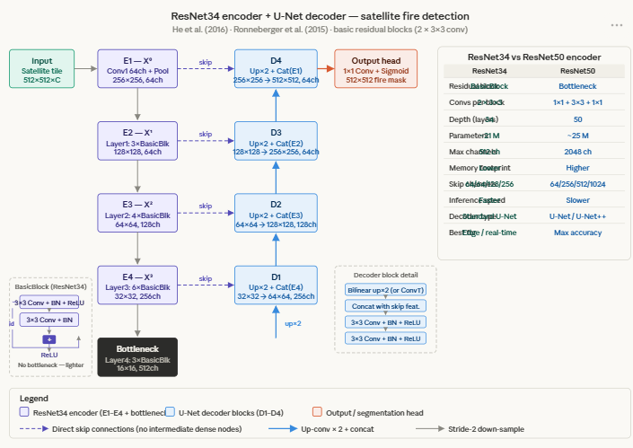

### ResNet50 + U-Net++

Our preferred option has been ResNet50 + U-Net++ for training, with a powerful pretrained feature extractor (ResNet50) with an advanced segmentation decoder (U-Net++), that is, probably, one of the strongest choices for fire and burn detection from satellite imagery.

Key features of this architecture are:

- **ResNet50 Encoder:** On the left, a standard ResNet50 model (pre-trained on ImageNet is common) acts as the feature extractor. It is composed of five stages that progressively downsample the image while extracting increasingly complex semantic features. Residual blocks with skip connections are highlighted within the encoder stages.

- **Multispectral Input:** The input is a multi-channel satellite patch (e.g., RGB + Short-Wave Infrared), as these bands are crucial for differentiating active fires from smoke or hot ground.

- **U-Net++ Decoder with Nested Skip Pathways:** This is the core of the design. Unlike standard U-Net, which uses direct skip connections between encoder and decoder at the same resolution, U-Net++ uses a dense, nested structure. Feature maps from the encoder pass through a series of intermediate convolutional layers before being concatenated with the decoder layers. This helps bridge the semantic gap between encoder and decoder features, improving the accuracy of edge detection and segmentation for small fire hotspots.

- **Deep Supervision:** The multiple output branches ($O_1, O_2, O_3, O_4$) allow the model to learn at multiple scales and capture both large burn scars and tiny initial ignitions. The final output is an ensemble or selection of these masks.

- **Fire Mask Output:** The output is a binary mask where white pixels indicate detected fire, corresponding to the hotspots visible in the input image.

> This combined approach leverages the powerful feature extraction of ResNet with the high-resolution localization capabilities of U-Net++ dense skip connections for precise fire segmentation. (He, 2016) (Zhou, 2018) (Ghandorh, 2023)

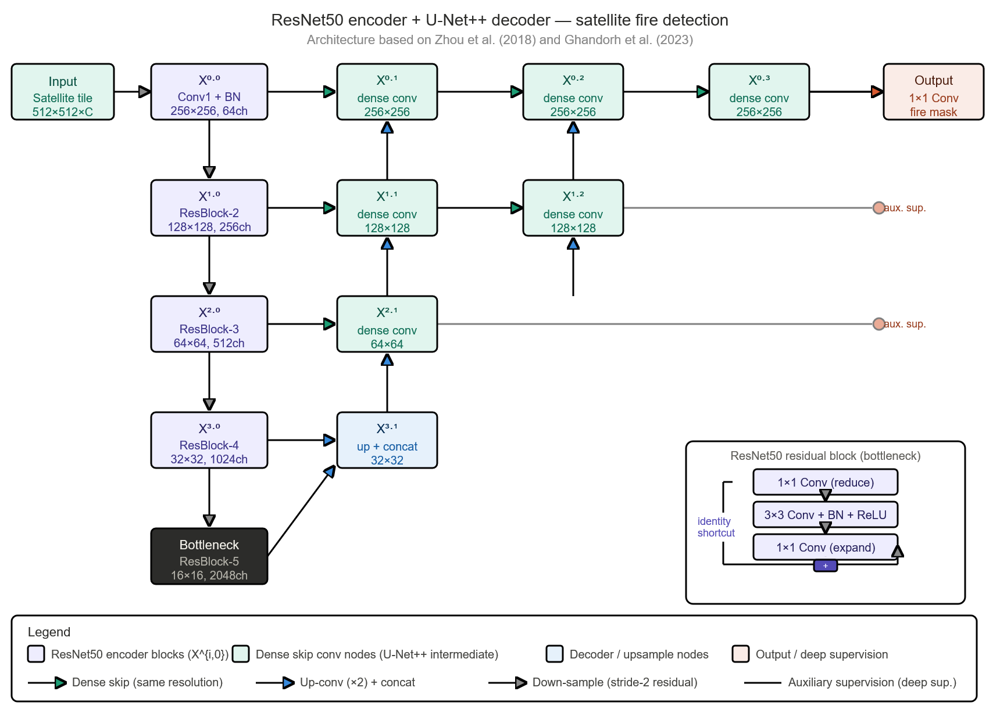


Let's provide some comparison between both architectures:

ResNet34 provides roughly 21 million parameters, compared to ~25 million for ResNet50 — but the key difference is not just the count, it is the maximum channel width. ResNet50's bottleneck design pushes feature maps up to 2048 channels, which is expensive both in memory and in the decoder's concatenation operations. ResNet34 caps out at 512 channels, making decoder blocks significantly lighter and faster. But, those additional channels in ResNet50 + U-Net++ encode progressively more abstract combinations of spectral bands. In Sentinel-2 imagery, the visual difference between an active fire pixel, a highly reflective urban surface, and sun glint over water is subtle in RGB but separable in the full 13-band spectral space. ResNet50's wider representations learn those discriminative spectral patterns more reliably.

On the performance side, taking into consideration that fire-monitoring pipelines process large geospatial tiles — Sentinel-2 produces 10,980 × 10,980 pixel scenes. These are typically tiled into 512×512 or 256×256 patches at inference time. ResNet34's lighter footprint means more patches can be processed per second per GPU, which is critical for near-real-time alerting.

Here there are summary tables comparing both architectures:

| Component | ResNet34 + U-Net | ResNet50 + U-Net++ |
|---|---|---|
| Encoder | ResNet34 (21M) | ResNet50 (25M) |
| Decoder | U-Net (direct skips) | U-Net++ (nested dense skips) |
| Total params | **~24.5M** | **~49M** |
| Best for | Speed, deployment | Accuracy |

| Criterion | ResNet34 + U-Net | ResNet50 + U-Net++ |
|---|---|---|
| Inference speed | Faster — better for near-real-time | Slower |
| GPU memory | Lower — fits on edge devices | Higher |
| Segmentation accuracy | Slightly lower | Higher (denser skip pathways) |
| Training data needed | Less — simpler model generalizes better | More — extra capacity can overfit |
| Small fire detection | Good | Better — nested nodes reduce semantic gap |
| Operational deployment | Preferred | Preferred for research benchmarks |

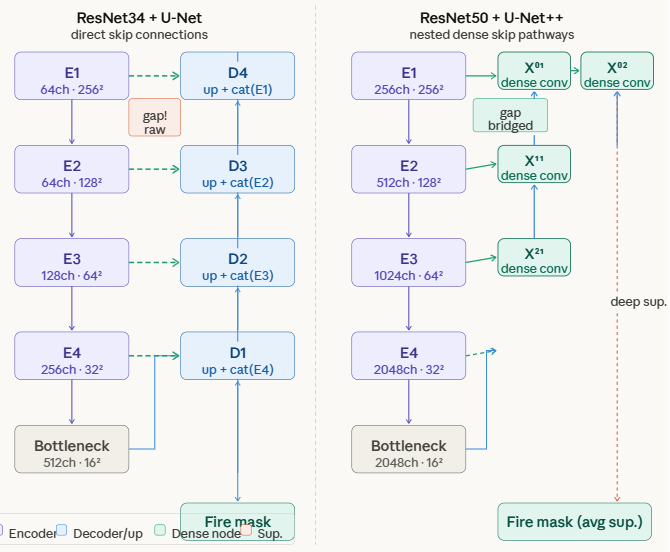


### Training Goals and Tasks

- **Goal:** Train a **semantic segmentation** model on CEMS wildfire patches (7-channel input, pixel-wise labels) and optionally use it for **binary fire detection** (patch-level "has fire" derived from segmentation). In fact, a single model can do a pixel-wise segmentation and patch-level detection/confidence. So we wouldn't need to train a separate classifier since detection is derived from segmentation by 'any fire pixel in the patch'.

- **Entry point:** `train.py` in `fire-pipeline/`. It builds data loaders (from the data transformation pipeline), model, loss, optimizer, scheduler, and metrics; runs train/val loops; saves checkpoints and supports resume and W&B.

- **Outputs:** `output_dir/config.json`, `output_dir/checkpoints/best_model.pt`, `final_model.pt`, and periodic checkpoints.

One training script covers both DEL (binary) and GRA (5-class); we pick the best model by validation fire IoU and can resume or log to Weights & Biases.

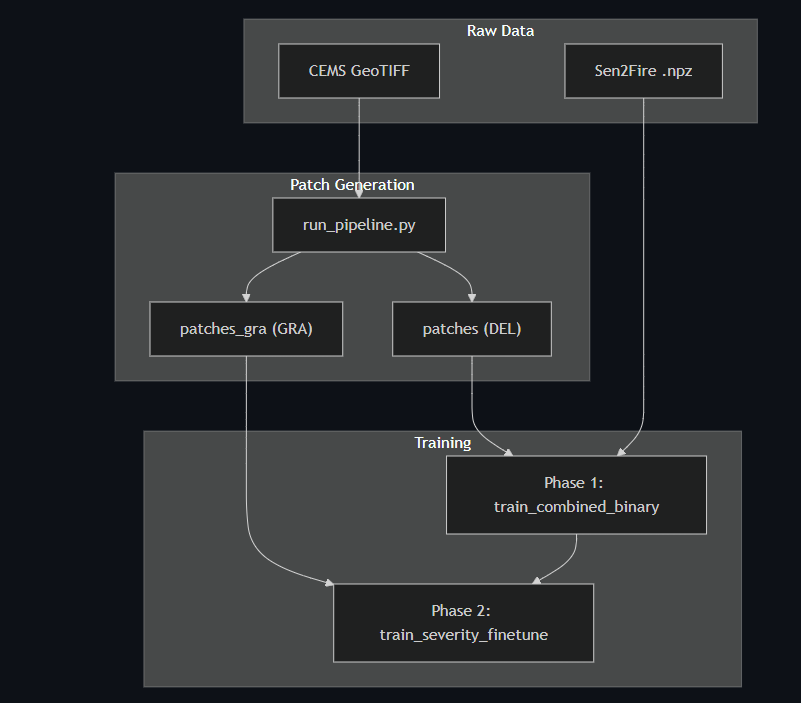


For the training process we plan to use an input Tensor with the following shape:

- Multiple images at once (batch)
- 7 spectral bands (we will pick the useful ones from here)
- Width and Height of 256 × 256

On the other side, the shape of the Target mask will include:

- One label per pixel (0, 1, 2, 3 or 4), representing the fire severity.
- Same Width and Height as input: 256 × 256

### Training the Model

#### What the Model Learns

The model learns patterns like:

- "When SWIR bands show high values + NIR shows low values → probably burned"
- "This texture pattern usually means fire damage"
- "Edges between these colors often indicate burn boundaries"

#### Model Checkpointing Strategy

We followed a simple checklist when running and comparing different models:

- Ensure we are saving the best model whenever validation IoU improves
- Save periodic checkpoints every few (e.g. 10) epochs
- Save final model at end of training
- Include model weights, optimizer state, and metadata
- Link checkpoints to experiment tracking (W&B run ID)

### Model Optimization

Model optimization is the process of finding the best hyperparameters to maximize model performance. We usually focus on hyperparameters that have the biggest impact on performance.

#### Training Configuration

Training configuration determines how the model learns from data. This includes the loss function (what the model tries to minimize), optimizer (how it updates weights), learning rate schedule (how fast it learns over time), and other hyperparameters that control the training process. Here is where we have to take into consideration:

- **Loss function** — What should the model optimize for:
  - Recommendation here is a combination of Binary Cross Entropy (BCE) (good for pixel-wise accuracy) and Dice (it helps with region overlap and optimizes the Intersection over Union IoU)
  - Our recommended formula: `total = 0.5 * CE + 0.5 * Dice`

- **Optimizer** — How to update the model weights based on gradients:
  - Here, the choices were AdamW because of its adaptive learning rate and how it handles sparse gradients; or SGD because it's more efficient (less memory) and sometimes has better generalization.
  - In our case, we started defining optimizer as AdamW (`lr=1e-4`, `weight_decay=1e-4`).

- **Learning Rate** — How to control the step size to avoid instability or slow convergence:
  - ReduceLROnPlateau looks to be a good choice since it reduces the Learning Rate when validation metric stops improving.
  - Other options could be OneCycleLR (for faster convergence) and Cosine Annealing (for longer training and smooth decay).
  - In our case, we have started with `ReduceLROnPlateau` on validation `fire_iou` (`mode=max`) with `factor=0.5`, `patience=5`.

- **Hyperparameters** — How to find a balance between training speed, stability and performance:
  - **Batch Size:** Since in our case we configured our Virtual Machine with 16 GB we could afford to define a batch size of 16–32, even though 8–12 is the usual recommendation.
  - **Number of Epochs:** The minimum for a reasonable performance should be set at 30. In general, we should look at how IoU metric (Intersection over Union) evolves with the number of epochs.
  - **Mixed Precision Training (FP16):** This is about reducing memory usage and speeding up training with the use of 16-bit floating point instead of 32-bit. This can help to speed up training.

### Sen2Fire Fine-Tune

After Phase 1 (CEMS binary training), we fine-tune on Sen2Fire to improve generalization to Australian bushfire imagery:

```bash
python fire-pipeline/train_sen2fire_finetune.py \
  --checkpoint output/v3_binary/resnet50_unetpp/best_model.pt \
  --sen2fire-dir ../data-sen2fire \
  --output-dir output/sen2fire_finetune \
  --epochs 20 \
  --lr 1e-5 \
  --max-cloud-score 0.3
```

### Our Training Strategy: CEMS First, Then Sen2Fire

The two-phase strategy ensures the model first learns robust fire detection on high-quality European data (CEMS), then generalizes to a different fire regime (Australian bushfires in Sen2Fire).

```
Phase 1: CEMS DEL + Sen2Fire (binary, combined)
    ↓  best checkpoint selected by val fire_iou
Phase 2: CEMS GRA only (severity fine-tune, dual-head)
    ↓  severity head trained; binary head frozen
Final model: dual-head (binary + severity)
```

### Training Plan (1)

```bash
# ResNet50 + U-Net++ (best accuracy)
python fire-pipeline/train.py \
  --encoder resnet50 \
  --decoder unetplusplus \
  --patches-dir ../patches \
  --sen2fire-dir ../data-sen2fire \
  --output-dir output/v3_binary/resnet50_unetpp \
  --epochs 50 \
  --batch-size 16 \
  --lr 1e-4 \
  --weight-decay 1e-4

# ResNet34 + U-Net (balanced speed/accuracy)
python fire-pipeline/train.py \
  --encoder resnet34 \
  --decoder unet \
  --patches-dir ../patches \
  --sen2fire-dir ../data-sen2fire \
  --output-dir output/v3_binary/resnet34_unet \
  --epochs 50 \
  --batch-size 16 \
  --lr 1e-4 \
  --weight-decay 1e-4

# MobileNetV2 + U-Net (lightweight)
python fire-pipeline/train.py \
  --encoder mobilenet_v2 \
  --decoder unet \
  --patches-dir ../patches \
  --sen2fire-dir ../data-sen2fire \
  --output-dir output/v3_binary/mobilenet_unet \
  --epochs 50 \
  --batch-size 32 \
  --lr 1e-4 \
  --weight-decay 1e-4
```

### Cloud Handling for Sen2Fire (no cloud masks)

Sen2Fire does not include cloud masks. To handle this:

1. **s2cloudless** (default): Apply the s2cloudless model on the fly during data loading. Patches with `cloud_score > threshold` (default 0.3) are skipped.
2. **No cloud filtering** (`--no-s2cloudless`): Skip cloud detection entirely. Useful for fast experimentation.
3. **Manual inspection**: Visually check the Sen2Fire scenes — the 4 Australian bushfire scenes (2019–2020) are mostly cloud-free by selection.

### Combined Binary + Severity Training Workflow

#### Why This Workflow

- Binary segmentation (DEL) has more data (all CEMS activations + Sen2Fire)
- Severity (GRA) has less data (only CEMS activations with GRA annotations)
- A single model can output both: binary head always active, severity head fine-tuned

#### Phase 1: Combined Binary Training

```bash
python fire-pipeline/train.py \
  --patches-dir ../patches \
  --sen2fire-dir ../data-sen2fire \
  --output-dir output/v3_combined_binary \
  --encoder resnet50 --decoder unetplusplus \
  --epochs 50 --batch-size 16 --lr 1e-4
```

#### Phase 2: Severity Fine-Tuning

```bash
python fire-pipeline/train_severity.py \
  --checkpoint output/v3_combined_binary/best_model.pt \
  --patches-gra-dir ../patches_gra \
  --output-dir output/v3_severity \
  --encoder resnet50 --decoder unetplusplus \
  --epochs 30 --batch-size 16 --lr 5e-5
```

### Two-Head Model Rationale

| Head | Input | Output | Loss |
|---|---|---|---|
| Binary | 8-channel patch | 1-channel sigmoid (fire prob) | BCE + Dice |
| Severity | 8-channel patch | 5-channel softmax (classes 0–4) | CrossEntropy (weighted) |

The encoder and decoder are shared. Only the final 1×1 convolution differs per head. This allows:
- Efficient inference (one forward pass for both outputs)
- Knowledge transfer (binary features help severity)
- Flexible deployment (use binary head only if no severity needed)

### Vegetation (NDVI)

NDVI (Normalized Difference Vegetation Index) is computed as:

```
NDVI = (NIR - Red) / (NIR + Red) = (B8 - B4) / (B8 + B4)
```

- **High NDVI** → healthy vegetation
- **Low NDVI** → burned areas, water, bare soil, shadow

Both CEMS and Sen2Fire support 8-channel input (7 bands + NDVI). Use NDVI by default; disable with `--no-ndvi` if needed.

### Data Requirements

| Dataset | Phase | Mask Type | Patches |
|---|---|---|---|
| CEMS | 1 | DEL (binary) | `./patches` (train/val/test) |
| Sen2Fire | 1 | Binary | `../data-sen2fire` (scene1–4) |
| CEMS | 2 | GRA (severity) | `./patches_gra` (train/val/test) |

### V3 Pipeline: Model Architectures & Training Commands

Here we describe the model architectures used in the combined binary + severity workflow, recommended encoder/decoder combinations, and copy-paste commands to train each variant.

#### Patch Generation

We generate patches before training.

##### CEMS DEL patches (`../patches`)

Binary fire/no-fire masks. Used for **Phase 1** (combined binary training).

Output: `../patches/train/`, `../patches/val/`, `../patches/test/` with `*_image.npy` and `*_mask.npy` (binary 0/1).

##### CEMS GRA patches (`../patches_gra`)

**What is patches_gra?** CEMS patches with **GRA (Grading)** masks — 5 severity levels (no damage, negligible, moderate, high, destroyed) instead of binary. Used for **Phase 2** (severity fine-tuning). Only CEMS images that have GRA annotations are included (check `satelliteData.csv` column GRA).

Output: `../patches_gra/train/`, `../patches_gra/val/`, `../patches_gra/test/` with `*_image.npy` and `*_mask.npy` (values 0–4).

**Sen2Fire patches (`../data-sen2fire`)**

Sen2Fire patches are **not** generated by `run_pipeline.py`. The dataset is downloaded from [Zenodo 10881058](https://zenodo.org/records/10881058).

Summary:
- **Phase 1:** Single-head binary (encoder + decoder + binary head)
- **Phase 2:** Dual-head (encoder + decoder + binary head frozen + severity head trained)

### Training Summary

Here is a summary on estimated consumption and performance across both architectures at our virtual machine (with a single GPU):

| Phase | Model | Epochs (actual) | Max Epochs | Batch Size | GPU Memory | Training Time |
|---|---|---|---|---|---|---|
| Phase 1 (binary) | ResNet34+U-Net | 17 | 50 | 16 | ~6–8 GB | ~15 min |
| Phase 1 (binary) | ResNet50+U-Net++ | 27 | 50 | 16 | ~10–12 GB | ~30 min |
| Phase 2 (severity) | Either | ~8–19 | 30 | 16 | ~6–12 GB | ~10–20 min |

| Requirement | ResNet34 + U-Net | ResNet50 + U-Net++ |
|---|---|---|
| Parameters | 24.5M | 49M |
| Checkpoint size | 94 MB | 188 MB |
| GPU memory (train) | ~6–8 GB | ~10–12 GB |
| GPU memory (inference) | ~2 GB | ~4 GB |
| Training time (Phase 1) | ~15 min (17 epochs) | ~30 min (27 epochs) |
| Inference speed | Faster | Slower |

### Virtual Machine — Compute Instance & Software Stack

To run our training and inference experiments, we defined an instance in Google Cloud which includes a:

- g2-standard-4 (4 vCPUs, 16 GB Memory)
- CPU platform: Intel Cascade Lake
- GPU: NVIDIA L4
- 500 GB Disk
- Operating system: Debian GNU/Linux 11
- With common Deep Learning frameworks (TensorFlow, PyTorch), CUDA, and NVIDIA drivers pre-installed

Google Cloud Platform provides the best balance of simplicity, functionality, and cost-effectiveness for capstone projects when university credits are available.

- We have set up a Git repository with proper structure
- We created a project directory structure (`data/`, `models/`, `notebooks/`, `src/`, `tests/`)
- We set up Weights & Biases (W&B) account and created a project
- We configured W&B project settings (entity, project name, tags)

---

## The Inference Process

### What About Inference?

Inference is about using our trained model on new images. The input format for the inference will be identical to training input:


- Same 7 bands (or 12 if you use all)
- Same 256×256 patch size
- Same value range (0–1)

### Inference on a Full Image

When dealing with real images, since they are huge, we had to:

- Cut the new image into patches (no overlap needed, or small overlap)
- Run each patch through the model
- Stitch the predictions back together

### What Are the Labels?

The labels are the mask files (DEL and GRA) so, for every satellite image, there is a corresponding mask that shows where fire burned. So for each satellite image:

```
EMSR230_AOI01_01_S2L2A.tif    ← INPUT (what satellite sees)
EMSR230_AOI01_01_DEL.tif      ← LABEL (binary: fire/no fire)
EMSR230_AOI01_01_GRA.tif      ← LABEL (severity: 0–4)
EMSR230_AOI01_01_CM.tif       ← Cloud mask (helper data)
```

After patching:

```
patch_r0_c0_image.npy    ← INPUT (256×256×7 channels)
patch_r0_c0_mask.npy     ← LABEL (256×256 with 0/1 or 0–4)
```

### How Was the Data Labeled?

The data was not labeled by an algorithm, but by human experts at Copernicus Emergency Management Service (CEMS), as follows:

1. Fire event reported (e.g., Portugal 2017)
2. Analysts get PRE-fire satellite image
3. Analysts get POST-fire satellite image
4. Analysts MANUALLY draw polygons around burned areas (comparing pre vs post, using spectral signatures)
5. Polygons converted to raster masks (DEL, GRA)

That's the reason why the labels are high quality — they're human-verified ground truth, not automated predictions.

### What the Model Learns

The model learns the relationship between spectral patterns and fire presence: when pixel looks THIS, then label THAT.

The training data (from satellite images) will include masks (labels as DEL/GRA), it's acquired after the fire (post-fire), where the burned area is visible and its quality is based on curated data (cloud free selected).

Then, with the inference (here we try to use as close as possible images from real time datasets) we provide a prediction of fire detection and severity. The data for inference will be acquired during fire or right after fire.

### Which Challenges Could We Face with Real-Time Data?

When we use our trained model on new satellite images, we could face the following challenges:

- No mask — then one of model's jobs is to predict that mask
- If there is no curated cloud mask, then we may need to:
  - Use Sentinel-2's built-in cloud detection
  - Train a separate cloud detection model
  - Use external cloud masking service
- There is no guaranteed quality, so the images may have:
  - Partial cloud cover
  - Smoke from active fires
  - Haze or atmospheric interference
- There is no geographical metadata... so we would need to track coordinates.

Inference resource consumption and performance summary:

| Model | Params | Checkpoint Size | Inference (256×256, batch 1) | Use Case |
|---|---|---|---|---|
| ResNet34 + U-Net | 24.5M | 94 MB | ~10–20 ms/patch (GPU) | Real-time, edge |
| ResNet50 + U-Net++ | 49M | 188 MB | ~20–40 ms/patch (GPU) | Best accuracy |

### Schema of the Inference Pipeline to Be Built


```
Sentinel-2 Scene (10,980×10,980 px)
         │
         ▼
  Band selection + NDVI
         │
         ▼
  Cloud mask generation
  (s2cloudless or CM file)
         │
         ▼
  Patch extraction (256×256, stride 192)
         │
         ▼
  Model inference (GPU)
  ┌──────┴──────┐
  ▼             ▼
Binary      Severity
mask        mask (0–4)
  │             │
  └──────┬──────┘
         ▼
  Gaussian blending
  (smooth patch boundaries)
         │
         ▼
  Georeference to original CRS
         │
         ▼
  Fire perimeter polygons
  (area, centroid, bbox)
         │
         ▼
  App visualization + alerts
```

### Metrics

**Combined Metrics**

- **Segmentation Metrics:** Confusion matrix over pixels; then per-class and aggregate:
  - **IoU**, **Dice**, **Precision**, **Recall** per class.
  - **mean\_iou**, **mean\_dice**.
  - **fire\_iou**, **fire\_dice**, **fire\_precision**, **fire\_recall** (all classes with index > 0 pooled).

- **DetectionMetrics:** Patch-level. "Has fire" = any pixel predicted as fire; same for target. Then **accuracy**, **precision**, **recall**, **F1** (and tp/fp/tn/fn).

**What is Used for Model Selection and Logging**

- **Best checkpoint:** Saved when **validation fire\_iou** improves. This is the **primary** metric.
- **Scheduler:** Steps on **val fire\_iou** (maximize).
- **Printed each epoch:** Train/val loss; val fire\_iou, fire\_recall, detection\_f1.
- **W&B** (if enabled): train/val loss, train/val fire\_iou, train/val detection\_f1, val fire\_recall, learning rate.

We have optimized for fire IoU; detection F1 and recall are monitored but the saved best model is by fire IoU.

---

## Analysis of Results, Discussion on Architectures and Next Steps

We evaluated 59 training runs (46 finished) across wildfire detection and severity segmentation. ResNet50 + U-Net++ is the best model, achieving fire IoU 0.78 for binary detection and mean IoU 0.34 for 5-class severity. Results support our V3 pipeline assumptions: pretrained encoders outperform scratch models, pixel-wise segmentation outperforms detection-style pipeline (YOLO mAP50-95 0.44), and combined CEMS+Sen2Fire training yields strong generalization. So, the final recommendation has been to deploy `resnet50_unetplusplus` for best accuracy, or `resnet34_unet` for a balance of speed and performance.

Here there is a summary of which models/runs we have executed and tracked with W&B:

| Run Type | Count | Description |
|---|---|---|
| cnn\_scratch | 11 | CNN from scratch (ScratchFireModel) |
| legacy\_smp | 17 | Legacy SMP (CEMS-only, pretrained encoder) |
| unet\_scratch | 6 | U-Net from scratch (no pretrained encoder) |
| v3\_binary | 8 | Phase 1: Combined binary (CEMS DEL + Sen2Fire) |
| v3\_severity | 14 | Phase 2: Severity fine-tune on CEMS GRA |
| yolo | 3 | YOLOv8-Seg baseline (8-channel, detection-style) |

And, here there is a summary from the "best" models we found thru our experiments on our Phase 1 (combined binary):

| Rank | Architecture | Fire IoU | Det F1 | Fire Prec | Fire Rec | Run |
|---|---|---|---|---|---|---|
| 1 | resnet50\_unetplusplus | 0.7791 | 0.8455 | 0.0000 | 0.9286 | [v3\_combined\_binary\_resnet50\_unetpp](https://wandb.ai/adrian-corvin-salceanu-upc-barcelona/fire-detection/runs/7ql5q0zk) |
| 2 | resnet50\_deeplabv3plus | 0.7724 | 0.8587 | 0.0000 | 0.9181 | [v3\_combined\_binary\_resnet50\_deeplabv3plus](https://wandb.ai/adrian-corvin-salceanu-upc-barcelona/fire-detection/runs/z0q19ck5) |
| 3 | resnet18\_unet | 0.7654 | 0.8351 | 0.0000 | 0.9218 | [v3\_combined\_binary\_resnet18\_unet](https://wandb.ai/adrian-corvin-salceanu-upc-barcelona/fire-detection/runs/embjzx6b) |
| 4 | resnet34\_unet | 0.7650 | 0.8524 | 0.0000 | 0.9286 | [v3\_combined\_binary\_resnet34\_unet](https://wandb.ai/adrian-corvin-salceanu-upc-barcelona/fire-detection/runs/wf7soxxj) |
| 5 | efficientnet-b2\_unetplusplus | 0.7612 | 0.8711 | 0.0000 | 0.9356 | [v3\_combined\_binary\_efficientnet-b2\_unetpp](https://wandb.ai/adrian-corvin-salceanu-upc-barcelona/fire-detection/runs/3xeahgrh) |
| 6 | mobilenet\_v2\_unet | 0.7572 | 0.8612 | 0.0000 | 0.9141 | [v3\_combined\_binary\_mobilenet\_unet](https://wandb.ai/adrian-corvin-salceanu-upc-barcelona/fire-detection/runs/w2klain9) |
| 7 | efficientnet-b1\_unetplusplus | 0.6736 | 0.8223 | 0.0000 | 0.9492 | [v3\_combined\_binary\_efficientnet\_unetpp](https://wandb.ai/adrian-corvin-salceanu-upc-barcelona/fire-detection/runs/q8ibpk5p) |

From this list, in phase 1, the ranking based on IoU performance has been:

1. resnet50\_unetplusplus with fire\_iou=0.7791
2. resnet50\_deeplabv3plus with fire\_iou=0.7724
3. resnet18\_unet with fire\_iou=0.7654

Then, on Phase 2 (focus on severity grading), here is a summary table of "best" models in that phase:

| Rank | Architecture | Mean IoU | Fire IoU | Val Acc | Val AUC | Run |
|---|---|---|---|---|---|---|
| 1 | resnet50\_unetplusplus | 0.3444 | 0.4069 | 0.0000 | 0.0000 | [v3\_finetune\_severity\_resnet50\_unetpp](https://wandb.ai/adrian-corvin-salceanu-upc-barcelona/fire-detection/runs/sb5t3qp4) |
| 2 | efficientnet-b2\_unetplusplus | 0.3388 | 0.3863 | 0.0000 | 0.0000 | [v3\_finetune\_severity\_efficientnet-b](https://wandb.ai/adrian-corvin-salceanu-upc-barcelona/fire-detection/runs/nl5x5fj2) |
| 3 | efficientnet-b2\_unetplusplus | 0.3364 | 0.3639 | 0.0000 | 0.0000 | [v3\_finetune\_severity\_efficientnet-b](https://wandb.ai/adrian-corvin-salceanu-upc-barcelona/fire-detection/runs/5ryow5t7) |
| 4 | resnet34\_unet | 0.3352 | 0.3715 | 0.0000 | 0.0000 | [v3\_finetune\_severity\_resnet34\_unet](https://wandb.ai/adrian-corvin-salceanu-upc-barcelona/fire-detection/runs/87r90end) |
| 5 | resnet34\_unet | 0.3346 | 0.3653 | 0.0000 | 0.0000 | [v3\_finetune\_severity\_resnet34\_unet](https://wandb.ai/adrian-corvin-salceanu-upc-barcelona/fire-detection/runs/kraosdtl) |
| 6 | efficientnet-b2\_unetplusplus | 0.3341 | 0.3568 | 0.0000 | 0.0000 | [v3\_finetune\_severity\_efficientnet-b](https://wandb.ai/adrian-corvin-salceanu-upc-barcelona/fire-detection/runs/wjm2gvj7) |
| 7 | resnet50\_deeplabv3plus | 0.3329 | 0.3092 | 0.0000 | 0.0000 | [v3\_finetune\_severity\_resnet50\_deepl](https://wandb.ai/adrian-corvin-salceanu-upc-barcelona/fire-detection/runs/zr80otqj) |
| 8 | mobilenet\_v2\_unet | 0.3317 | 0.3638 | 0.0000 | 0.0000 | [v3\_finetune\_severity\_mobilenet\_unet](https://wandb.ai/adrian-corvin-salceanu-upc-barcelona/fire-detection/runs/pqvle9f1) |
| 9 | resnet18\_unet | 0.3240 | 0.3641 | 0.0000 | 0.0000 | [v3\_finetune\_severity\_resnet18\_unet](https://wandb.ai/adrian-corvin-salceanu-upc-barcelona/fire-detection/runs/slukfegt) |
| 10 | efficientnet\_unetplusplus | 0.3167 | 0.3488 | 0.0000 | 0.0000 | [v3\_finetune\_severity\_efficientnet\_u](https://wandb.ai/adrian-corvin-salceanu-upc-barcelona/fire-detection/runs/xihz71ht) |

From this list, in phase 2, the ranking based on IoU performance has been:

1. resnet50\_unetplusplus with mean\_iou=0.3444 and fire\_iou=0.4069
2. efficientnet-b2\_unetplusplus with mean\_iou=0.3388 and fire\_iou=0.3863
3. efficientnet-b2\_unetplusplus with mean\_iou=0.3364 and fire\_iou=0.3639

> In this Phase 2, resnet50 + unetpp is still best for severity — and supports our assumption of high accuracy model.

### Scratch Models (No Pretrained Encoder)

In this experiment, we went thru a number of runs on training models on 3 architectures with no pretrained encoder. All models were trained on CEMS+Sen2Fire (DEL) with 8-channel input (7 bands + NDVI).

**1. U-Net Scratch** (pixel-wise segmentation, metric: Fire IoU / Fire Dice)

| Rank | Fire IoU | Fire Dice | Mean IoU | Run |
|---|---|---|---|---|
| 1 | 0.7453 | 0.8541 | 0.8527 | [unet-scratch+s2f-tune-top3-lr1.2e-04-wd2.2e-05-bs32](https://wandb.ai/adrian-corvin-salceanu-upc-barcelona/fire-detection/runs/s89w94t8) |
| 2 | 0.7430 | 0.8526 | 0.8518 | [unet-scratch+s2f-tune-top1-lr1.8e-04-wd9.7e-05-bs32](https://wandb.ai/adrian-corvin-salceanu-upc-barcelona/fire-detection/runs/b0uf46zb) |
| 3 | 0.7188 | 0.8364 | 0.8362 | [unet-scratch+s2f-tune-top2-lr2.8e-04-wd3.0e-05-bs32](https://wandb.ai/adrian-corvin-salceanu-upc-barcelona/fire-detection/runs/rmxkcwtd) |

**2. CNN Scratch** (patch-level classifier, metric: Val F1)

| Rank | Val F1 | Val Precision | Val Recall | Val AUC |
|---|---|---|---|---|
| 1 | 0.6016 | 0.3600 | 0.6345 | 0.9446 |
| 2 | 0.5779 | 0.3401 | 0.6430 | 0.9405 |
| 3 | 0.5492 | 0.3922 | 0.5805 | 0.9283 |

**3. YOLO Baseline**

In the case of YOLO, all runs were trained on CEMS+Sen2Fire (DEL). Different metric (mAP50-95):

| Rank | mAP50-95 | F1 | Precision | Recall | Run |
|---|---|---|---|---|---|
| 1 | 0.4397 | 0.6098 | 0.7130 | 0.5328 | [yolo+s2f-tune-top1-lr7.8e-03-wd6.7e-04-b](https://wandb.ai/adrian-corvin-salceanu-upc-barcelona/fire-detection/runs/upbdth1b) |
| 2 | 0.4391 | 0.6079 | 0.7078 | 0.5328 | [yolo+s2f-tune-top2-lr2.9e-03-wd9.8e-04-b](https://wandb.ai/adrian-corvin-salceanu-upc-barcelona/fire-detection/runs/b4y7pfte) |
| 3 | 0.4355 | 0.6021 | 0.7240 | 0.5153 | [yolo+s2f-tune-top3-lr9.5e-04-wd3.2e-04-b](https://wandb.ai/adrian-corvin-salceanu-upc-barcelona/fire-detection/runs/izbp833y) |

### A View on U-Net Scratch and YOLO Architectures

U-Net is particularly well-suited to satellite fire detection because of its encoder-decoder structure with skip connections — it can simultaneously learn coarse semantic context (where fires tend to be) and fine-grained spatial detail (exact burn boundaries), which is critical when working with multispectral satellite imagery.


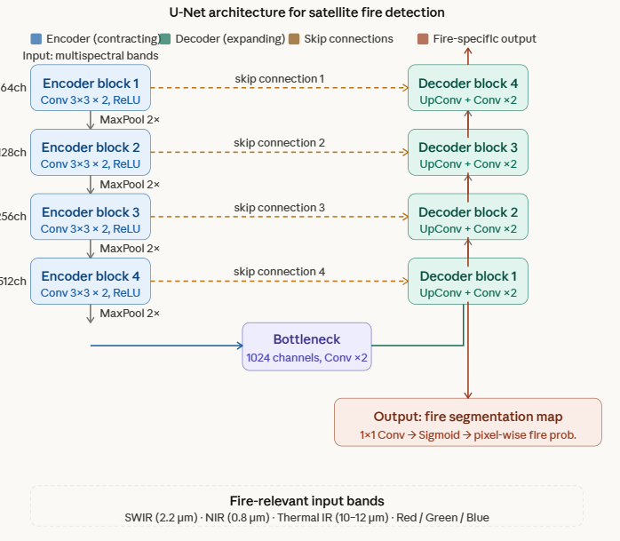


In this architecture, the encoder (contracting path) progressively downsamples the input while doubling the number of feature channels. For fire detection, this means the early layers learn low-level spectral signatures — the characteristic brightness of SWIR (shortwave infrared) and thermal bands that fire and hot embers produce — while deeper layers learn contextual patterns like "fire adjacent to dry vegetation" or "smoke plume shape."

The skip connections are what make U-Net uniquely valuable here. When the decoder upsamples back to full resolution, it would otherwise "forget" fine spatial detail lost during pooling. The skip connections concatenate encoder feature maps directly into the decoder, so the network can precisely locate burn boundaries at the pixel level. For satellite imagery this is critical — you want to know not just that a fire exists, but the exact perimeter, which matters for containment modeling.

Then, the decoder (expanding path) reconstructs spatial resolution step by step. Each decoder block receives both the upsampled coarse features from below and the high-resolution features from the skip connection, then fuses them with two convolutions.

And, finally, the output head is a 1×1 convolution followed by a sigmoid, producing a per-pixel fire probability map at the same resolution as the input. This is the segmentation mask: each pixel gets a value between 0 (no fire) and 1 (active fire / burn scar).

### YOLO Baseline

YOLO is a very different architecture compared to U-Net. Instead of a pure pixel-wise segmentation network, it's a single-stage instance detection + segmentation model, which gives it unique advantages and tradeoffs for fire detection from satellite images.

Compared to U-Net, the design decision that separates YOLOv8-Seg from U-Net is that it produces two simultaneous outputs — bounding boxes and instance masks — in a single forward pass.


YOLOv8-Seg reasons about fire instances, not just fire pixels. When a satellite image contains multiple separate fires — a common scenario in large wildfire regions — U-Net produces a single merged binary mask where you may not be able to tell where one fire ends and another begins. YOLOv8-Seg assigns each fire its own bounding box, confidence score, and independent pixel mask. This matters enormously for downstream applications: you can count individual fire fronts, track their individual spread over time, and assign independent risk scores to each.

YOLOv8-Seg excels when the task is "find and delimit discrete fire events in near real time," while U-Net from scratch excels when the task is "produce the most accurate possible pixel-level burn scar map." Many operational fire monitoring systems benefit from running both: YOLOv8-Seg for rapid initial detection and instance tracking, U-Net for precise delineation and area estimation.

BUT, very large, spatially diffuse fire fronts that span most of a tile, or extremely small sub-pixel hotspots, challenge the detection head more than they challenge U-Net's pure segmentation approach.

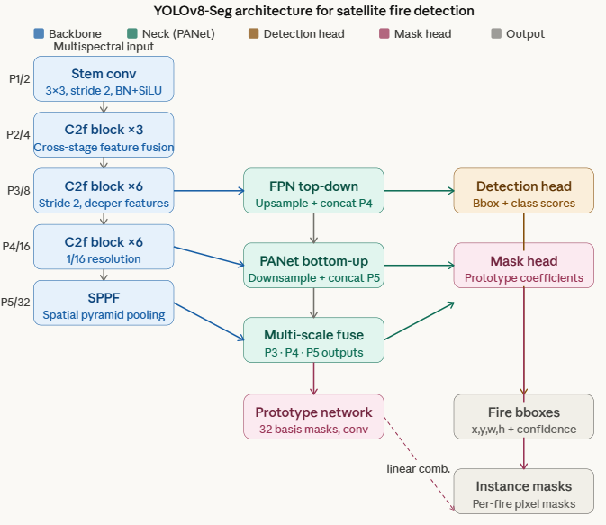

In this case, we were running an experiment on YOLOv8-Seg (RGB detection-style). Different metric (mAP50-95):

| Rank | mAP50-95 | F1 | Precision | Recall | Run |
|---|---|---|---|---|---|
| 1 | 0.4397 | 0.6098 | 0.7130 | 0.5328 | [yolo+s2f-tune-top1-lr7.8e-03-wd6.7e-04-b](https://wandb.ai/adrian-corvin-salceanu-upc-barcelona/fire-detection/runs/upbdth1b) |
| 2 | 0.4391 | 0.6079 | 0.7078 | 0.5328 | [yolo+s2f-tune-top2-lr2.9e-03-wd9.8e-04-b](https://wandb.ai/adrian-corvin-salceanu-upc-barcelona/fire-detection/runs/b4y7pfte) |
| 3 | 0.4355 | 0.6021 | 0.7240 | 0.5153 | [yolo+s2f-tune-top3-lr9.5e-04-wd3.2e-04-b](https://wandb.ai/adrian-corvin-salceanu-upc-barcelona/fire-detection/runs/izbp833y) |

Based on the mAP50-95, the results from the YOLO were considered only "decent", even though they were not far from the 0.45 threshold that defines a strong precision in localization.

### Inference Recommendation for the Fire Detection App

Based on the results of our different runs, our recommended models for deployment are:

| Criterion | Recommendation | Rationale |
|---|---|---|
| Best accuracy | **resnet50\_unetplusplus** | Best IoU on fire segmentation in Phase 1 and best mean\_iou in Phase 2. |
| Balanced (accuracy + speed) | **resnet34\_unet** | Solid baseline, faster than ResNet50. |
| Edge / lightweight | **mobilenet\_v2\_unet** | Smallest footprint; acceptable accuracy. |

Therefore, we took the following recommendations for use at the Fire Detection Application:

- **Use resnet50\_unetplusplus if compute allows.**
- **Otherwise resnet34\_unet** for a good balance of speed and accuracy.

On the other hand, YOLO had to be discarded since this model uses RGB-only, has a lower precision mAP50-95 (~0.44) than SMP (Segmentation Models PyTorch) segmentation (fire\_iou ~0.78). SMP uses 8-channel (7 bands + NDVI) for better spectral discrimination.

SMP is a Python library built on PyTorch that provides neural networks for image semantic segmentation. Its main features include a simple high-level API, 12 encoder-decoder model architectures (U-Net, U-Net++, SegFormer, DPT, and more), and over 800 pretrained convolutional and transformer-based encoders.

Then, Scratch models (UNetScratch) can reach high fire\_dice on CEMS-only, but CEMS+Sen2Fire combined training with pretrained SMP yields better generalization; in this case, pretrained encoders provide strong spectral feature extraction.

Other findings from our experiments are:

- A bigger dataset, combining the Copernicus CEMS and Sen2Fire datasets showed clear benefits in terms of improving models results.
- The inclusion of an additional input channel (8 or NDVI) helped to take into consideration vegetation. The Normalized Difference Vegetation Index quantifies the presence and **health** of vegetation in satellite imagery. It helps detect vegetation loss after disasters (such as fires, floods, deforestation).
- Regarding the training time (how long it takes), while MobileNet is faster, since it has 1/6 of parameters than ResNet50, this latter still provides a better tradeoff on the time/precision combination.
- On the usage of "Recall" for fire detection, we found that this metric could matter more than precision, in order that we don't miss relevant fires.

Here a summary table of results from running different models:

| Architecture | Phase 1 Fire IoU | Phase 2 Mean IoU | Phase 2 Fire IoU |
|---|---|---|---|
| efficientnet-b1\_unetplusplus | 0.6736 | — | — |
| efficientnet-b2\_unetplusplus | 0.7612 | 0.3388 | 0.3863 |
| efficientnet\_unetplusplus | — | 0.3167 | 0.3488 |
| mobilenet\_v2\_unet | 0.7572 | 0.3317 | 0.3638 |
| resnet18\_unet | 0.7654 | 0.3240 | 0.3641 |
| resnet34\_unet | 0.7650 | 0.3352 | 0.3715 |
| resnet50\_deeplabv3plus | 0.7724 | 0.3329 | 0.3092 |
| resnet50\_unetplusplus | **0.7791** | **0.3444** | **0.4069** |

All in all, our experiments evaluated 46 finished runs across multiple model families: V3 two-phase (combined binary + severity fine-tune), scratch models (UNetScratch, ScratchFireModel), and a YOLOv8-Seg baseline. The best-performing architecture is resnet50\_unetplusplus, achieving fire IoU 0.78 in Phase 1 (binary) and mean IoU 0.34 / fire IoU 0.41 in Phase 2 (severity).

Here is a quick summary of results by the different tasks:

- **Binary fire segmentation (Phase 1):** Fire IoU of 0.78 is strong for satellite-based burned area mapping. Published work on Sentinel-2 wildfire segmentation (e.g. FLOGA, Sen2Fire, Land8Fire) typically reports IoU in the 0.65–0.90 range depending on dataset difficulty, band selection, and annotation quality. Our result sits in the upper part of this range, supported by (Lisa Knopp\*, 2020) (Anh Tran 1, 2025) (Tang Sui):
  - combined CEMS + Sen2Fire training for geographic diversity,
  - 8-channel input (7 bands + NDVI) for spectral discrimination, and
  - pretrained encoders for robust feature extraction.

- **Severity segmentation (Phase 2):** Mean IoU of 0.34 and fire IoU of 0.41 are in line with expectations for 5-class severity grading. Severity mapping is harder than binary detection because:
  - classes are fine-grained (negligible vs moderate vs high damage),
  - the "no damage" class dominates, and
  - expert annotations can disagree on boundaries.

  In multi-class remote sensing (e.g. land cover with 7–15 classes), mean IoU of 0.3–0.5 is common; our result fits this range. The fire IoU (0.41) shows that burned-area segmentation remains solid even when the model must distinguish severity subclasses.

- **YOLO baseline:** mAP50-95 of 0.44 is lower than SMP segmentation (fire IoU ~0.78). Both YOLO and SMP use 8-channel input (7 bands + NDVI); the difference lies in the task formulation — YOLO uses a detection-style pipeline (bounding boxes) while SMP performs pixel-wise segmentation. This confirms that pixel-wise segmentation is better suited for burned area mapping.

- **Scratch vs pretrained:** UNetScratch reaches fire dice ~0.85 on CEMS+Sen2Fire (DEL), but pretrained SMP (resnet50\_unetplusplus) on CEMS+Sen2Fire achieves better generalization (fire IoU 0.78 vs 0.75). Pretrained encoders provide useful spectral and spatial features for satellite imagery.

### Interpretation

Our Architecture choice has been validated. The V3 assumptions are supported by the data. ResNet50 + U-Net++ is best for both binary and severity; ResNet34 + U-Net is a good baseline; MobileNet + U-Net is suitable for lightweight deployment.

In addition, a two-phase training works since Phase 1 run (CEMS DEL + Sen2Fire) learns robust binary fire detection. And, then, Phase 2 (CEMS GRA only) adds severity without degrading binary performance. The dual-head design allows a single model to output both binary and severity maps.

We have defined some trade-offs for deployment. On one side, for the app, resnet50\_unetplusplus is recommended when accuracy is the priority. Since resnet34\_unet offers a better accuracy–speed balance, we make it available as well in the app. Last but not least, mobilenet\_v2\_unet is suitable for edge or resource-limited settings with a small drop in performance (fire IoU 0.76 vs 0.78).

And, we have identified, as well, some limitations. For example, severity metrics are moderate, not state-of-the-art. There are possible improvements such as more GRA-annotated data, loss weighting for rare severity classes, and post-processing (e.g. CRF) for boundary refinement. The CEMS dataset is Mediterranean-focused so performance on other regions should be validated.

All in all, the experimental results support the V3 pipeline design and architecture choices. Binary fire detection reaches strong performance (fire IoU ~0.78), and severity segmentation is within the typical range for multi-class remote sensing. The recommended model for inference is resnet50\_unetplusplus, with resnet34\_unet as a practical alternative when speed matters.

---

## Application Design and Features

The application is intended to display both severity maps (based on the 1st dataset training) and binary maps (based on the 2nd dataset fine tuning) as layers — so one could visually compare, for example, the maps. In summary:

- It uses Sentinel-2 imagery, so it fetches satellite data from Planetary Computer with date range and cloud-cover filters
- It runs a real-time fire detection with U-Net inference for burn scars; it shows a binary fire map and 5-level severity map (it identifies fire pixels in satellite imagery using the trained segmentation model)
- Then, it provides a synced image viewer where you can look at original vs fire overlay with linked zoom/pan (it converts pixel-level predictions into geographic polygons for visualization and analysis)
- It delivers an analysis history so you can filter by fire/date, view past runs, load parameters to re-run
- There is a Statistics dashboard — Total analyses, detection rate, recent fires, cleanup of old data.

Our aim was to be able to calculate some quantitative metrics about detected fire areas such as:

- **Total area:** Primary metric — how much area is affected by fire
- **Fire percentage:** Contextual metric — what fraction of analyzed region is on fire
- **Perimeter:** Useful for firefighting planning — boundary length indicates containment difficulty
- **Centroid:** Geographic center — useful for location identification and mapping
- **Bounding box:** Extent coordinates — defines region of interest, useful for zooming/display

And it even provides a multi-model support so you can choose among trained models from a dropdown.

The user interface is intended to:

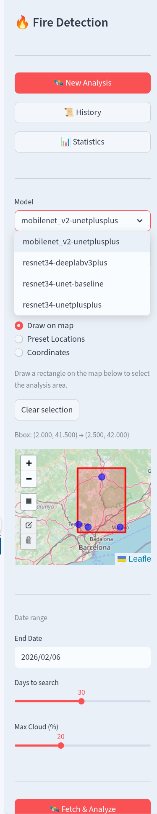

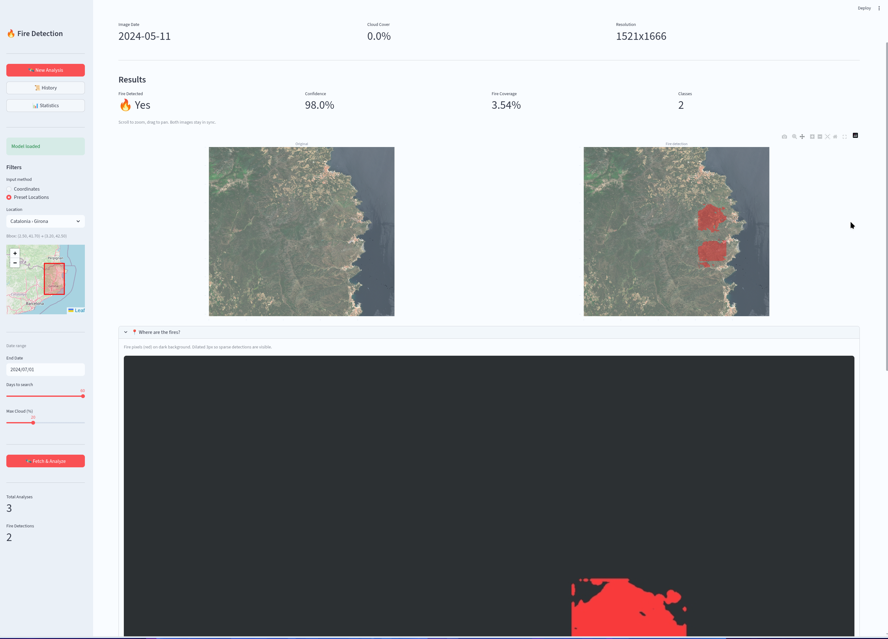

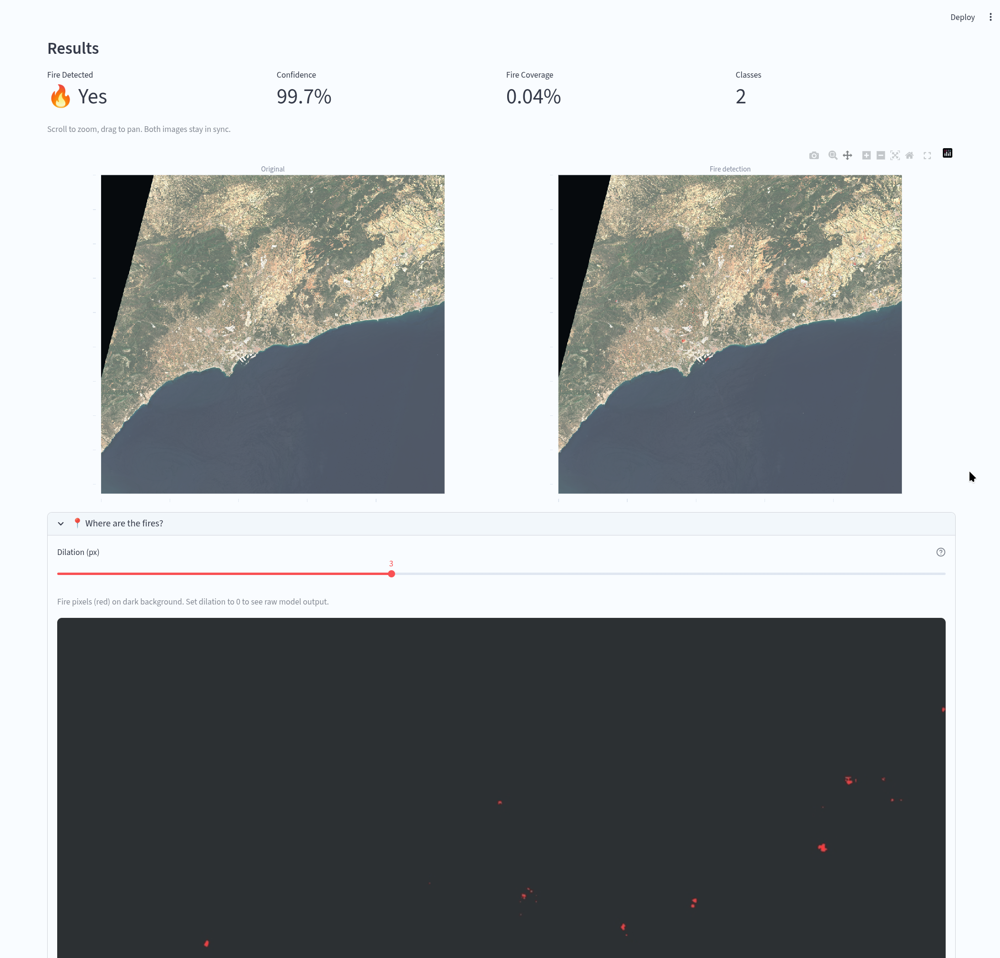

- Provide an interactive map showing region of interest and fire detections, so the user specifies geographic region to analyze
- User selects which model to run and for which satellite imagery

Here you can see how the app shows the burned area from a large fire occurred in 2025 at southern Tarragona province.

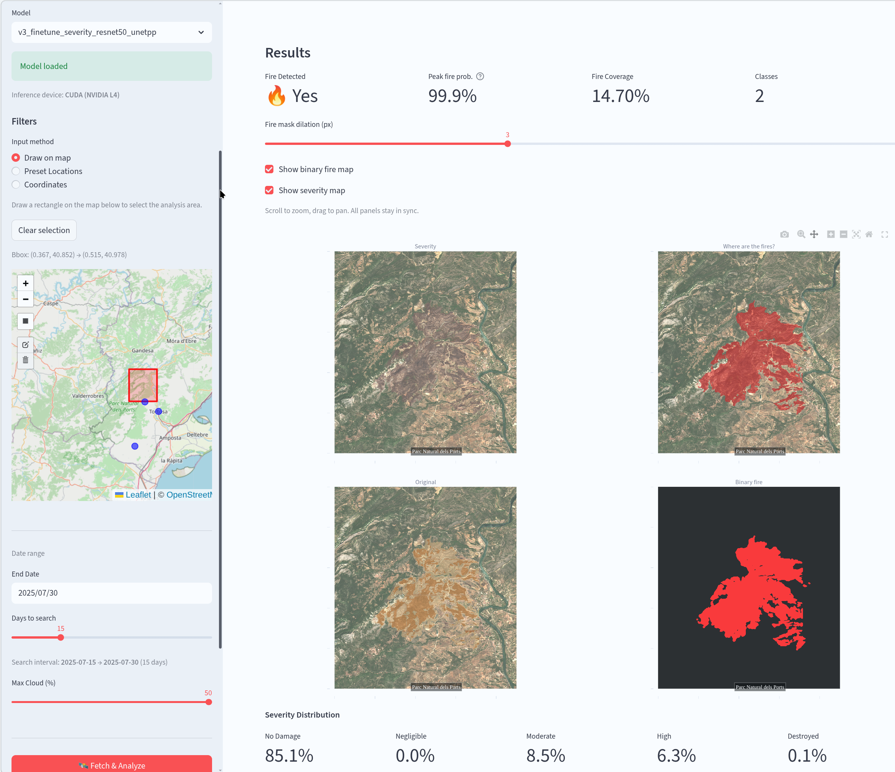 You can compare a usual satellite image with the identified fire area.


Here is a summary of what you can see in that app screenshot:

- Fire Detection App tested on the Paüls wildfire (southern Catalonia, July 2025)
- That fire event burned about ~3,200 ha and you can see that fire crossed the Ebro river; There were 18,000 people confined in that area.
- Pre-fire (June 2025): App should detect no fire. Imagery shows pre-fire vegetation
- Post-fire (July 8+): App should detect fire and severity maps. Burn scars are visible in post-fire imagery

This is proof that the Fire Detection App correctly distinguishes pre- vs post-fire imagery and produces plausible burn maps.

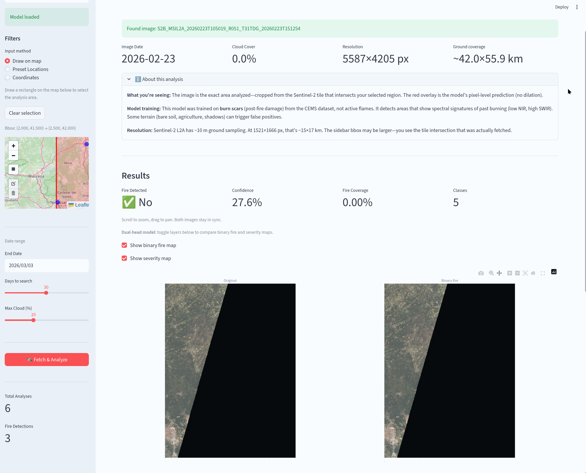

Here is a simple schema on how the app works together with the imagery dataset and deep learning architecture (inference):

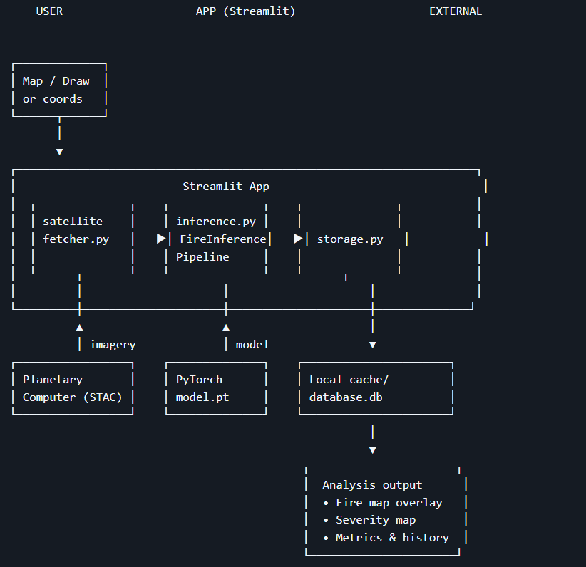

- It's a web app for satellite-based wildfire detection and severity mapping
- Image source comes from Sentinel-2 L2A from Microsoft Planetary Computer (STAC API)
- We have used Streamlit frontend and PyTorch U-Net inference

---

## Machine Learning Ops: Measuring Performance with Weights and Biases Analysis

We have used Weights and Biases for experiment tracking and systematically records all training runs, their hyperparameters, metrics, and configurations. This helps on the reproducibility and comparison of experiments.

Weights and Biases provide excellent plots for training curves, hyperparameter sweeps... Here we can track:

- Those hyperparameters that we have defined at our training configuration, such as learning rate, batch size, encoder, loss weights and optimizer settings.
- Validation/Evaluation metrics such as IoU (Intersection over Union), Dice (measures how much the predicted mask overlaps with the ground-truth mask annotated by a human expert) or Recall.

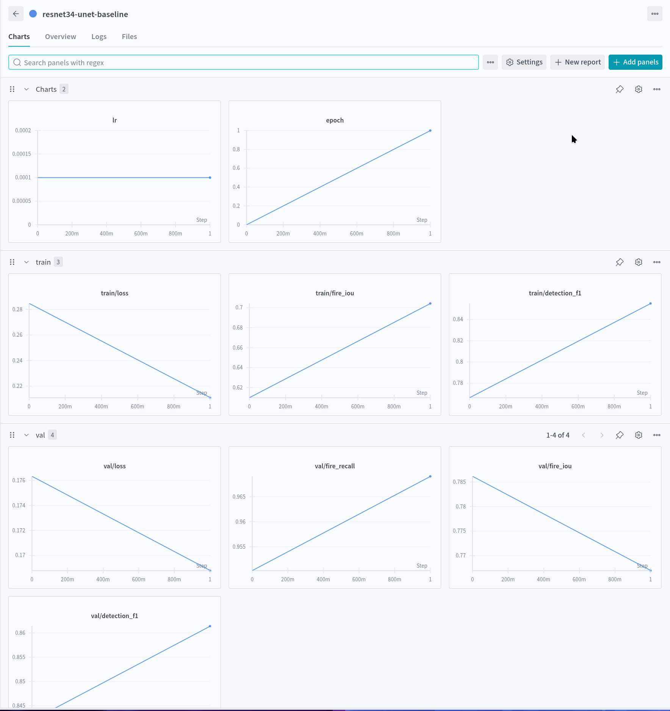

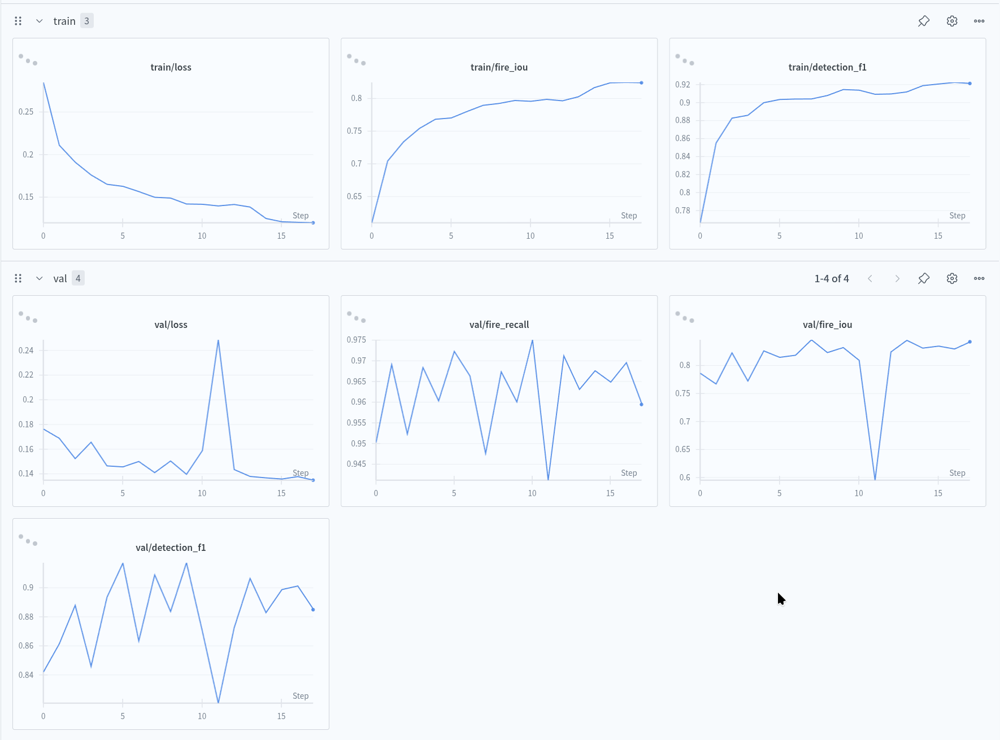

**Training metrics analysis:**

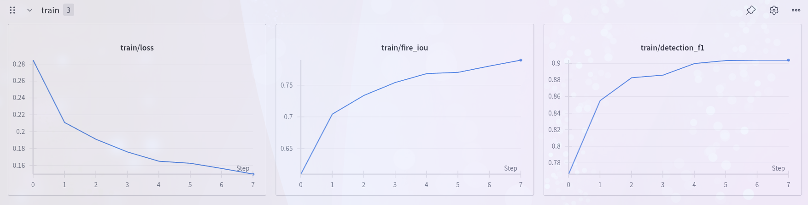

All runs converge into the 0.6–0.8 range by step ~20 and plateau there. The spread between runs is moderate (~0.15 range), suggesting learning rate and weight decay choices meaningfully affect recall.

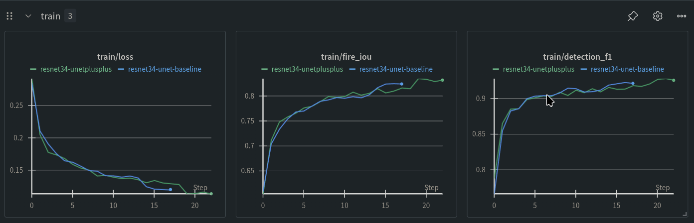

Precision is notably higher than recall across all runs, clustering tightly in the 0.85–0.95 range by step ~15. The tight clustering here — much tighter than in recall — tells you that the models are conservative: they're quite confident about what they predict as fire, but they're missing some fire pixels (hence the lower recall).

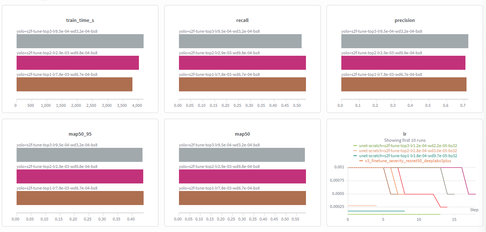

On the train/mean\_iou, the v3\_finetune\_severity runs (DeepLabV3+, EfficientNet-b2, MobileNet variants in warm colors) all plateau extremely early — around step 3–5 — at a mean IoU of just 0.25–0.35. They barely improve after that. This is a training failure pattern, not a convergence pattern. Combined with the GPU bottleneck seen in the system dashboard, these fine-tuning runs have a compound problem: the data isn't feeding the GPU efficiently, and the model isn't learning from what it does see.

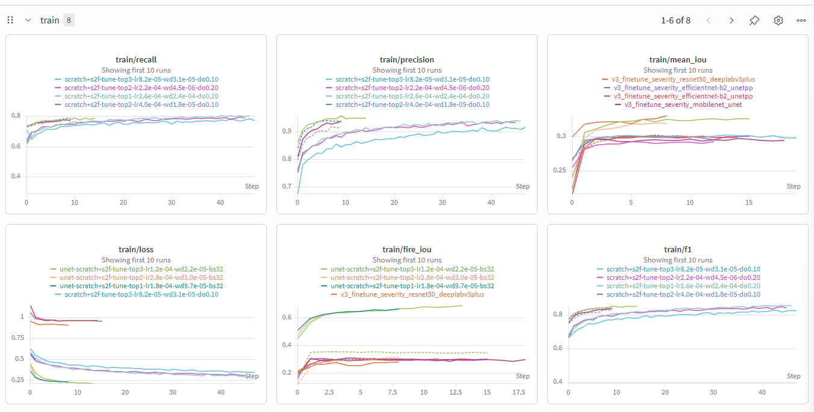

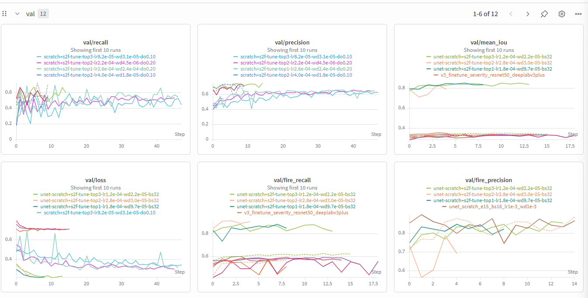

Then, finally on train/fire\_iou, the metric that matters most for our application, the U-Net scratch runs (unet-scratch+s2f-tune) climb steadily, reaching fire IoU values of 0.5–0.65 by step ~15. The v3\_finetune\_severity\_resnet50\_deeplabv3plus run (shown as a flat dashed line near 0.25–0.30) is essentially not learning fire-class segmentation at all. This is a critical finding: that run is likely getting a deceptively acceptable overall loss by predicting mostly non-fire, which gives high accuracy on the dominant class but near-zero fire IoU. This is the class-imbalance trap.

**GPU system metrics analysis:**

Looking at the W&B system metrics dashboard showing GPU hardware telemetry, we can see that:

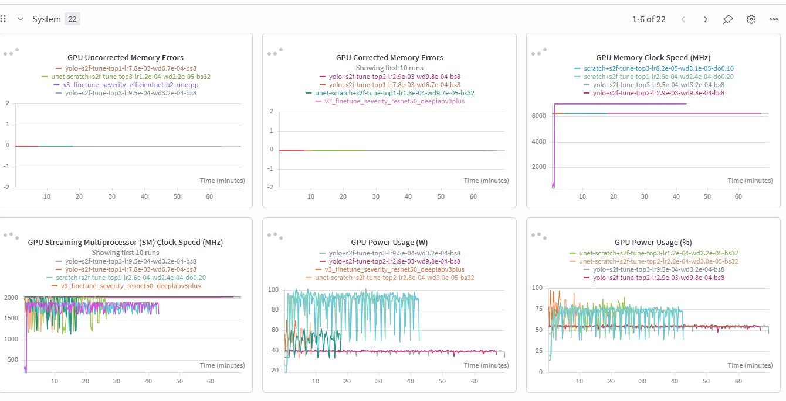

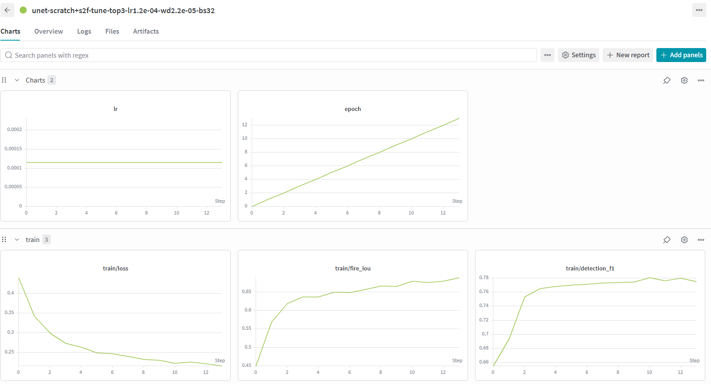

- Both uncorrected and corrected memory error panels are essentially flat at zero across all runs for the full 60-minute window. This is a healthy sign — no ECC memory events, meaning the GPU VRAM is stable and we're not hitting hardware-level bit-flip issues that could silently corrupt gradients.
- Most runs settle quickly at the hardware maximum (~6000 MHz), which is expected behavior — the GPU boosts its memory clock early and holds it. One run (`yolo+s2f-tune-top2-lr2e-03-wd9.8e-04-bs8`) shows a notably lower memory clock, hovering around 4000–5000 MHz. This can indicate that particular run is less memory-bandwidth intensive — possibly a smaller batch or a run that fits more comfortably in cache — or that it hit a thermal/power limit earlier.
- On the GPU Streaming Multiprocessor (SM) clock speed, most runs stabilize in the 1500–2000 MHz range, consistent with sustained GPU compute under deep learning training. However, `v3_finetune_severity_resnet50_deeplabv3plus` (shown in purple/pink) drops dramatically — it appears to idle near 300–500 MHz for much of the run. This strongly suggests that model is CPU-bottlenecked or I/O-bottlenecked: the GPU is waiting for data, the CPU is preprocessing slowly, or the DataLoader has too few workers. DeepLabV3+ with a ResNet50 backbone is not particularly heavier than the U-Net variants shown, so the bottleneck is likely in data pipeline configuration rather than compute itself.
- On the GPU Power Usage in Watts, the YOLO runs (yolo+s2f-tune) and the U-Net scratch run draw between 60–100W with high variability, typical of active training with frequent gradient updates. The DeepLabV3+ run again sits at the bottom (~35–40W), consistent with the SM clock observation — it's barely utilizing the GPU. The spiky pattern in the higher-power runs is normal: it reflects the forward/backward pass cycle.
- And on GPU Power Usage %, most runs sit at 50–75% GPU utilization


, which is reasonable for segmentation training with moderate batch sizes (bs8 is visible in several run names). The U-Net scratch run (`unet-scratch+s2f-tune-top3`) shows the most consistent high utilization. The DeepLabV3+ run again lags far behind.

**Validation metrics analysis:**

The validation metrics from the screenshot show a coherent story:

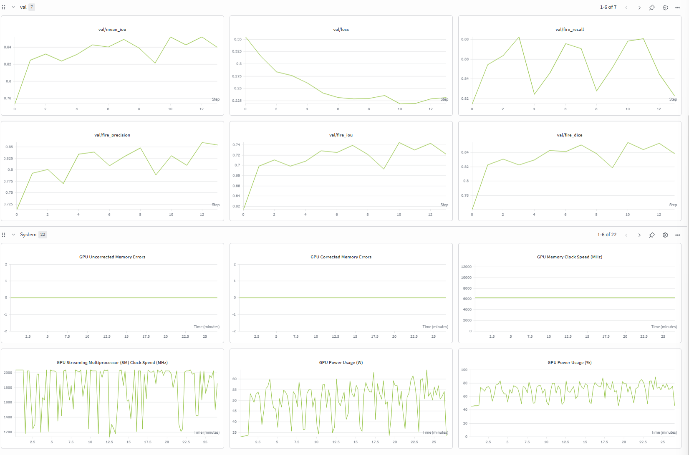


 loss declining, fire IoU climbing toward 0.73, recall holding in the 0.82–0.86 range, precision recovering after an early dip. The hardware is healthy and the training loop is efficiently pipelined. The main remaining concern is that the LR scheduler (which was dropping aggressively to near-zero by step 15 in the previous dashboard) may cut this run's learning off before the fire IoU fully converges — the upward trend in val/fire\_iou has not yet plateaued, suggesting more training steps with a gentler decay schedule could push fire IoU above 0.75 and potentially toward 0.78–0.80.

---

## Conclusions

The experimental results support the combined binary plus severity workflow design and architecture choices of encoder/decoder combinations. Binary fire detection reaches strong performance (fire IoU ~0.78), and severity segmentation is within the typical range for multi-class remote sensing. ResNet50 + U-Net++ is best for both binary and severity; ResNet34 + U-Net is a good baseline; MobileNet + U-Net is suitable for lightweight deployment. All in all, the recommended model for inference is resnet50\_unetplusplus, with resnet34\_unet as a practical alternative when speed matters.

Our experiments evaluated 46 finished runs across multiple model families: two-phase (combined binary + severity fine-tune), scratch models (UNetScratch, ScratchFireModel), and a YOLOv8-Seg baseline. The best-performing architecture is resnet50\_unetplusplus, achieving fire IoU 0.78 in Phase 1 (binary) and mean IoU 0.34 / fire IoU 0.41 in Phase 2 (severity).

Regarding the task of Binary fire segmentation (Phase 1), we have achieved a Fire IoU of 0.78 that is strong for satellite-based burned area mapping. Published work on Sentinel-2 wildfire segmentation (e.g. FLOGA, Sen2Fire, Land8Fire) typically reports IoU in the 0.65–0.90 range depending on dataset difficulty, band selection, and annotation quality. Our result sits in the upper part of this range, supported by: (1) combined CEMS + Sen2Fire training for geographic diversity, (2) 8-channel input (7 bands + NDVI) for spectral discrimination, and (3) pretrained encoders for robust feature extraction.

On the other side, on Severity segmentation (Phase 2) we have achieved a Mean IoU of 0.34 and fire IoU of 0.41 are in line with expectations for 5-class severity grading. Severity mapping is harder than binary detection because: (1) classes are fine-grained (negligible vs moderate vs high damage), (2) the "no damage" class dominates, and (3) expert annotations can disagree on boundaries. In multi-class remote sensing (e.g. land cover with 7–15 classes), a mean IoU of 0.3–0.5 is common; our result fits this range. The fire IoU (0.41) shows that burned-area segmentation remains quite solid even when the model must distinguish severity subclasses.

We went thru other models such as YOLO and compared to SMP. Our measurement at YOLO baseline mAP50-95 of 0.44 is lower than SMP segmentation (fire IoU ~0.78). YOLO uses RGB-only input and a detection-style pipeline; SMP uses 8-channel multispectral data and pixel-wise segmentation. This supports the choice of spectral bands and NDVI for wildfire tasks.

We compared, as well, performance of Scratch vs pretrained models. In this case, UNetScratch reaches fire dice ~0.89 on CEMS-only, but on CEMS+Sen2Fire combined training, pretrained SMP (resnet50\_unetplusplus) achieves better generalization. Pretrained encoders provide useful spectral and spatial features for satellite imagery.

And then, we went thru a two-phase training workflow. While at Phase 1 (CEMS DEL + Sen2Fire) learns robust binary fire detection, then at Phase 2 (CEMS GRA only) adds severity without degrading binary performance. The dual-head design allows a single model to output both binary classification and severity maps.

Finally, we had to manage some trade-offs for deployment. For the application, resnet50\_unetplusplus is recommended when accuracy is the priority. resnet34\_unet offers a better accuracy–speed balance. mobilenet\_v2\_unet is suitable for edge or resource-limited settings with a small drop in performance (fire IoU 0.76 vs 0.78).

And we had to take into account some limitations such as severity metrics are moderate, not state-of-the-art. Possible improvements on this condition would be about getting more GRA-annotated data, loss weighting for rare severity classes, and post-processing (e.g. CRF) for boundary refinement. Last but not least, the CEMS dataset is Mediterranean-focused; so, performance on other regions should be validated as a follow up of this project.

After this project, we are confident that combining satellite imagery and the recommended deep learning architectures, a number of applications could be developed to improve precision, accuracy and timing on identifying and classifying wildfires extrapolating the presented pipeline to other geographies. There is potential, as well, for a Fire Spread Detection with Multi-temporal Analysis or an Alert system that automatically generates alerts when fires are detected, with severity levels based on fire characteristics and even integrate notification channels to deliver alerts through various communication channels.

---

## Bibliography

Anh Tran 1, M. T. (2025). Land8Fire: A Complete Study on Wildfire Segmentation. *Remote Sensing 17(16)*.

Calum X. Cunningham\*, J. T. (2025). Climate-linked escalation of societally disastrous wildfires. *Science Vol 390, Issue 6768*, 53–58.

CEMS. (n.d.). *CEMS Rapid Mapping*. Retrieved from emergency.copernicus.eu

CEMS. (n.d.). *Sentinel-2 Documentation*. Retrieved from sentinels.copernicus.eu

Chevalier, G. (n.d.). *Smoothly Blend image patches*. Retrieved from https://github.com/Vooban/Smoothly-Blend-Image-Patches

Fernando Rodriguez-Jimenez, H. L.-A. (2023). PLS-PM analysis of forest fires using remote sensing tools. The case of Xurés in the Transboundary Biosphere Reserve. *Ecological Informatics Volume 75*.

Filipponi, F. (2019). Exploitation of Sentinel-2 Time Series to Map Burned Areas at the National Level: A Case Study on the 2017 Italy Wildfires. *Remote Sensing*.

Ghandorh, H. e. (2023). Uni-temporal Sentinel-2 imagery for wildfire detection using deep learning semantic segmentation models. *Geomatics, Natural Hazards and Risk, Taylor & Francis.*

Giglio, L. B. (2018). The Collection 6 MODIS burned area mapping algorithm and product. *Remote Sensing of Environment 217*, 72–85.

Guangqing Zhai, L. D. (2025). From spark to suppression: An overview of wildfire monitoring, progression. *International Journal of Applied Earth Observation and Geoinformation, vol 140*.

Günay, O. T. (2009). Video based wildfire detection at. *Fire Saf. J., 44 (6)*, 860–868.

He, K. Z. (2016). Deep Residual Learning for Image Recognition. *CVPR 2015*, 771–774.

Hugginface. (n.d.). *Huggingface dataset*. Retrieved from huggingface.co/datasets/links-ads/wildfires-cems

Lisa Knopp\*, M. (2020). A Deep Learning Approach for Burned Area Segmentation with Sentinel-2 Data. *Remote Sensing 12(15)*, 2422.

Merlo, M. (n.d.). *CEMS Wildfire dataset*. Retrieved from github.com/MatteoM95/CEMS-Wildfire-Dataset

Minghao Qiu, J. L.-N. (2025). Wildfire smoke exposure and mortality burden in the USA under climate change. *Nature*, Number 647, pages 935–943.

Oliva, E. C. (2020). Satellite Remote Sensing Contributions to Wildland Fire Science and management. *Fire Science Management*, 81–96.

Rego, F. C. (2006). Modelling the effects of distance on the probability of fire. *Int. J. Wildland Fire 15 (2)*, 197–202.

Rui Ba, W. S. (2019). Integration of Multiple Spectral Indices and a Neural Network for Burned Area Mapping Based on MODIS Data. *Remote Sensing*.

Sean Parks, G. D. (2014). A New Metric for Quantifying Burn Severity: The Relativized Burn Ratio. *Remote Sensing vol 6*, 1827–1844.

Sullivan, P. C. (2008). *Grassfires: Fuel, Weather and Fire Behaviour.* CSIRO Publishing.

Tang Sui, Q. H. (n.d.). BiAU-Net: Wildfire burnt area mapping using bi-temporal Sentinel-2 imagery and U-Net with attention mechanism. *International Journal of Applied Earth Observation and Geoinformation*.

Wooster, M. J. (2021). Satellite Remote Sensing of Active Fires: History and Current Status, Applications and Future Requirements. *Remote Sens. Environ. Vol 267*.

Zhou, Z. S. (2018). UNet++: A Nested U-Net Architecture for Medical Image Segmentation. *DLMIA @ MICCAI 2018. Springer LNCS 11045*, 3–11.

---

## Resource Links

### Datasets

| Resource | URL |
|---|---|
| CEMS-Wildfire Dataset (links-ads) | <https://huggingface.co/datasets/links-ads/wildfires-cems> |
| CEMS-Wildfire Dataset (9334hq) | <https://huggingface.co/datasets/9334hq/wildfires-cems> |
| CEMS-Wildfire GitHub | <https://github.com/MatteoM95/CEMS-Wildfire-Dataset> |
| CEMS-HLS (Alternative) | <https://huggingface.co/datasets/morenoj11/CEMS-HLS> |
| EO4WildFires Dataset | <https://huggingface.co/datasets/AUA-Informatics-Lab/eo4wildfires> |
| Sen2Fire Dataset | <https://github.com/Orion-AI-Lab/Sen2Fire> (check arXiv paper) |
| Sen2Fire Paper | <https://arxiv.org/abs/2403.17884> |
| Land8Fire Dataset | <https://www.mdpi.com/2072-4292/17/16/2776> |
| TS-SatFire Dataset | <https://arxiv.org/abs/2412.11555> |
| S2-WCD Dataset | <https://ieee-dataport.org/documents/sentinel-2-wildfire-change-detection-s2-wcd> |
| FireSR Dataset | <https://zenodo.org/records/13384289> |
| FLOGA Dataset | <https://arxiv.org/abs/2311.03339> |
| Active Fire (Landsat-8) | <https://arxiv.org/abs/2101.03409> |

### Satellite Data APIs

| Resource | URL |
|---|---|
| Copernicus Data Space Browser | <https://browser.dataspace.copernicus.eu/> |
| Copernicus Data Space API | <https://documentation.dataspace.copernicus.eu/> |
| Sentinel Hub API | <https://docs.sentinel-hub.com/> |
| Sentinel Hub Python | <https://sentinelhub-py.readthedocs.io/> |
| sentinelsat Python Library | <https://sentinelsat.readthedocs.io/> |
| pystac-client | <https://pystac-client.readthedocs.io/> |
| NASA FIRMS | <https://firms.modaps.eosdis.nasa.gov/> |
| NASA FIRMS API | <https://firms.modaps.eosdis.nasa.gov/api/> |
| EFFIS Portal | <https://effis.jrc.ec.europa.eu/> |
| EFFIS Active Fires | <https://effis.jrc.ec.europa.eu/apps/effis.current-situation/active-fires> |
| Eye on the Fire API | <https://eyeonthefire.com/data-sources> |
| Ambee Fire API | <https://www.getambee.com/api/fire> |

### Regional Data (Catalonia)

| Resource | URL |
|---|---|
| Generalitat Fire Data | <https://agricultura.gencat.cat/ca/ambits/medi-natural/incendis-forestals/> |
| Generalitat Fire Perimeters (CSV) | <https://analisi.transparenciacatalunya.cat/api/views/bks7-dkfd/rows.csv?accessType=DOWNLOAD> |
| Generalitat Civil Protection Risk Map | <https://datos.gob.es/en/catalogo/a09002970-mapa-de-proteccion-civil-de-cataluna-riesgo-de-incendios-forestales> |
| ICGC CatLC Dataset | <https://www.icgc.cat/en/Geoinformation-and-Maps/Maps/Dataset-Land-cover-map-CatLC> |
| ICGC CatLC FTP Download | <https://ftp.icgc.cat/descarregues/CatLCNet> |
| PREVINCAT Server | <https://previncat.ctfc.cat/en/index.html> |
| PREVINCAT MDPI Paper | <https://www.mdpi.com/2072-4292/12/24/4124> |
| Copernicus EMS Catalonia Fire (2022) | <https://data.jrc.ec.europa.eu/dataset/7d5a5041-efac-4762-b9d1-c0b290ab2ce7> |
| WUI Map Catalonia | <https://pdxscholar.library.pdx.edu/esm_fac/215/> |
| Fire Sondes Data (Catalonia) | <https://zenodo.org/records/6424854> |
