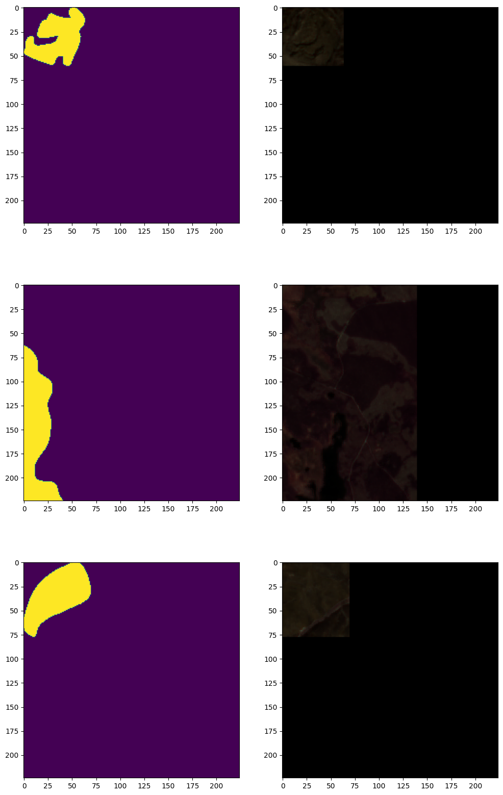

# EO4WildFires Dataset — Expanded Summary (Talking Points)

**1–2 page expanded summary for talks and deep-dive discussions.**

---

## 1. What the dataset is

- **EO4WildFires** is an **Earth Observation multi-sensor, time-series** benchmark for **wildfire severity prediction** (size and shape of burned area), not ignition.
- **Goal**: Given pre-fire conditions (Sentinel-2, Sentinel-1, meteorological data), predict **how much area will be burned** if a fire occurs — i.e. severity/impact forecasting.
- **Sources**: [EFFIS](https://forest-fire.emergency.copernicus.eu/) (labels), [Sentinel-2](https://sentinels.copernicus.eu/) and [Sentinel-1](https://sentinels.copernicus.eu/) (Copernicus), [NASA POWER](https://power.larc.nasa.gov/) (meteorology). Data cubes built via Sentinel Hub API and NASA Power API.
- **Reference**: Sykas et al., *Fire* 2024 — “Deep Learning Approaches for Wildfire Severity Prediction…” ([MDPI](https://www.mdpi.com/2571-6255/7/11/374)); original dataset on [Zenodo](https://zenodo.org/records/7762564).

**Talking point**: This is a **severity-forecasting** dataset: “If a fire happens here, how big will it be?” It combines **optical + SAR + weather** in one cube per event.

---

## 2. Scale and scope

| Aspect | Detail |
|--------|--------|
| **Events** | 31,730 wildfire events |
| **Samples** | 31,740 total (train + validation + test) |
| **Time span** | 2018 – 2022 |
| **Geography** | 45 countries; 8,707 level-4 administrative areas |
| **Largest fires** | 54,769 ha (Antalya, Turkey, 2021); 51,245 ha (Evoia, Greece, 2021) |
| **Median fire size** | 31 ha |
| **Average fire size** | 128.77 ha |
| **Top countries** | Ukraine (UA), Turkey (TR) ~25%; + Algeria (DZ), Spain (ES), Romania (RO), Syria (SY) → ~45% |

**Talking point**: Much larger **event count** and **geographic spread** than single-region datasets; useful for generalisation and multi-country models.

---

## 3. Image and data specifics (what’s in each data cube)

### 3.1 Structure

- **One event = one data cube** (NetCDF on Zenodo; on HuggingFace, loaded via `datasets` with splits `train` / `validation` / `test`).
- **Spatial resolution**: **10 m for all pixel data** (Sentinel-2 and Sentinel-1). The paper states explicitly: “The spatial resolution for all pixels is 10 m” — so S2’s native 10 m / 20 m / 60 m bands are resampled to a single 10 m grid in the data cube. Meteorological data cover the **event region** (point or area), not per-pixel.
- **Sample size in paper**: Resized to **224×224** pixels. Events with **&lt;10 burned pixels** (≈&lt;1 km²) can be excluded for severity-focused experiments.
- **HuggingFace**: Use `datasets==3.6.0` (not compatible with 4.x). Keys include `S2A`, `S1`, `burned_mask`, plus metadata.

### 3.2 Sentinel-2 (S2A)

- **Product**: Multispectral imagery via **Sentinel Hub**; paper mentions **Sentinel-2 Level 1C** (TOA) for standardised preprocessing.
- **Temporal**: **Monthly composite** — best pixels from the **last 30 days before** the event (mosaicing to reduce clouds). Composite logic: band-ratio-based pixel selection (e.g. [Sentinel-2 monthly composite script](https://custom-scripts.sentinel-hub.com/sentinel-2/monthly_composite/)).
- **Bands**: 13 spectral bands (typical S2); in code, RGB is often formed as `S2A[3:0:-1]` (R=band 3, G=band 2, B=band 1) → B04, B03, B02.
- **Role**: Pre-fire **vegetation and land** state; NIR/SWIR useful for fuel and moisture.

### 3.3 Sentinel-1 (S1)

- **Product**: C-band **SAR** (ascending and descending orbits).
- **Temporal**: **Single most recent** acquisition before the event (SAR is all-weather; no compositing needed).
- **Role**: Structure, moisture, and backscatter; complements optical in cloudy regions.
- **NaNs**: ~1.8% of S1 pixels are NaN in the dataset and are replaced with 0.

### 3.4 NASA POWER (meteorology)

- **Temporal**: From **day before event** back to **30 days prior** (central point of event).
- **Parameters** (from Zenodo/paper): ratio of actual to saturation water vapour pressure, average temperature, bias-corrected total precipitation, average wind speed, fraction of land covered by snowfall, percent of root zone soil wetness, snow depth, snow precipitation, percent of soil moisture.
- **Spatial**: Regional/point; not per-pixel. Used as **scalar or time-series features** per event.

### 3.5 Labels (burned mask)

- **Source**: **EFFIS** (European Forest Fire Information System) — fire perimeters and affected area.
- **Format**: **Rasterized** onto the Sentinel-2 grid → **binary mask** (burned = 1, not burned = 0). Unaffected pixels may be stored as NaN and replaced with 0 (dataset has ~56% NaN in `burned_mask` before replacement).
- **Use**: Target for **binary segmentation** (burned area); total burned area and shape support **severity** (size/shape) metrics.

**Talking point**: Labels are **EFFIS-derived** (operational system), not hand-drawn per tile; good for real-world alignment and scale.

---

## 4. Visual examples (layers in the dataset)

- **S2A RGB**: True-color composite from Sentinel-2 (e.g. bands 3,2,1 → R,G,B).
- **burned_mask**: Binary EFFIS mask (0/1 or 0/255 for display).
- **S1**: SAR channels (VV/VH or similar); typically visualised as grayscale or dual-channel.

*Sample grid below from the [how-to-use-eo4wildfires.ipynb](https://huggingface.co/datasets/AUA-Informatics-Lab/eo4wildfires/blob/main/how-to-use-eo4wildfires.ipynb) notebook (validation set).*

### 4.1 Sample grid: burned masks and Sentinel-2 RGB

Three validation samples — left column: EFFIS burned-area mask (yellow = burned); right column: Sentinel-2 true-color composite. Samples are ~224×224 px; black areas in the satellite images are NoData / outside the region of interest.

*To generate more figures locally, run from the repo root: `python _docs_/scripts/export_eo4wildfires_samples.py` (requires `datasets==3.6.0`, matplotlib, numpy).*

### 4.2 Geographic and statistical context

- **Median burned pixels per event**: 8.8% of the sample.
- **Total burned area (dataset)**: 38,275,473,851 m².
- **Total burned pixels**: 7.4% of all pixels across events.
- High fire concentration in **Mediterranean** and Eastern Europe (see MDPI paper Figures 1–2 for maps).

**Talking point**: When presenting, stress **multi-sensor + time-series**: “We have pre-fire optical, SAR, and 30 days of weather; the target is the EFFIS burn mask.”

---

## 5. From data cube to training

- **Load**: `load_dataset('AUA-Informatics-Lab/eo4wildfires')` → splits `train`, `validation`, `test`.
- **Format**: `dataset.set_format('np')` for NumPy arrays; then e.g. `dataset['validation'][i]['S2A']`, `dataset['validation'][i]['burned_mask']`.
- **Preprocessing**: Resize to 224×224 (as in paper); optionally exclude samples with &lt;10 burned pixels; replace NaN with 0 in mask and S1.
- **Tasks**: Binary segmentation (burned vs not); severity can be proxied by burned area or shape metrics (e.g. aPD).

**Talking point**: Data are **AI-ready** (pre-aligned cubes); the main modelling choice is how to fuse S2, S1, and meteorology (early fusion, late fusion, or separate towers).

---

## 6. Intended use and limitations

- **Intended**: Severity prediction (size/shape of burned area); risk planning; benchmarking segmentation and fusion models; research with multi-sensor time-series.
- **Limitations**: (1) EFFIS focus — European and neighbouring regions; (2) Labels are rasterized EFFIS, so quality depends on EFFIS accuracy and timing; (3) Many small events (median 31 ha); excluding very small events improves metrics (paper: 0.87 F1, 0.77 IoU, 44.8% aPD without empty/very-small); (4) NaN handling and 224×224 resize are part of the standard setup.

**Talking point**: “We’re not predicting *whether* a fire will start, but *how much* will burn — that’s severity.”

---

## 7. References and links

- **HuggingFace**: [AUA-Informatics-Lab/eo4wildfires](https://huggingface.co/datasets/AUA-Informatics-Lab/eo4wildfires) — load with `datasets==3.6.0`.
- **Zenodo**: [EO4WildFires 7762564](https://zenodo.org/records/7762564) — full dataset description, 25.4 GB.
- **How-to notebook**: [how-to-use-eo4wildfires.ipynb](https://huggingface.co/datasets/AUA-Informatics-Lab/eo4wildfires/blob/main/how-to-use-eo4wildfires.ipynb).
- **Paper**: Sykas et al., “Deep Learning Approaches for Wildfire Severity Prediction…”, *Fire* 7(11), 374 (2024), [DOI 10.3390/fire7110374](https://www.mdpi.com/2571-6255/7/11/374).
- **EFFIS**: [forest-fire.emergency.copernicus.eu](https://forest-fire.emergency.copernicus.eu/).
- **NASA POWER**: [power.larc.nasa.gov](https://power.larc.nasa.gov/).

---

*Short slide version: [EO4WildFires_Dataset_Summary.md](EO4WildFires_Dataset_Summary.md).*
