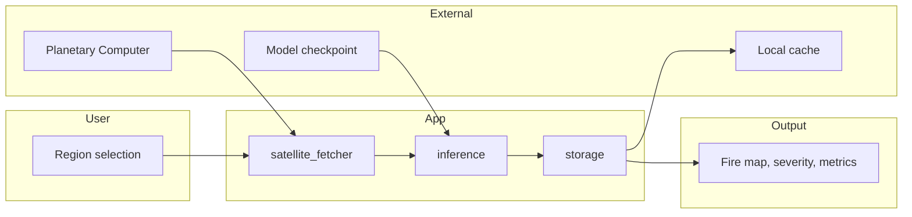

# Fire Detection App

Slide-ready overview of the web application for satellite-based wildfire detection.

<style>
pre, code { font-family: "Cascadia Code", "Fira Code", "JetBrains Mono", "Source Code Pro", "Consolas", "Monaco", monospace; }
</style>

---

## Tech Stack

- **Framework:** Streamlit (Python)
- **Backend:** PyTorch inference (ResNet50 + U-Net++ or other trained models)
- **Satellite data:** Sentinel-2 L2A from Microsoft Planetary Computer (STAC API)
- **Storage:** Local SQLite + `.npy` / `.png` files in `cache/`
- **Visualization:** Plotly (synced zoom/pan), Folium (map selection)

---

## Features

- **Interactive region selection** — Draw on map, preset locations (Catalonia, California, Portugal, Greece, Australia), or enter coordinates
- **Sentinel-2 imagery** — Fetch satellite data with date range and cloud-cover filters
- **Real-time fire detection** — U-Net inference; binary fire map and 5-level severity map
- **Synced image viewer** — Original vs fire overlay with linked zoom/pan
- **Analysis history** — Filter by fire/date, view past runs, load parameters to re-run
- **Statistics dashboard** — Total analyses, detection rate, recent fires, cleanup of old data
- **Multi-model support** — Choose among trained models from a dropdown

---

## Architecture

### Diagram

```
    USER                    APP (Streamlit)                    EXTERNAL
    ────                    ─────────────────                 ────────

┌─────────────┐
│ Map / Draw  │
│ or coords   │
└──────┬──────┘
       │
       ▼
┌─────────────────────────────────────────────────────────────────────┐
│                         Streamlit App                                │
│  ┌──────────────┐    ┌──────────────┐    ┌──────────────┐           │
│  │ satellite_   │    │ inference.py │    │              │           │
│  │ fetcher.py   │───▶│ FireInference│───▶│ storage.py   │           │
│  │              │    │ Pipeline     │    │              │           │
│  └──────┬───────┘    └──────────────┘    └──────┬───────┘           │
│         │                     │                     │               │
└─────────┼─────────────────────┼─────────────────────┼──────────────┘
          ▲                     ▲                     │
          │ imagery             │ model               ▼
┌─────────────────┐    ┌──────────────┐    ┌──────────────────────┐
│ Planetary       │    │ PyTorch      │    │ Local cache/         │
│ Computer (STAC) │    │ model.pt     │    │ database.db          │
└─────────────────┘    └──────────────┘    └──────────────────────┘
                                                      │
                                                      ▼
                                            ┌──────────────────────┐
                                            │  Analysis output      │
                                            │  • Fire map overlay   │
                                            │  • Severity map       │
                                            │  • Metrics & history  │
                                            └──────────────────────┘
```

### Mermaid



---

## Flow

1. **Region** — User selects area (map draw, presets, or coords) and date range
2. **Fetch** — `satellite_fetcher` queries Planetary Computer, downloads 7 bands, normalizes
3. **Inference** — `FireInferencePipeline` runs model on 256×256 patches, stitches output
4. **Store** — `StorageManager` saves image, result, visualization; SQLite for metadata
5. **Display** — Plotly synced viewer (RGB, binary fire, severity); metrics and history

---

## Run

```bash
cd fire-pipeline
uv sync --extra app
streamlit run app.py
```

Set `FIRE_USE_MOCK=false` for real Sentinel-2 data. Use `FIRE_MODELS_DIR` to enable multi-model dropdown.

---

## Executive Summary

- **Web app** for satellite-based wildfire detection and severity mapping
- **Image source:** Sentinel-2 L2A from Microsoft Planetary Computer (STAC API)
- **Streamlit** frontend; PyTorch U-Net inference
- **Select region** via map, presets, or coordinates; fetch imagery with date and cloud filters
- **Binary fire map** and **5-level severity** in one forward pass; synced zoom/pan viewer
- **History** and **statistics**; filter by fire/date; load parameters to re-run
- **Multi-model** support; local SQLite + file cache for analyses
