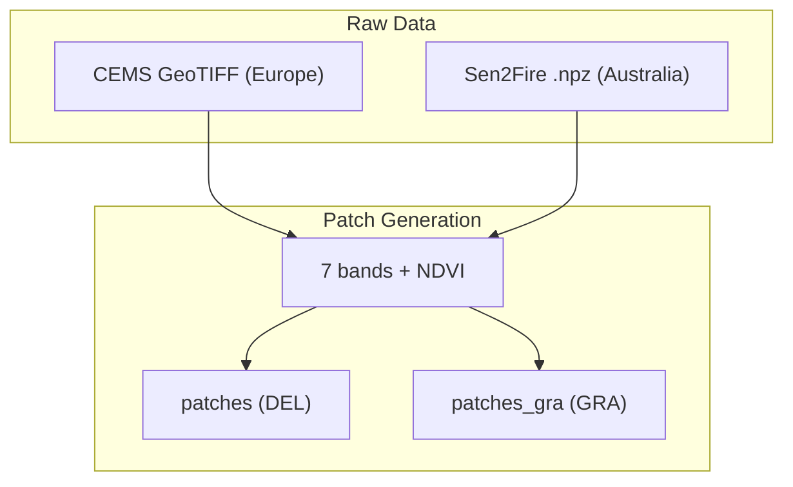
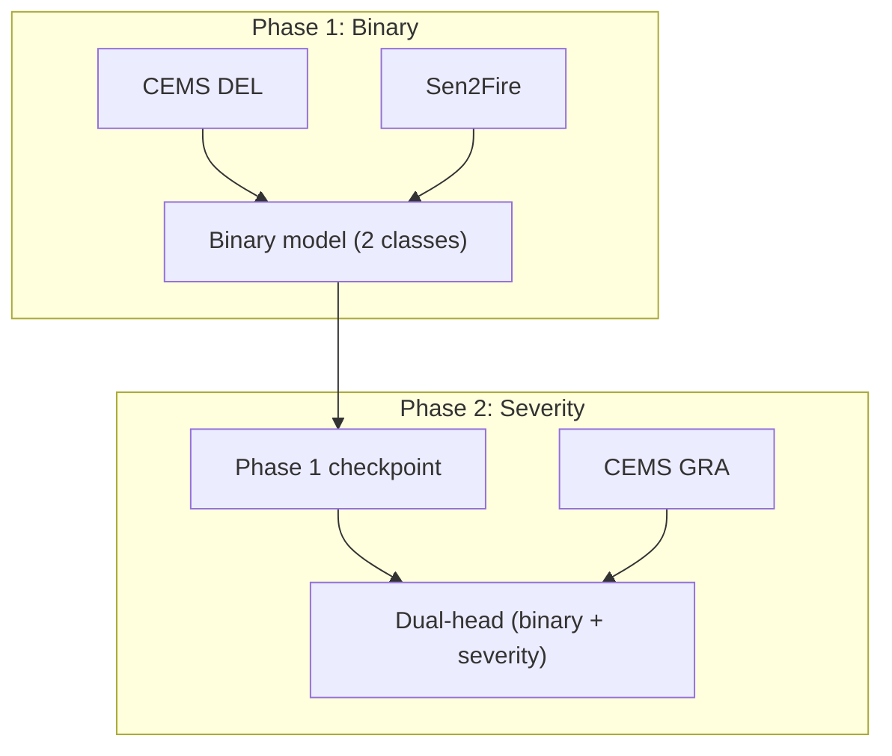

# Data & Training Pipeline

Slide-ready overview. One slide per section.

<style>
pre, code { font-family: "Cascadia Code", "Fira Code", "JetBrains Mono", "Source Code Pro", "Consolas", "Monaco", monospace; }
</style>

---

## Slide 1: Data Pipeline

### Diagram

```
    RAW DATA                         PATCH GENERATION
    ────────                         ────────────────

┌──────────────┐              ┌─────────────────────────────┐
│ CEMS         │              │  • 12 bands → 7 selected   │
│ GeoTIFF      │─────────────▶│  • + NDVI (8th channel)      │
│ (Europe)     │              │  • Sliding window 256×256   │
└──────────────┘              │  • Cloud filter (>50% out)  │
         │                    └──────────────┬──────────────┘
         │                                   │
         │                    ┌──────────────┴──────────────┐
         │                    ▼                             ▼
┌────────┴──────┐      ┌──────────┐                 ┌──────────┐
│ Sen2Fire      │      │ patches  │                 │patches_gra│
│ .npz          │─────▶│ (DEL)    │                 │ (GRA)     │
│ (Australia)   │      │ binary   │                 │ 5 severity │
└───────────────┘      └──────────┘                 └──────────┘
```

### Mermaid



### Bullet points

- **Input:** CEMS GeoTIFF (12 bands) or Sen2Fire .npz; 7 bands selected (B02, B03, B04, B08, B8A, B11, B12)
- **NDVI:** 8th channel computed as (NIR−Red)/(NIR+Red); helps separate burn scars from water/shadow
- **Sliding window:** 256×256 patches, stride 128 (50% overlap)
- **Cloud filter:** Patches with >50% cloud cover rejected
- **Output:** `.npy` files — image (256,256,8) float32, mask (256,256) uint8
- **Mask types:** DEL (binary 0/1) for fire detection; GRA (0–4) for severity
- **Imbalance:** ~4% images with no fire; class weights (inverse frequency) applied in training
- **Augmentation:** Flips, 90° rotations, brightness/contrast, Gaussian noise; stronger augmentation for fire patches

---

## Slide 2: Training Pipeline

### Diagram

```
    PHASE 1: BINARY                              PHASE 2: SEVERITY
    ─────────────────                            ──────────────────

    CEMS DEL (Europe)     Sen2Fire (Australia)
           \                    /
            \                  /
             ▼                ▼
    ┌─────────────────────────────────┐
    │   Combined binary training      │
    │   • Single-head (fire / no-fire) │
    │   • 8 ch (7 bands + NDVI)       │
    │   • Output: binary checkpoint   │
    └────────────────┬────────────────┘
                     │
                     ▼
    ┌─────────────────────────────────┐         CEMS GRA (Europe)
    │   Load checkpoint               │         severity labels
    │   Add severity head             │                │
    │   Freeze: encoder + binary      │                │
    │   Train: severity head only     │◀───────────────┘
    │   Output: dual-head model       │
    └─────────────────────────────────┘
```

### Mermaid



### Bullet points

**Phase 1**
- **Goal:** Binary fire detection (fire vs no-fire)
- **Data:** CEMS DEL + Sen2Fire (Europe + Australia) for geographic diversity
- **Model:** Single-head, 2 classes, 8 channels
- **Output:** Binary checkpoint

**Phase 2**
- **Goal:** Severity assessment (5 levels: no damage → destroyed)
- **Input:** Phase 1 checkpoint
- **Data:** CEMS GRA only (Sen2Fire has no severity labels)
- **Frozen:** Encoder, decoder, binary head
- **Trained:** Severity head only
- **Output:** Dual-head model — binary fire map + severity map in one forward pass

**Why two phases?**
- Phase 1: Maximize fire examples from two continents → better generalization
- Phase 2: Severity labels only in CEMS → train dedicated head without diluting binary performance

**Training details**
- **Loss:** CombinedLoss (0.5 × CrossEntropy + 0.5 × Dice), class weights
- **Optimizer:** AdamW
- **Regularization:** Weight decay, early stopping, ReduceLROnPlateau
