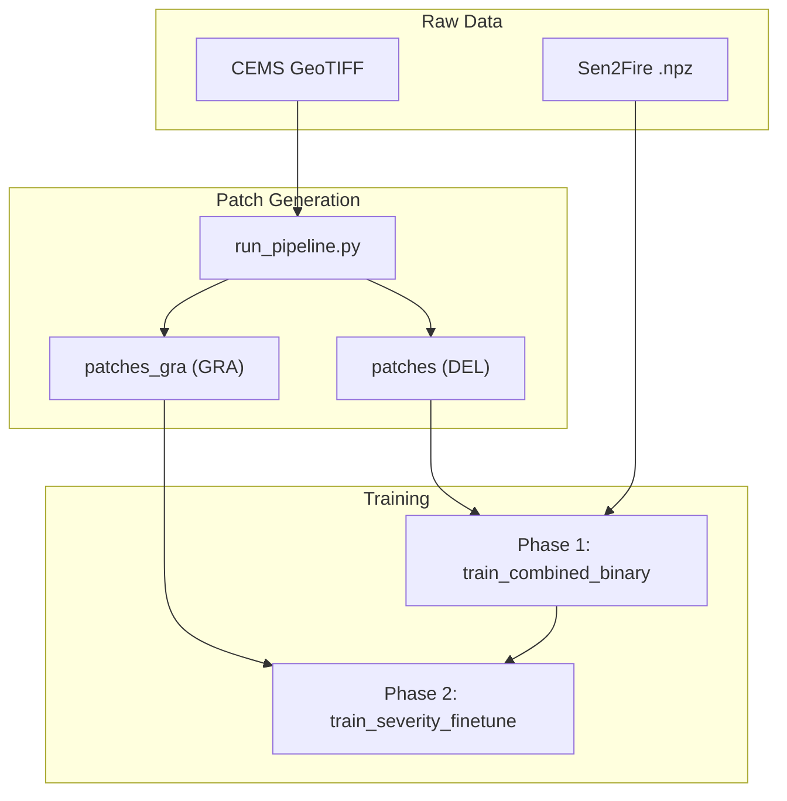

# Data Pipeline

Slide-ready overview of patch generation, training, and fine-tuning for wildfire detection.

<style>
pre, code { font-family: "Cascadia Code", "Fira Code", "JetBrains Mono", "Source Code Pro", "Consolas", "Monaco", monospace; }
</style>

---

## Pipeline Diagram (Simplified)

### ASCII

```
    RAW DATA                    PATCH GENERATION                 TRAINING & FINE-TUNING
    ────────                    ─────────────────               ──────────────────────

┌──────────────┐         ┌─────────────────────────────┐
│ CEMS         │         │  run_pipeline.py            │
│ GeoTIFF      │────────▶│  • Load 12 bands → 7+NDVI   │
│ (12 bands)   │         │  • Sliding window 256×256   │
└──────────────┘         │  • Cloud filter (>50% out)  │
         │               │  • Output: .npy (img,mask)  │
         │               └──────────────┬──────────────┘
         │                              │
         │               ┌───────────────┴───────────────┐
         │               ▼                               ▼
         │         ┌──────────┐                   ┌──────────┐
         │         │ patches  │                   │patches_gra│
         │         │ (DEL)    │                   │ (GRA)     │
         │         │ binary   │                   │ 5 classes │
         │         └────┬─────┘                   └────┬─────┘
         │              │                               │
┌────────┴──────┐      │         ┌──────────────────────┴──────────────────────┐
│ Sen2Fire      │      │         │  PHASE 1: train_combined_binary.py           │
│ .npz (scene1-4)│──────┼────────▶│  CEMS DEL + Sen2Fire → binary model (2 cls)  │
└───────────────┘      │         └──────────────────────┬──────────────────────┘
                        │                                │
                        │                                ▼
                        │         ┌─────────────────────────────────────────────┐
                        └────────▶│  PHASE 2: train_severity_finetune.py        │
                                  │  Load Phase 1 → add severity head           │
                                  │  Freeze encoder+binary → train severity     │
                                  │  CEMS GRA only → dual-head (binary+severity)│
                                  └─────────────────────────────────────────────┘
```

### Mermaid



---

## Patch Generation — Key Points

- **Input:** CEMS GeoTIFF (12 bands) or Sen2Fire .npz; band selection → 7 bands (B02, B03, B04, B08, B8A, B11, B12)
- **NDVI:** 8th channel computed as (NIR−Red)/(NIR+Red); helps separate burn scars from water/shadow
- **Sliding window:** 256×256 patches, stride 128 (50% overlap) for training
- **Cloud filter:** Patches with >50% cloud cover rejected
- **Output:** `.npy` files — image (256,256,8) float32, mask (256,256) uint8
- **Mask types:** DEL (binary 0/1) for fire detection; GRA (0–4) for severity
- **Script:** `run_pipeline.py` — `patch_generator.py` does the extraction

---

## Training — Key Points

- **Phase 1 (combined binary):** CEMS DEL + Sen2Fire → single-head binary model (2 classes)
- **Data:** Europe (CEMS) + Australia (Sen2Fire) for geographic diversity
- **Phase 2 (severity):** Load Phase 1 checkpoint, add severity head, freeze encoder+binary, train on CEMS GRA only
- **Data:** CEMS GRA only (5 severity levels); Sen2Fire has no severity labels
- **Scripts:** `train_combined_binary.py` (Phase 1), `train_severity_finetune.py` (Phase 2)

---

## Fine-Tuning — Key Points

- **Phase 2 = severity fine-tuning:** Adds a 1×1 conv severity head on shared decoder; encoder and binary head frozen
- **Alternative:** `train_sen2fire_finetune.py` — fine-tune CEMS model on Sen2Fire (binary head only, severity frozen)
- **Output:** Dual-head model for inference — binary fire map + severity map in one forward pass

---

## See Also

- [Data & Training Pipeline](DATA_AND_TRAINING_PIPELINE.md) — Consolidated slide-ready overview
- [Training Pipeline](TRAINING_PIPELINE.md) — Training workflow details
