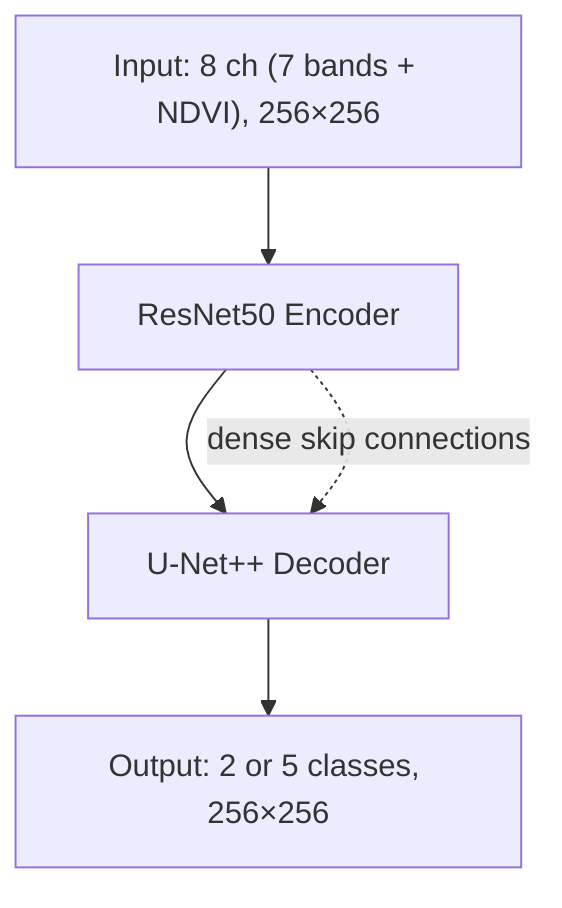

# ResNet50 + U-Net++ Architecture

Slide-ready bullet points for the wildfire detection model.

<style>
pre, code { font-family: "Cascadia Code", "Fira Code", "JetBrains Mono", "Source Code Pro", "Consolas", "Monaco", monospace; }
</style>

---

## Architecture Diagram (Simplified)

### ASCII

```
                    INPUT (8 ch, 256×256)
                              │
                              ▼
    ┌─────────────────────────────────────────────┐
    │              ResNet50 ENCODER                │
    │  ┌─────┐   ┌─────┐   ┌─────┐   ┌─────┐      │
    │  │ B1  │──▶│ B2  │──▶│ B3  │──▶│ B4  │      │  256→128→64→32→16
    │  └──┬──┘   └──┬──┘   └──┬──┘   └──┬──┘      │
    └─────┼─────────┼─────────┼─────────┼─────────┘
          │         │         │         │
          │  skip   │  skip   │  skip   │  skip
          │         │         │         │
    ┌─────┼─────────┼─────────┼─────────┼─────────┐
    │     ▼         ▼         ▼         ▼         │
    │  ┌─────┐   ┌─────┐   ┌─────┐   ┌─────┐      │
    │  │ Up1 │◀──│ Up2 │◀──│ Up3 │◀──│ Up4 │      │  U-Net++ DECODER
    │  └──┬──┘   └──┬──┘   └──┬──┘   └──┬──┘      │  (dense nested skips)
    │     │         │         │         │         │
    │     └─────────┴─────────┴─────────┘         │
    └──────────────────┬─────────────────────────┘
                        │
                        ▼
                 OUTPUT (2 or 5 cls, 256×256)
```

### Mermaid



---

## ResNet50 U-Net++ — Key Points

- **Encoder:** ResNet50 (50-layer CNN, ImageNet-pretrained) adapted to 8 input channels (7 Sentinel-2 bands + NDVI)
- **Decoder:** U-Net++ (nested U-Net) with dense skip connections instead of direct encoder→decoder links
- **Skip connections:** Dense pathways between encoder and decoder reduce the semantic gap and improve gradient flow
- **Output:** Pixel-wise segmentation — binary fire/no-fire (2 classes) or severity (5 GRA levels)
- **Performance:** Best in our experiments — fire IoU 0.78 (binary), mean IoU 0.34 (severity)
- **Implementation:** `segmentation_models_pytorch` (smp) — `UnetPlusPlus` + `resnet50` encoder
