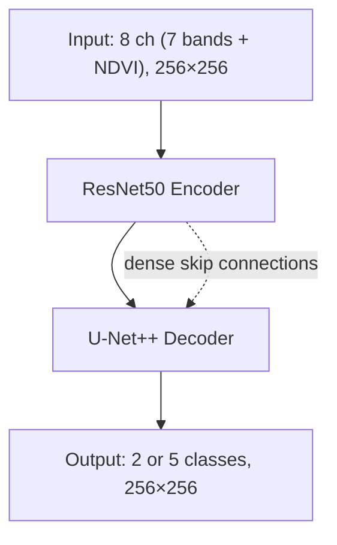

# ResNet50 + U-Net++ Architecture

Slide-ready bullet points for the wildfire detection model.

<style>
pre, code { font-family: "Cascadia Code", "Fira Code", "JetBrains Mono", "Source Code Pro", "Consolas", "Monaco", monospace; }
</style>

---

## Architecture Diagram (Simplified)

### ASCII

```
                    INPUT (8 ch, 256×256)
                              │
                              ▼
    ┌─────────────────────────────────────────────┐
    │              ResNet50 ENCODER                │
    │  ┌─────┐   ┌─────┐   ┌─────┐   ┌─────┐      │
    │  │ B1  │──▶│ B2  │──▶│ B3  │──▶│ B4  │      │  256→128→64→32→16
    │  └──┬──┘   └──┬──┘   └──┬──┘   └──┬──┘      │
    └─────┼─────────┼─────────┼─────────┼─────────┘
          │         │         │         │
          │  skip   │  skip   │  skip   │  skip
          │         │         │         │
    ┌─────┼─────────┼─────────┼─────────┼─────────┐
    │     ▼         ▼         ▼         ▼         │
    │  ┌─────┐   ┌─────┐   ┌─────┐   ┌─────┐      │
    │  │ Up1 │◀──│ Up2 │◀──│ Up3 │◀──│ Up4 │      │  U-Net++ DECODER
    │  └──┬──┘   └──┬──┘   └──┬──┘   └──┬──┘      │  (dense nested skips)
    │     │         │         │         │         │
    │     └─────────┴─────────┴─────────┘         │
    └──────────────────┬─────────────────────────┘
                        │
                        ▼
                 OUTPUT (2 or 5 cls, 256×256)
```

### Mermaid



---

## ResNet50 U-Net++ — Key Points

- **Encoder:** ResNet50 (50-layer CNN, ImageNet-pretrained) adapted to 8 input channels (7 Sentinel-2 bands + NDVI)
- **Decoder:** U-Net++ (nested U-Net) with dense skip connections instead of direct encoder→decoder links
- **Skip connections:** Dense pathways between encoder and decoder reduce the semantic gap and improve gradient flow
- **Output:** Pixel-wise segmentation — binary fire/no-fire (2 classes) or severity (5 GRA levels)
- **Performance:** Best in our experiments — fire IoU 0.78 (binary), mean IoU 0.34 (severity)
- **Implementation:** `segmentation_models_pytorch` (smp) — `UnetPlusPlus` + `resnet50` encoder

---

## Training Results

### Model Size

| Property | Value |
|----------|-------|
| Total parameters | ~49M |
| Checkpoint size (dual-head, Phase 2) | 188 MB |
| Inference (256×256, batch 1, GPU) | ~20–40 ms/patch |

### Training Configuration

| Phase | Dataset | Max epochs | Batch size | Learning rate | Notes |
|-------|---------|------------|------------|---------------|-------|
| Phase 1 (binary) | CEMS DEL + Sen2Fire | 50 | 16 | 2.5e-5 | Early stopping |
| Phase 2 (severity) | CEMS GRA | 30 | 16 | 5e-4 | Encoder + binary head frozen |

### Training Time

| Phase | Time | Epochs to best |
|-------|------|----------------|
| Phase 1 (binary) | ~30 min | 27 |
| Phase 2 (severity) | ~10–20 min | 15 |

**Hardware:** Single GPU (e.g. T4, V100, RTX 3080+).

### Performance Metrics

| Phase | Fire IoU | Mean IoU | Det F1 | Fire recall |
|-------|----------|----------|--------|-------------|
| Phase 1 (binary) | 0.78 | — | 0.85 | 0.93 |
| Phase 2 (severity) | 0.41 | 0.34 | — | — |

### W&B Runs

- **Phase 1:** [v3_combined_binary_resnet50_unetpp](https://wandb.ai/adrian-corvin-salceanu-upc-barcelona/fire-detection/runs/7ql5q0zk)
- **Phase 2:** [v3_finetune_severity_resnet50_unetp](https://wandb.ai/adrian-corvin-salceanu-upc-barcelona/fire-detection/runs/sb5t3qp4)

### Data Sources

Metrics and config from [docs/WANDB_ANALYSIS_REPORT.md](WANDB_ANALYSIS_REPORT.md) and [fire-pipeline/wandb_runs_export.csv](../fire-pipeline/wandb_runs_export.csv). Parameter count and training time from [docs/DEFENSE_SOLUTION_REPORT.md](DEFENSE_SOLUTION_REPORT.md).
