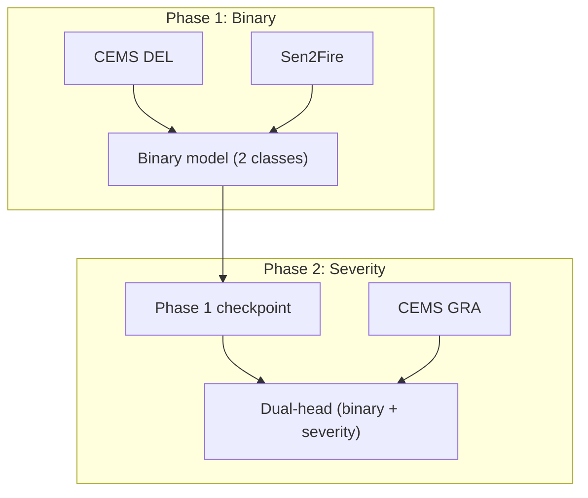

# Training Pipeline

Slide-ready bullet points for the defense deck. V3 combined workflow for wildfire detection and severity assessment.

<style>
pre, code { font-family: "Cascadia Code", "Fira Code", "JetBrains Mono", "Source Code Pro", "Consolas", "Monaco", monospace; }
</style>

---

## Pipeline Diagram

### ASCII (slide-friendly)

```
    PHASE 1: BINARY                              PHASE 2: SEVERITY
    ─────────────────                            ──────────────────

    CEMS DEL (Europe)     Sen2Fire (Australia)
           \                    /
            \                  /
             ▼                ▼
    ┌─────────────────────────────────┐
    │   Combined binary training      │
    │   • Single-head (fire / no-fire)│
    │   • 8 ch (7 bands + NDVI)      │
    │   • Output: binary checkpoint   │
    └────────────────┬────────────────┘
                     │
                     ▼
    ┌─────────────────────────────────┐         CEMS GRA (Europe)
    │   Load checkpoint               │         severity labels
    │   Add severity head              │                │
    │   Freeze: encoder + binary       │                │
    │   Train: severity head only      │◀───────────────┘
    │   Output: dual-head model       │
    └─────────────────────────────────┘
```

### Mermaid



---

## Phase 1 — Key Points

- **Goal:** Train binary fire detection (fire vs no-fire)
- **Data:** CEMS DEL (Europe) + Sen2Fire (Australia) for geographic diversity
- **Model:** Single-head segmentation, 2 classes
- **Input:** 8 channels (7 Sentinel-2 bands + NDVI)
- **Output:** Binary checkpoint (encoder + decoder + binary head)

---

## Phase 2 — Key Points

- **Goal:** Add severity assessment (5 levels: no damage → destroyed)
- **Input:** Phase 1 checkpoint
- **Data:** CEMS GRA only (Sen2Fire has no severity labels)
- **Frozen:** Encoder, decoder, binary head
- **Trained:** Severity head only (1×1 conv on shared decoder)
- **Output:** Dual-head model — binary fire map + severity map in one forward pass

---

## Why Two Phases?

- **Phase 1:** Maximize fire examples from two continents → better generalization
- **Phase 2:** Severity labels exist only in CEMS → train dedicated head without diluting binary performance
- **Stability:** Binary head stays frozen; only severity head learns

---

## Loss and Metrics

- **Phase 1:** CombinedLoss (CrossEntropy + Dice), class weights; primary metric: fire IoU
- **Phase 2:** CombinedLoss on severity head; primary metric: mean IoU

---

## See Also

- [Data Pipeline](DATA_PIPELINE.md) — Patch generation and data flow
- [Data & Training Pipeline](DATA_AND_TRAINING_PIPELINE.md) — Consolidated slide-ready overview
- [Combined Binary + Severity Workflow](COMBINED_BINARY_SEVERITY_WORKFLOW.md) — Rationale
- [V3 Pipeline Architectures](V3_PIPELINE_ARCHITECTURES.md) — Encoder/decoder options
- [ResNet50 + U-Net++ Architecture](RESNET50_UNETPP_ARCHITECTURE.md) — Best model details
