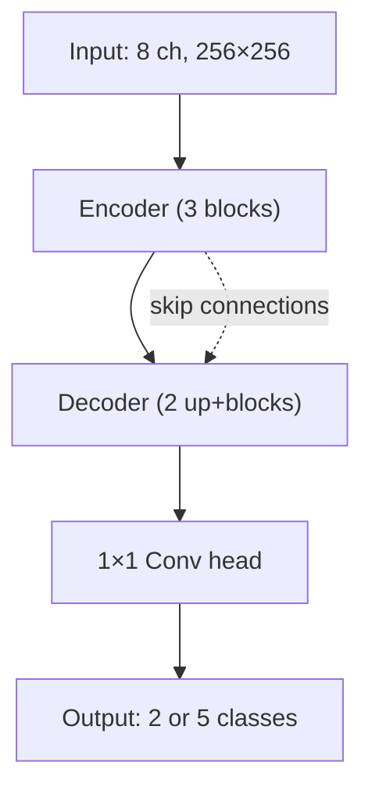

# U-Net (Scratch) Architecture

Slide-ready bullet points for the from-scratch U-Net fire detection model.

<style>
pre, code { font-family: "Cascadia Code", "Fira Code", "JetBrains Mono", "Source Code Pro", "Consolas", "Monaco", monospace; }
</style>

---

## Architecture Diagram (Simplified)

### ASCII

```
                    INPUT (8 ch, 256×256)
                              │
                              ▼
    ┌─────────────────────────────────────────────┐
    │              ENCODER (no pretrain)           │
    │  ┌─────────┐     ┌─────────┐     ┌─────────┐│
    │  │ 8→16    │     │ 16→32   │     │ 32→64   ││   Block: Conv3×3→BN→ReLU→Conv3×3→BN→ReLU
    │  │ Block   │ pool│ Block   │ pool│ Block   ││   256→128→64→32
    │  └────┬────┘     └────┬────┘     └────┬────┘│
    └───────┼───────────────┼───────────────┼─────┘
           │ skip          │ skip          │
           │               │               │
    ┌───────┼───────────────┼───────────────┼─────┐
    │       ▼               ▼               ▼    │
    │  ┌─────────┐     ┌─────────┐                │
    │  │ Up+Dec  │     │ Up+Dec  │   DECODER      │   UpConv 2×2 + concat skip + Block
    │  │ 64→32   │     │ 32→16   │                │   32→64→128→256
    │  └────┬────┘     └────┬────┘                │
    └───────┼───────────────┼─────────────────────┘
            │               │
            ▼               ▼
    ┌───────────────────────────┐
    │  Head: Conv 1×1 (16→C)    │
    └─────────────┬─────────────┘
                  ▼
           OUTPUT (2 or 5 cls, 256×256)
```

### Mermaid



---

## U-Net Scratch — Key Points

- **Encoder:** 3 blocks (8→16→32→64), each: Conv3×3→BN→ReLU→Conv3×3→BN→ReLU, MaxPool2×2 after each
- **Decoder:** 2 upsampling stages; ConvTranspose2×2, concat skip (center-cropped), then Block
- **Block:** Double conv (3×3, pad=1) with BatchNorm and ReLU — no residual connections
- **Head:** Single 1×1 conv (16 → num_classes)
- **No pretrained weights** — trained from scratch on CEMS (and optionally Sen2Fire)
- **Performance:** Fire dice ~0.89 on CEMS-only; ~0.84 on CEMS+Sen2Fire combined
- **Implementation:** `fire-pipeline/unet_scratch.py` — custom `UNet`, `Encoder`, `Decoder`, `Block`
